# MAPPING FINAL : Intégration Logiciels Comptables

> **Architecture multi-connecteurs** : Ce document décrit l'intégration de **3 logiciels comptables en cohabitation** :
> - **Inqom** : Connexion directe via API (username/password + credentials API)
> - **Chift** : Connecteur multi-logiciels via OAuth (Pennylane, Cegid, Sage, etc.)
> - **ACD** : À venir
>
> Chaque Society peut être connectée à **UN SEUL** logiciel à la fois. Les 3 options coexistent dans l'application.

**Version:** 3.3 DÉFINITIVE
**Date:** 9 décembre 2025
**Statut:** VÉRIFIÉ PAR TESTS API RÉELS
**Projet:** Simple Comme Ça - Intégration Logiciels Comptables (Inqom, Chift, ACD)

---

> ⚠️ **CE DOCUMENT EST LA RÉFÉRENCE UNIQUE POUR LES DÉVELOPPEURS**
>
> Toutes les structures JSON ont été vérifiées par des appels API réels le 03/12/2025 (Inqom) et 09/12/2025 (Chift).

### Historique des versions

| Version | Date | Modifications |
|---------|------|---------------|
| 1.0 | 03/12/2025 | Création initiale avec mapping API Inqom |
| 1.1 | 03/12/2025 | Ajout section TVA complète, contexte métier Auth/Society/Journal/Fournisseur/Client/Facture |
| 1.2 | 03/12/2025 | Ajout contexte métier pour toutes les sections (Lignes, VAT, Transaction, Compte, Résumé) |
| 1.3 | 03/12/2025 | Ajout section 11: API Documents & OCR avec endpoints et champs extraits |
| 1.4 | 04/12/2025 | Ajout cadrage popup connexion logiciel comptable + stratégie refresh token |
| 1.5 | 04/12/2025 | Ajout credentials complets Inqom, déconnexion logiciel, exemple reconstitution facture |
| 1.6 | 04/12/2025 | Correction : client_id/client_secret par Agence (pas global), nouveaux champs Agence |
| 1.7 | 04/12/2025 | Ajout section 13: Trésorerie (comptes bancaires, transactions, soldes) |
| 1.8 | 04/12/2025 | **Tests API réels** : corrections paramètres entry-lines (journalId, dates obligatoires, filtres côté client) |
| 1.9 | 04/12/2025 | Cadrage écrans Trésorerie + Paramètres Comptes Bancaires, nouvelle table Compte_Bancaire_Inqom |
| 2.0 | 04/12/2025 | Ajout solde initial (saisi par utilisateur) + formule calcul solde actuel |
| 2.1 | 04/12/2025 | Limite API 1000 entry-lines + Backend Workflow Bubble.io récursif avec pagination |
| 2.2 | 05/12/2025 | **Refonte cadrage Trésorerie au format V0** : user stories "En tant que...", organisation par écrans (Portail/Trésorerie, Portail/Paramètres) |
| 2.3 | 05/12/2025 | **Ajout section 14 : Cadrages fonctionnels V0 complets** - Paiements, Encaissements, Ventes (facturation), Paramètres TVA, Paramètres Journaux/GED, GED classement automatique, Connexion logiciel comptable |
| 2.4 | 05/12/2025 | **Cadrage Connexion détaillé** : états (connecté/non connecté/erreur), popup étape par étape, tous les cas d'erreur API avec messages exacts, workflow déconnexion, tableau récapitulatif |
| 2.5 | 05/12/2025 | **Ajout section 15 : Questions pour le client** + Décisions confirmées (sync à l'ouverture, recalcul immédiat, Compte Pro Swan, articles Bubble, encaissements = échéancier) |
| 2.6 | 05/12/2025 | **Tous les credentials Inqom au niveau Société** : `client_id`, `client_secret`, `company_id`, `username`, `password` sont tous au niveau Society pour flexibilité maximale (permet différentes sociétés avec différents comptes Inqom). |
| 2.7 | 05/12/2025 | **Ajout screenshots application** : Intégration des captures d'écran de l'application réelle dans tous les cadrages V0 (Paiements, Encaissements, Ventes, Trésorerie, Paramètres TVA/Journaux/Connexion, Documents, Importer). Screenshots stockés dans `bubble-explorer/.playwright-mcp/`. |
| 2.8 | 05/12/2025 | **Screenshots complémentaires V0** : Tiroir Paiements, Tiroir Encaissements, Filtres Paiements/Encaissements, Fiche Client détail, Popup ajout article, Portail connexion Chift. Screenshots dans `inqom-integration-mapping/screenshots/`. |
| 2.9 | 05/12/2025 | **Ajout option Chift** : Chift comme 2ème option de connexion (OAuth), credentials Chift (client_id, client_secret, account_id), workflow OAuth avec redirection externe, nouveaux champs Society pour Chift, mise à jour tableaux récapitulatifs. |
| 3.0 | 05/12/2025 | **Révision cohérence document** : Titre mis à jour, flux utilisateur avec 3 options (Inqom/Chift/ACD), nouvelles maquettes popup par étapes, correction des tableaux récapitulatifs. |
| 3.1 | 08/12/2025 | **Corrections cadrage** : Maquette popup Inqom 5 champs, Privacy Rules Bubble.io, Refresh token quotidien, Popup déconnexion sécurisée, Mapping DB 3 intégrations. |
| 3.2 | 08/12/2025 | **Refonte cohabitation** : Suppression de toute référence à une "migration" Chift→Inqom. Les 3 intégrations coexistent. Restructuration des tableaux de mapping avec colonnes distinctes par intégration. |
| 3.3 | 09/12/2025 | **Clarification flux écritures comptables** : Refonte section 9 (Paiement factures achat = PAS d'écriture), ajout section 9bis (Batch Swan 12h15), enrichissement section Ventes (création écriture à la validation avec endpoints Chift/Inqom), récapitulatif "Quand l'app génère des écritures", tests API Chift réels. |

---

## Contexte Métier - Simple Comme Ça

**Simple Comme Ça** est une plateforme en ligne qui permet aux **cabinets comptables** (Agences) et à leurs **clients** (Sociétés) de gérer l'ensemble de leurs données et transactions sans avoir à accéder manuellement à leurs comptes bancaires et logiciels comptables (Inqom, Silae, Finthesis...).

### Acteurs principaux

| Acteur | Description |
|--------|-------------|
| **Société** | Employés des sociétés clientes des cabinets comptables. Ils gèrent la comptabilité de leurs sociétés depuis l'application SCC |
| **Agence** | Cabinets comptables clients de Simple Comme Ça. Ils créent des entités Société et invitent des utilisateurs |

### Flux principaux impactés par l'intégration

| Module | Fonctionnalité | API Call concerné |
|--------|----------------|-------------------|
| **Lot 2: Connexion** | Connexion logiciel comptable (Inqom direct ou Chift) | Auth, Folders, Journals |
| **Lot 2: Fournisseurs** | Synchronisation fournisseurs | Accounts (401*) |
| **Lot 2: Paiements** | Factures d'achat à payer | Entry-Lines, Documents |
| **Lot 5: Encaissements** | Synchronisation clients | Accounts (411*) |
| **Lot 5: Ventes** | Factures de vente | Entry-Lines, Entries (POST) |
| **GED** | Classement factures | Documents, Journals |

---

## Table des Matières

1. [Authentification](#1-authentification)
2. [Table Society](#2-table-society)
3. [Table Journal](#3-table-journal)
4. [Table Fournisseur](#4-table-fournisseur)
5. [Table Client](#5-table-client)
6. [Table Facture](#6-table-facture)
7. [Table Facture - Ligne](#7-table-facture---ligne)
8. [Table VAT Linked Chart of Account Number](#8-table-vat-linked-chart-of-account-number)
9. [**Récapitulatif : Quand l'app génère des écritures**](#récapitulatif--quand-lapp-génère-t-elle-des-écritures-comptables-)
    - 9a. [Paiement des factures d'achat](#9-paiement-des-factures-dachat)
    - 9b. [Batch quotidien Swan → Logiciel comptable](#9bis-batch-quotidien-swan--logiciel-comptable)
10. [Table Compte](#10-table-compte-compte-bancaire)
11. [API Documents & OCR](#11-api-documents--ocr)
12. [Résumé des Endpoints](#12-résumé-des-endpoints)
13. [Trésorerie (Flux Bancaires)](#13-trésorerie-flux-bancaires)
14. [**CADRAGES FONCTIONNELS V0**](#14-cadrages-fonctionnels-v0---intégration-inqom)
    - [Paiements](#paiements--cadrage-fonctionnel-v0)
    - [Encaissements](#encaissements--cadrage-fonctionnel-v0)
    - [Ventes (Facturation) - avec création d'écriture](#ventes-facturation--cadrage-fonctionnel-v0)
    - [Paramètres TVA](#paramètres-tva--cadrage-fonctionnel-v0)
    - [Paramètres Journaux & GED](#paramètres-journaux--ged--cadrage-fonctionnel-v0)
    - [GED Classement Automatique](#ged-classement-automatique--cadrage-fonctionnel-v0)
    - [Connexion Logiciel Comptable](#connexion-logiciel-comptable--cadrage-fonctionnel-v0)
15. [**QUESTIONS POUR LE CLIENT**](#15-questions-pour-le-client)

---

# CADRAGE : POPUP CONNEXION LOGICIEL COMPTABLE

## Règles métier

| Règle | Description |
|-------|-------------|
| **1 Société = 1 logiciel** | Choix exclusif (Inqom, Chift OU ACD - un seul à la fois) |
| **Accès** | Uniquement utilisateurs **Agence** (pas les utilisateurs Société) |
| **Credentials** | Inqom: email + mot de passe | Chift: OAuth (client_id, client_secret, account_id) | ACD: à définir |
| **Scope** | L'Agence gère plusieurs Sociétés, chaque Société a ses propres credentials utilisateur |
| **Déconnexion** | L'Agence peut déconnecter une Société à tout moment |

## Flux utilisateur

```
Agence (utilisateur cabinet comptable)
    │
    ├── Société A ──► Inqom (direct)  ──► email/mdp      ──► Dossier Inqom A
    ├── Société B ──► Chift (OAuth)   ──► Pennylane      ──► Dossier Pennylane B
    ├── Société C ──► Chift (OAuth)   ──► Cegid          ──► Dossier Cegid C
    ├── Société D ──► Chift (OAuth)   ──► Sage           ──► Dossier Sage D
    └── Société E ──► ACD (à venir)   ──► (bientôt)      ──► Dossier ACD E
```

> **Note :** Chift est un connecteur multi-logiciels qui permet de se connecter à de nombreux
> logiciels comptables (Pennylane, Cegid, Sage, QuickBooks, etc.) via une interface OAuth unifiée.


## Emplacement

**Paramètres > Logiciel Comptable** (accessible uniquement aux utilisateurs Agence)

## Maquette popup - Étape 1 : Choix du logiciel

```
┌─────────────────────────────────────────────────────────────┐
│  Connexion au logiciel comptable           [Société: XXX]   │
├─────────────────────────────────────────────────────────────┤
│                                                             │
│  Choisissez votre logiciel comptable :                      │
│                                                             │
│  ○ Inqom         Connexion directe avec email/mot de passe  │
│                                                             │
│  ○ Chift         Connecteur multi-logiciels (Pennylane,     │
│                  Cegid, Sage, QuickBooks, etc.)             │
│                  → Connexion via OAuth                      │
│                                                             │
│  ○ ACD           (Bientôt disponible)                       │
│                                                             │
│  ○ Aucun         Pas de logiciel comptable                  │
│                                                             │
├─────────────────────────────────────────────────────────────┤
│                    [ Annuler ]  [ Suivant → ]               │
└─────────────────────────────────────────────────────────────┘
```

## Maquette popup - Étape 2a : Credentials Inqom (si Inqom sélectionné)

> ⚠️ **IMPORTANT** : L'authentification Inqom nécessite 5 paramètres variables (pas seulement email/mdp).
> L'utilisateur doit obtenir le triplet `client_id`, `client_secret`, `company_id` auprès du support Inqom avant la première connexion.

```
┌─────────────────────────────────────────────────────────────────┐
│  Connexion Inqom                               [Société: XXX]   │
├─────────────────────────────────────────────────────────────────┤
│                                                                 │
│  ℹ️ Pour obtenir vos identifiants API Inqom, contactez le       │
│     support Inqom ou votre administrateur.                      │
│                                                                 │
│  ── Credentials API (fournis par Inqom) ───────────────────     │
│                                                                 │
│  Client ID :      [                              ]              │
│  Client Secret :  [                              ] 🔒           │
│  Company ID :     [                              ]              │
│                                                                 │
│  ── Identifiants utilisateur ──────────────────────────────     │
│                                                                 │
│  Email :          [                              ]              │
│  Mot de passe :   [                              ] 🔒           │
│                                                                 │
│                   [ Tester la connexion ]                       │
│                                                                 │
│  ─────────────────────────────────────────────────────────────  │
│                                                                 │
│  Dossier comptable :  [ Sélectionner... ▼ ]                     │
│                       (liste chargée après test réussi)         │
│                                                                 │
├─────────────────────────────────────────────────────────────────┤
│                      [ ← Retour ]  [ Enregistrer ]              │
└─────────────────────────────────────────────────────────────────┘
```

> **Légende :** 🔒 = champ masqué (type password), stocké chiffré en base

## Maquette popup - Étape 2b : Credentials Chift (si Chift sélectionné)

```
┌─────────────────────────────────────────────────────────────┐
│  Configuration Chift                       [Société: XXX]   │
├─────────────────────────────────────────────────────────────┤
│                                                             │
│  ℹ️ Chift permet de connecter plusieurs logiciels           │
│     comptables via une interface unifiée.                   │
│                                                             │
│  Credentials API (obtenus sur chift.eu) :                   │
│                                                             │
│  Client ID :     [                          ]               │
│  Client Secret : [                          ]               │
│  Account ID :    [                          ]               │
│                                                             │
│  🔗 Créer un compte Chift →                                 │
│                                                             │
│  ─────────────────────────────────────────────────────────  │
│                                                             │
│  En cliquant sur "Connecter", vous serez redirigé vers      │
│  le portail Chift pour autoriser l'accès et sélectionner    │
│  votre logiciel comptable.                                  │
│                                                             │
├─────────────────────────────────────────────────────────────┤
│                    [ ← Retour ]  [ Connecter via Chift ]    │
└─────────────────────────────────────────────────────────────┘
```


## Credentials Inqom (API)

> ⚠️ **IMPORTANT : L'authentification Inqom nécessite plus que email/mot de passe**

Pour obtenir un token, il faut **6 paramètres** :

| Paramètre | Type | Valeur exemple | Stockage Bubble |
|-----------|------|----------------|-----------------|
| `client_id` | Variable | `cabinetdupont` | `Society.Inqom_client_id` |
| `client_secret` | Variable | `xyz123...` | `Society.Inqom_client_secret` |
| `username` | Variable | Email utilisateur Inqom | `Society.Inqom_username` |
| `password` | Variable | Mot de passe utilisateur | `Society.Inqom_password` |
| `grant_type` | Fixe | `password` | Hardcodé |
| `scope` | Fixe | `openid apidata` | Hardcodé |

### Requête d'authentification complète

```
POST https://auth.inqom.com/identity/connect/token
Content-Type: application/x-www-form-urlencoded

client_id={Society.Inqom_client_id}
client_secret={Society.Inqom_client_secret}
username={Society.Inqom_username}
password={Society.Inqom_password}
grant_type=password
scope=openid apidata
```

### Organisation des credentials par niveau

```
Société (chaque société a ses propres credentials complets)
    │
    ├── Inqom_client_id      ← Fourni par Inqom
    ├── Inqom_client_secret  ← Fourni par Inqom
    ├── Inqom_company_id     ← Fourni par Inqom (ID du cabinet dans Inqom)
    ├── Inqom_username       ← Email compte Inqom
    └── Inqom_password       ← Mot de passe
```

| Credential | Niveau | Description |
|------------|--------|-------------|
| `client_id` | **Société** | Identifiant API du compte Inqom |
| `client_secret` | **Société** | Clé secrète API (chiffrée) |
| `company_id` | **Société** | ID du cabinet dans Inqom (pour lister les dossiers) |
| `username` | **Société** | Email du compte utilisateur Inqom |
| `password` | **Société** | Mot de passe du compte (chiffré) |

> **Note :** Tous les credentials sont au niveau **Société** pour une flexibilité maximale. Cela permet :
> - Différentes sociétés d'une même agence connectées à différents comptes Inqom
> - Une société utilisant un cabinet Inqom différent de ses sociétés sœurs
> - L'utilisateur obtient le triplet `client_id`, `client_secret`, `company_id` auprès du support Inqom

### Champs Agence (BDD Bubble)

> **Note :** Les credentials Inqom ne sont plus au niveau Agence mais au niveau **Société** (voir ci-dessous).

## Workflow détaillé

| Étape | Action utilisateur | Action système |
|-------|-------------------|----------------|
| 1 | Sélectionne "Inqom" | Affiche les champs de connexion |
| 2 | Saisit `client_id`, `client_secret`, `company_id` | - |
| 3 | Saisit `email` + `mot de passe` | - |
| 4 | Clique "Tester la connexion" | Appel `POST /identity/connect/token` |
| 5 | - | Si OK : utilise `Society.Inqom_company_id` + appelle `GET /accounting-folders` |
| 6 | - | Remplit le dropdown "Dossier comptable" avec la liste |
| 7 | Sélectionne son dossier | - |
| 8 | Clique "Enregistrer" | Sauvegarde dans Society + affiche status 🟢 |

> **Note :** L'utilisateur obtient le triplet `client_id`, `client_secret`, `company_id` auprès du support Inqom avant la première connexion.

## Champs Society (BDD Bubble)

| Champ | Type | Description | Sécurité |
|-------|------|-------------|----------|
| `logiciel_comptable` | option | "inqom", "chift", "acd", "none" | Public |
| `Inqom_client_id` | text | Client ID API Inqom | Privé |
| `Inqom_client_secret` | text | Client Secret API Inqom | ⚠️ Privé + chiffré |
| `Inqom_company_id` | number | Company ID Inqom (pour lister les dossiers) | Privé |
| `Inqom_username` | text | Email utilisateur Inqom | Privé |
| `Inqom_password` | text | Mot de passe Inqom | ⚠️ Privé + chiffré |
| `Inqom_folder_id` | number | ID dossier sélectionné | Privé |
| `Inqom_folder_name` | text | Nom dossier (pour affichage) | Public |
| `Inqom_access_token` | text | Token JWT actif | Privé |
| `Inqom_token_expiry` | date | Date expiration token | Privé |
| `Inqom_connected` | boolean | Connexion active | Public |
| `Inqom_last_sync` | date | Dernière synchronisation | Public |
| `Chift_client_id` | text | Client ID API Chift | Privé |
| `Chift_client_secret` | text | Client Secret API Chift | ⚠️ Privé + chiffré |
| `Chift_account_id` | text | Account ID Chift | Privé |
| `Chift_access_token` | text | Token OAuth Chift | Privé |
| `Chift_refresh_token` | text | Refresh token Chift | ⚠️ Privé + chiffré |
| `Chift_token_expiry` | date | Date expiration token | Privé |
| `Chift_connected` | boolean | Connexion Chift active | Public |
| `Chift_connected_software` | text | Logiciel connecté via Chift (ex: "Pennylane") | Public |
| `Chift_folder_name` | text | Nom du dossier sélectionné | Public |
| `Chift_last_sync` | date | Dernière synchronisation Chift | Public |
| `ACD_username` | text | Identifiant utilisateur ACD | Privé |
| `ACD_password` | text | Mot de passe ACD | ⚠️ Privé + chiffré |
| `ACD_access_token` | text | Token d'accès ACD | Privé |
| `ACD_token_expiry` | date | Date expiration token ACD | Privé |
| `ACD_connected` | boolean | Connexion ACD active | Public |
| `ACD_folder_id` | text | ID du dossier ACD | Privé |
| `ACD_folder_name` | text | Nom du dossier ACD | Public |
| `ACD_last_sync` | date | Dernière synchronisation ACD | Public |

> **Flexibilité maximale :** Tous les credentials sont au niveau Société, permettant à chaque société d'avoir son propre compte Inqom/Chift/ACD distinct (même au sein d'une même agence).

### Récapitulatif des 3 types d'intégration

| Intégration | Méthode d'authentification | Refresh token | Durée token |
|-------------|---------------------------|---------------|-------------|
| **Inqom** | username/password + client_id/secret | ❌ Non (mais refresh quotidien forcé) | ~1 an |
| **Chift** | OAuth 2.0 (redirection externe) | ✅ Oui (refresh_token) | Variable |
| **ACD** | À définir | À définir | À définir |

## Stratégie de gestion du token

### Option retenue : Refresh quotidien

| Aspect | Valeur |
|--------|--------|
| **Durée token Inqom** | ~1 an (31 104 000 secondes) |
| **Fréquence refresh** | 1 fois par jour |
| **Déclencheur** | Backend workflow schedulé (ex: 02h00) |
| **Fallback** | Si refresh échoue, redemander credentials à l'utilisateur |

### Workflow refresh token

> ⚠️ **IMPORTANT - Décision sécurité** : Malgré la durée de validité d'1 an du token Inqom,
> le refresh est effectué **quotidiennement** pour des raisons de sécurité.
> Cela permet de détecter rapidement les credentials révoqués et de maintenir un token "frais".

```
┌─────────────────────────────────────────────────────────────┐
│  Backend Workflow : "Refresh Inqom Tokens" (quotidien 02h)  │
├─────────────────────────────────────────────────────────────┤
│                                                             │
│  POUR CHAQUE Society où Inqom_connected = true :            │
│                                                             │
│  1. Récupérer les credentials :                             │
│     └── Society.Inqom_client_id                             │
│     └── Society.Inqom_client_secret                         │
│     └── Society.Inqom_username                              │
│     └── Society.Inqom_password                              │
│                                                             │
│  2. Appeler POST /identity/connect/token                    │
│     avec les 6 paramètres (4 variables + 2 fixes)           │
│                                                             │
│  3. Si succès :                                             │
│     └── Mettre à jour Society.Inqom_access_token            │
│     └── Mettre à jour Society.Inqom_token_expiry            │
│     └── Mettre à jour Society.Inqom_last_sync = now         │
│                                                             │
│  4. Si échec (credentials invalides) :                      │
│     └── Mettre Society.Inqom_connected = false              │
│     └── Notifier l'Agence par email                         │
│                                                             │
│  ⚠️ NOTE : Pas de condition sur la date d'expiration.       │
│     Le refresh est TOUJOURS effectué, tous les jours.       │
│                                                             │
└─────────────────────────────────────────────────────────────┘
```

### Justification du refresh quotidien

| Raison | Description |
|--------|-------------|
| **Sécurité** | Détection rapide si les credentials sont révoqués côté Inqom |
| **Fiabilité** | Garantie d'avoir toujours un token valide sans risque d'expiration |
| **Monitoring** | Notification immédiate (sous 24h) en cas de problème d'accès |
| **Coût négligeable** | 1 appel API/jour/société = impact minimal sur les quotas Inqom |

### Sécurité des credentials

> ⚠️ **IMPORTANT : Le mot de passe Inqom doit être protégé**
>
> **Option recommandée :**
> - Stocker le mot de passe **chiffré** dans Bubble (Privacy Rules + encryption)
> - Ne jamais exposer le mot de passe côté client
> - Tous les appels API Inqom passent par des Backend Workflows
>
> **Alternative :**
> - Ne pas stocker le mot de passe
> - Stocker uniquement le token
> - Redemander le mot de passe si le token expire (rare, ~1x/an)

### Recommandations Privacy Rules Bubble.io

> 🔒 **Configuration obligatoire pour protéger les données sensibles**

#### Structure d'une Privacy Rule Bubble.io

```
┌─────────────────────────────────────────────────────────────────┐
│  Name: [nom_de_la_regle]                                        │
│  When: [condition]                                              │
├─────────────────────────────────────────────────────────────────┤
│  Users who match this rule can...                               │
│  ┌───────────────────────────────────────────────────────────┐  │
│  │ ☐ View all fields                                         │  │
│  │     ☐ Champ1  ☐ Champ2  ☐ Champ3  ...                    │  │
│  │ ☐ Find this in searches                                   │  │
│  │ ☐ View attached files                                     │  │
│  │ ☐ Allow auto-binding                                      │  │
│  │     ☐ Champ1  ☐ Champ2  ☐ Champ3  ...                    │  │
│  │ ☐ Modify via API                                          │  │
│  │ ☐ Delete via API                                          │  │
│  │ ☐ Create via API                                          │  │
│  └───────────────────────────────────────────────────────────┘  │
├─────────────────────────────────────────────────────────────────┤
│  Everyone else (default permissions)                            │
│  ┌───────────────────────────────────────────────────────────┐  │
│  │ ☐ View all fields                                         │  │
│  │     ☐ Champ1  ☐ Champ2  ☐ Champ3  ...                    │  │
│  │ ☐ Find this in searches                                   │  │
│  │ ☐ View attached files                                     │  │
│  │ ☐ Allow auto-binding                                      │  │
│  │ ☐ Modify via API                                          │  │
│  │ ☐ Delete via API                                          │  │
│  │ ☐ Create via API                                          │  │
│  └───────────────────────────────────────────────────────────┘  │
└─────────────────────────────────────────────────────────────────┘
```

**Logique :**
- Les utilisateurs qui **matchent** la condition `When` → permissions de la section "Users who match"
- **Tous les autres** → permissions de la section "Everyone else (default permissions)"

---

#### Table Society - Privacy Rule recommandée pour les credentials

**Name :** `protect_credentials`

**When :** `Current User's Agencies contains This Society's Agence`
*(ou la condition appropriée pour identifier les utilisateurs autorisés)*

---

**Section "Users who match this rule can..."** (utilisateurs Agence autorisés) :

| Option | Valeur | Champs à cocher |
|--------|--------|-----------------|
| **View all fields** | ☐ Non coché | Sélection manuelle ci-dessous |
| ↳ Champs visibles | ☑ Cocher | `logiciel_comptable`, `Inqom_connected`, `Inqom_folder_name`, `Inqom_last_sync`, `Chift_connected`, `Chift_folder_name`, `Chift_connected_software`, `ACD_connected`, `ACD_folder_name` |
| ↳ Champs **sensibles** | ☐ **NE PAS cocher** | `Inqom_client_id`, `Inqom_client_secret`, `Inqom_password`, `Inqom_access_token`, `Inqom_username`, `Chift_client_secret`, `Chift_access_token`, `Chift_refresh_token`, `ACD_password`, `ACD_access_token` |
| **Find this in searches** | ☑ Coché | - |
| **View attached files** | ☑ Coché | - |
| **Allow auto-binding** | ☐ Non coché | Aucun champ sensible |
| **Modify via API** | ☐ Non coché | - |
| **Delete via API** | ☐ Non coché | - |
| **Create via API** | ☐ Non coché | - |

---

**Section "Everyone else (default permissions)"** (utilisateurs non autorisés) :

| Option | Valeur | Détail |
|--------|--------|--------|
| **View all fields** | ☐ Non coché | Aucun champ visible |
| **Find this in searches** | ☐ Non coché | Ne peuvent pas trouver ces Society |
| **View attached files** | ☐ Non coché | - |
| **Allow auto-binding** | ☐ Non coché | - |
| **Modify via API** | ☐ Non coché | - |
| **Delete via API** | ☐ Non coché | - |
| **Create via API** | ☐ Non coché | - |

> ⚠️ **IMPORTANT** : Les champs credentials (`*_secret`, `*_password`, `*_token`) ne doivent être cochés dans **AUCUNE** des deux sections. Seuls les Backend Workflows peuvent y accéder.

---

#### Récapitulatif des champs Society

| Champ | Users who match | Everyone else | Raison |
|-------|-----------------|---------------|--------|
| `logiciel_comptable` | ☑ | ☐ | Affichage UI |
| `Inqom_connected` | ☑ | ☐ | Affichage statut |
| `Inqom_folder_name` | ☑ | ☐ | Affichage UI |
| `Inqom_last_sync` | ☑ | ☐ | Affichage UI |
| `Inqom_client_id` | ☐ | ☐ | **Sensible** |
| `Inqom_client_secret` | ☐ | ☐ | **Sensible** |
| `Inqom_username` | ☐ | ☐ | **Sensible** |
| `Inqom_password` | ☐ | ☐ | **Sensible** |
| `Inqom_access_token` | ☐ | ☐ | **Sensible** |
| `Chift_connected` | ☑ | ☐ | Affichage statut |
| `Chift_folder_name` | ☑ | ☐ | Affichage UI |
| `Chift_connected_software` | ☑ | ☐ | Affichage UI |
| `Chift_client_secret` | ☐ | ☐ | **Sensible** |
| `Chift_access_token` | ☐ | ☐ | **Sensible** |
| `Chift_refresh_token` | ☐ | ☐ | **Sensible** |
| `ACD_connected` | ☑ | ☐ | Affichage statut |
| `ACD_folder_name` | ☑ | ☐ | Affichage UI |
| `ACD_password` | ☐ | ☐ | **Sensible** |
| `ACD_access_token` | ☐ | ☐ | **Sensible** |

---

#### Bonnes pratiques

| Pratique | Description |
|----------|-------------|
| **Backend Workflows uniquement** | Tous les appels API Inqom/Chift/ACD DOIVENT passer par des Backend Workflows (ignorent les Privacy Rules) |
| **Pas de secrets côté client** | Ne jamais référencer `*_password` ou `*_secret` dans les workflows frontend |
| **Chiffrement Bubble** | Activer l'encryption : Data > Types > champ > ⚙️ > "This field is encrypted" |
| **Test de sécurité** | Vérifier en mode incognito via l'inspecteur réseau (onglet Network) que les champs sensibles ne sont pas exposés |

#### Exemple de Backend Workflow sécurisé

```
Backend Workflow : "Refresh Inqom Token"

Note : Les Backend Workflows IGNORENT les Privacy Rules,
       ils peuvent donc lire TOUS les champs y compris les sensibles.

Étapes :
1. Récupérer Society (accès complet car backend)
2. Lire Society.Inqom_client_id, Inqom_client_secret, Inqom_password
3. Appeler API Inqom avec ces credentials
4. Mettre à jour Society.Inqom_access_token
```

## États de connexion

| Status | Icône | Condition |
|--------|-------|-----------|
| Non connecté | 🔴 | `logiciel_comptable = none` ou aucun flag connected à true |
| Connecté (Inqom) | 🟢 | `Inqom_connected = true` et token valide |
| Connecté (Chift) | 🟢 | `Chift_connected = true` et token OAuth valide |
| Erreur | 🟠 | Token expiré ou credentials invalides |

## Déconnexion du logiciel comptable

> 📌 **Voir section détaillée** : [Popup Déconnecter un logiciel comptable](#popup-déconnecter-un-logiciel-comptable-inqom-chift-acd) dans les cadrages fonctionnels V0.

### Résumé du workflow déconnexion

| Étape | Action utilisateur | Action système |
|-------|-------------------|----------------|
| 1 | Clique "Déconnecter" | Affiche popup de confirmation sécurisée |
| 2 | Saisit "DECONNECTER ET SUPPRIMER" | Active le bouton de confirmation |
| 3 | Clique "Déconnecter" | Réinitialise les champs Society + supprime Journaux/Emails |
| 4 | - | Affiche status 🔴 Non connecté |

### Données impactées par la déconnexion

| Type de données | Action | Raison |
|-----------------|--------|--------|
| **Credentials Society** | ❌ SUPPRIMÉS | Sécurité (tous les tokens et mots de passe effacés) |
| **Journaux** | ❌ SUPPRIMÉS | Ne sont plus pertinents sans connexion |
| **Emails d'Envoi** | ❌ SUPPRIMÉS | Liés aux journaux |
| **Factures** | ✅ CONSERVÉES | Historique comptable |
| **Fournisseurs/Clients** | ✅ CONSERVÉS | Historique comptable |
| **Transactions bancaires** | ✅ CONSERVÉES | Historique trésorerie |

> ⚠️ **IMPORTANT** : La déconnexion supprime les Journaux et Emails d'Envoi. L'utilisateur doit confirmer en tapant "DECONNECTER ET SUPPRIMER".

## Champs ACD (intégration à venir)

Les champs ACD suivants sont prévus pour une future intégration :

| Champ | Type | Description |
|-------|------|-------------|
| `ACD_username` | text | Identifiant utilisateur ACD |
| `ACD_password` | text | Mot de passe ACD (chiffré) |
| `ACD_access_token` | text | Token d'accès ACD |
| `ACD_token_expiry` | date | Date expiration token |
| `ACD_connected` | boolean | Connexion ACD active |
| `ACD_folder_id` | text | ID du dossier ACD |
| `ACD_folder_name` | text | Nom du dossier ACD |
| `ACD_last_sync` | date | Dernière synchronisation |

> Le champ `logiciel_comptable` (option: "inqom", "chift", "acd", "none") permet déjà le choix exclusif entre les 3 intégrations.

---

# 1. AUTHENTIFICATION

## Contexte métier

> **Quand ?** À chaque démarrage de session ou expiration du token
>
> **Pourquoi ?** Tous les appels API nécessitent un Bearer token valide
>
> **Note :** Chaque intégration a sa propre méthode d'authentification.

## Comparatif des authentifications par intégration

| Aspect | Chift | Inqom | ACD |
|--------|-------|-------|-----|
| **Grant type** | client_credentials | password (ROPC) | À définir |
| **Durée token** | 30 min | ~1 an | À définir |
| **Refresh token** | Oui | Non (mais refresh quotidien forcé) | À définir |
| **Paramètres requis** | client_id, client_secret | client_id, client_secret, username, password, company_id | À définir |

---

## Authentification Chift

```
POST https://api.chift.eu/token
Content-Type: application/x-www-form-urlencoded

client_id={Chift_client_id}
client_secret={Chift_client_secret}
grant_type=client_credentials
```

**Réponse Chift :**
```json
{
  "access_token": "eyJ...",
  "expires_in": 1800,
  "token_type": "Bearer",
  "refresh_token": "abc123..."
}
```

---

## Authentification Inqom ✅ VÉRIFIÉ

```
POST https://auth.inqom.com/identity/connect/token
Content-Type: application/x-www-form-urlencoded

username={Inqom_username}
password={Inqom_password}
grant_type=password
scope=openid apidata
client_id={Inqom_client_id}
client_secret={Inqom_client_secret}
```

**Réponse Inqom (testée) :**
```json
{
  "access_token": "eyJ0eXAiOiJKV1QiLCJhbGciOiJSUzI1NiIs...",
  "expires_in": 31104000,
  "token_type": "Bearer"
}
```

---

## Authentification ACD (à venir)

> 🚧 Documentation à compléter lors de l'intégration ACD.

---

# 2. TABLE SOCIETY

## Contexte métier

> **Quand ?**
> - Lors de la création d'une nouvelle Société dans SCC
> - Lors de la connexion au logiciel comptable (popup choix Inqom)
> - Dans l'onglet **Paramètres > Logiciel Comptable**
>
> **Pourquoi ?**
> - Lister les dossiers comptables disponibles dans Inqom
> - Permettre à l'utilisateur de sélectionner son dossier
> - Stocker l'ID du dossier pour les appels suivants
>
> **Flux cadrage :**
> 1. L'utilisateur clique sur "Connecter un logiciel comptable"
> 2. Il choisit Inqom dans la liste
> 3. L'API retourne la liste des dossiers (accounting-folders)
> 4. L'utilisateur sélectionne son dossier → `Inqom_folder_ID` est stocké

## Champs Society par type d'intégration

> ⚠️ **IMPORTANT** : Les 3 intégrations (Inqom, Chift, ACD) fonctionnent **en parallèle**.
> Une Society utilise UN SEUL logiciel à la fois, déterminé par `logiciel_comptable`.
> Les champs sont **distincts** (pas de migration/remplacement).

### Champs communs

| Champ Bubble | Type | Usage |
|--------------|------|-------|
| `logiciel_comptable` | option | "inqom", "chift", "acd", "none" - Détermine quel logiciel est actif |

### Champs spécifiques Chift

| Champ Bubble | Type | Usage |
|--------------|------|-------|
| `Chift_consumer_ID` | text | ID du consumer Chift |
| `Chift_folder_ID` | text | ID du dossier comptable Chift |
| `Chift_connection_state` | option | État de la connexion Chift |
| `Current_connection_ID` | text | ID de connexion courante Chift |

### Champs spécifiques Inqom

| Champ Bubble | Type | Usage |
|--------------|------|-------|
| `Inqom_company_ID` | text | ID du company Inqom (fourni lors de la connexion, ex: "28118") |
| `Inqom_folder_ID` | text | ID du dossier Inqom sélectionné |
| `Inqom_connection_state` | option | État du dossier dans Inqom (voir détail ci-dessous) |
| `Inqom_access_token` | text (privé) | Token JWT actif |
| `Inqom_token_expiry` | date | Date expiration token |
| `Inqom_last_sync` | date | Dernière synchronisation |

#### Détail : `Inqom_connection_state`

| Valeur | Signification | Conséquence |
|--------|---------------|-------------|
| `Active` | Le dossier est actif dans Inqom | Synchronisation possible |
| `Archived` | Le dossier a été archivé dans Inqom | Synchronisation impossible, lecture seule |

> Cette valeur provient du champ `Status` retourné par l'API Inqom lors de la récupération des dossiers.

### Champs spécifiques ACD (à venir)

| Champ Bubble | Type | Usage |
|--------------|------|-------|
| `ACD_folder_ID` | text | ID du dossier ACD |
| `ACD_connection_state` | option | État de la connexion ACD |
| `ACD_access_token` | text (privé) | Token ACD |
| `ACD_token_expiry` | date | Date expiration token |
| `ACD_last_sync` | date | Dernière synchronisation |

## API : Liste des dossiers comptables

### Chift
```
GET https://api.chift.eu/consumers/{consumer_id}/accounting/folders
```

### Inqom ✅ VÉRIFIÉ
```
GET https://wa-fred-accounting-services-prod.azurewebsites.net/provisioning/companies/28118/accounting-folders
```

**Réponse Inqom (testée):**
```json
[
  {
    "Id": 80548,
    "Name": "TEST SCC",
    "Siren": "878762145",
    "Nic": "00018",
    "Status": "Active",
    "AccountingType": "Engagement",
    "CompanyId": 28118,
    "CreatedAt": "2024-12-05T15:00:03.83Z",
    "UniqueName": "test-scc",
    "ContractType": "Normal",
    "ExternalId": ""
  }
]
```

## Mapping des attributs API → Champs Bubble

> ⚠️ **Note** : Les champs Chift et Inqom sont **distincts**. Ce tableau montre la correspondance entre les attributs API et les champs Bubble pour chaque intégration.

| Donnée | Champ Bubble (Chift) | Attribut API Chift | Champ Bubble (Inqom) | Attribut API Inqom |
|--------|---------------------|-------------------|---------------------|-------------------|
| ID Company/Consumer | `Chift_consumer_ID` | consumer_id | `Inqom_company_ID` | **CompanyId** |
| ID Dossier | `Chift_folder_ID` | folder_id | `Inqom_folder_ID` | **Id** |
| Nom dossier | `Chift_folder_name` | folder_name | `Inqom_folder_name` | **Name** |
| SIREN | - | siren | - | **Siren** |
| État connexion | `Chift_connection_state` | connection.status | `Inqom_connection_state` | **Status** |

---

# 3. TABLE JOURNAL

## Contexte métier

> **Quand ?**
> - Après connexion au logiciel comptable (synchronisation automatique)
> - Dans l'onglet **Paramètres > Logiciel Comptable > Journaux**
> - Lors de la classification des factures dans la GED
>
> **Pourquoi ?**
> - Permettre de relier chaque journal à un dossier de la GED
> - Les journaux définissent où classer les factures : Achats (HA), Ventes (VT), Banque (BQ)...
> - Chaque écriture comptable est associée à un journal
>
> **Flux cadrage (Lot 2) :**
> 1. Synchronisation des journaux via `GET /journals`
> 2. Dans l'onglet Classement, l'utilisateur associe chaque journal à un dossier GED :
>    - Journal HA → Dossier "Factures d'achats"
>    - Journal VT → Dossier "Factures de vente"
>    - Journal OD → Dossier "Notes de frais"
> 3. Les factures sont ensuite classées automatiquement selon le journal

## Champs Bubble existants

| Champ Bubble | Type | Usage actuel |
|--------------|------|--------------|
| Nom | text | Nom du journal |
| Abreviation | text | Code court (HA, VT...) |
| Type | option | Type de journal |
| Society | Society | Société liée |

## Champs spécifiques par intégration

> ⚠️ **IMPORTANT** : Chaque journal peut provenir d'Inqom, Chift OU ACD. Un seul champ `*_id` sera rempli selon le logiciel connecté.

| Champ Bubble | Type | Usage | Rempli si |
|--------------|------|-------|-----------|
| `Chift_journal_id` | text | ID du journal Chift | `logiciel_comptable = "chift"` |
| `Chift_folder_ID` | text | ID dossier Chift | `logiciel_comptable = "chift"` |
| `Inqom_journal_id` | number | ID du journal Inqom | `logiciel_comptable = "inqom"` |
| `ACD_journal_id` | text | ID du journal ACD | `logiciel_comptable = "acd"` |
| `source_integration` | option | "inqom", "chift", "acd" | Toujours rempli |

## API : Liste des journaux

### Chift
```
GET https://api.chift.eu/consumers/{consumer_id}/accounting/journals?folder_id={folder_id}
```

**Réponse Chift:**
```json
{
  "items": [
    {
      "id": "948155",
      "code": "HA",
      "name": "Achats",
      "journal_type": "supplier_invoice"
    }
  ]
}
```

### Inqom ✅ VÉRIFIÉ
```
GET https://wa-fred-accounting-services-prod.azurewebsites.net/v1/dossiers/80548/journals
```

**Réponse Inqom (testée le 03/12/2025):**
```json
[
  {"Id": 948155, "Name": "HA", "Description": "Achat", "Type": "Buy"},
  {"Id": 948156, "Name": "VT", "Description": "Vente", "Type": "Sell"},
  {"Id": 948157, "Name": "BQ", "Description": "Banque", "Type": "Bank"},
  {"Id": 948158, "Name": "OD", "Description": "Operations Diverses", "Type": "Misc"},
  {"Id": 948159, "Name": "SA", "Description": "Salaire", "Type": "Salary"},
  {"Id": 948160, "Name": "AN", "Description": "A Nouveaux", "Type": "ANouveaux"}
]
```

## Mapping des attributs


| Champ Bubble | Attribut Chift | Attribut Inqom ✅ | Attribut ACD |
|--------------|----------------|-------------------|--------------|
| `Chift_journal_id` / `Inqom_journal_id` / `ACD_journal_id` | id | **Id** | À définir |
| Abreviation | code | **Name** | À définir |
| Nom | name | **Description** | À définir |
| Type | journal_type | **Type** | À définir |

## Correspondance des Types

| Code | Chift journal_type | Inqom Type ✅ | Usage SCC |
|------|-------------------|---------------|-----------|
| HA | supplier_invoice | **Buy** | Factures achats |
| VT | customer_invoice | **Sell** | Factures ventes |
| BQ | bank | **Bank** | Banque |
| OD | misc | **Misc** | Opérations diverses |
| SA | payroll | **Salary** | Salaires |
| AN | opening | **ANouveaux** | À nouveaux |

---

# 4. TABLE FOURNISSEUR

## Contexte métier

> **Quand ?**
> - Dans l'onglet **Paramètres > Fournisseurs**
> - Lors du clic sur "Synchroniser" (bouton dans l'onglet)
> - Automatiquement avant synchronisation des factures d'achat
>
> **Pourquoi ?**
> - Afficher la liste des fournisseurs avec leur nom et IBAN
> - Permettre de définir le moyen de paiement par défaut pour chaque fournisseur
> - Éviter qu'une facture soit reliée à un fournisseur inexistant
>
> **Flux cadrage (Lot 2 - Fournisseurs) :**
> 1. Clic sur "Synchroniser" → Appel `GET /accounts?prefix=401`
> 2. Pour chaque fournisseur retourné :
>    - S'il n'existe pas en base → Création
>    - S'il existe → Mise à jour des données manquantes (IBAN ajouté côté Inqom)
> 3. Notification : "La synchronisation des onglets Fournisseurs et Paiements est terminée"
>
> **Tiroir Fournisseur :** Général, Adresses, Paiement, Factures

## Champs Bubble existants (communs)

| Champ Bubble | Type | Usage actuel |
|--------------|------|--------------|
| name | text | Nom |
| account_number | text | Numéro de compte |
| iban | text | IBAN |
| bic | text | BIC |
| email | text | Email |
| phone | text | Téléphone |
| mobile | text | Mobile |
| vat | text | Numéro TVA |
| siret | text | SIRET |
| website | text | Site web |
| bank_account | text | Compte bancaire |
| currency | text | Devise |
| delai_paiement | number | Délai de paiement |
| moyen_paiement | option | Moyen de paiement |
| adresse | Adresse | Adresse |
| society | Society | Société liée |

## Champs spécifiques par intégration

> ⚠️ **IMPORTANT** : Chaque fournisseur peut provenir d'Inqom, Chift OU ACD. Un seul champ `*_id` sera rempli selon le logiciel connecté.

| Champ Bubble | Type | Usage | Rempli si |
|--------------|------|-------|-----------|
| `Chift_supplier_id` | text | ID fournisseur Chift | `logiciel_comptable = "chift"` |
| `Chift_folder_ID` | text | ID dossier Chift | `logiciel_comptable = "chift"` |
| `Inqom_account_number` | text | Numéro compte 401* Inqom | `logiciel_comptable = "inqom"` |
| `ACD_supplier_id` | text | ID fournisseur ACD | `logiciel_comptable = "acd"` |
| `source_integration` | option | "inqom", "chift", "acd" | Toujours rempli |

## API : Liste des fournisseurs

### Chift
```
GET https://api.chift.eu/consumers/{consumer_id}/accounting/suppliers?folder_id={folder_id}
```

**Réponse Chift:**
```json
{
  "items": [
    {
      "id": "SUP-001",
      "name": "AMAZON FRANCE",
      "iban": "FR76...",
      "email": "comptabilite@amazon.fr",
      "phone": "01 23 45 67 89",
      "vat": "FR12345678901",
      "account_number": "401AMAZON",
      "addresses": [...]
    }
  ]
}
```

### Inqom ✅ VÉRIFIÉ
```
GET https://wa-fred-accounting-services-prod.azurewebsites.net/v1/dossiers/80548/accounts?accountNumberPrefix=401&accountType=All
```

**Réponse Inqom (testée):**
```json
[
  {
    "Number": "401",
    "Name": "Fournisseurs",
    "IsImpactable": false,
    "IsDivisible": false,
    "IsManaged": false
  },
  {
    "Number": "4011TESTMARC",
    "Name": "FOURNISSEUR TEST MARC",
    "IsImpactable": true,
    "IsDivisible": false,
    "IsManaged": false,
    "ParentAccountNumber": "4011"
  }
]
```

## Mapping des attributs

| Champ Bubble | Attribut Chift | Attribut Inqom ✅ | Attribut ACD | Note |
|--------------|----------------|-------------------|--------------|------|
| `Chift_supplier_id` / `Inqom_account_number` / `ACD_supplier_id` | id | **Number** | À définir | Ex: "4011TESTMARC" |
| name | name | **Name** | À définir | Nom du compte |
| account_number | account_number | **Number** | À définir | Identique |
| iban | iban | ❌ Non disponible | À définir | Garder en local |
| bic | - | ❌ Non disponible | À définir | Garder en local |
| email | email | ❌ Non disponible | À définir | Garder en local |
| phone | phone | ❌ Non disponible | À définir | Garder en local |
| mobile | mobile | ❌ Non disponible | À définir | Garder en local |
| vat | vat | ❌ Non disponible | À définir | Garder en local |
| siret | company_id | ❌ Non disponible | À définir | Garder en local |
| website | website | ❌ Non disponible | À définir | Garder en local |

> ⚠️ **ATTENTION:** Inqom ne stocke QUE le numéro de compte et le nom.
> Toutes les autres informations (IBAN, email, etc.) doivent rester dans Bubble.
> ACD : mapping à compléter lors de l'intégration.

## Création d'un fournisseur

### Chift
```
POST https://api.chift.eu/consumers/{consumer_id}/accounting/suppliers
```

### Inqom ✅ VÉRIFIÉ
```
POST https://wa-fred-accounting-services-prod.azurewebsites.net/v1/dossiers/80548/accounts
Content-Type: application/json

{
  "AccountNumber": "4011NOUVEAUFOURNISSEUR",
  "Name": "NOUVEAU FOURNISSEUR SARL",
  "Auxiliarize": true
}
```

**Réponse:** `"4011NOUVEAUFOURNISSEUR"` (le numéro peut être modifié par Inqom)

---

# 5. TABLE CLIENT

## Contexte métier

> **Quand ?**
> - Dans l'onglet **Encaissements > Clients**
> - Lors du clic sur "Synchroniser Clients et Encaissements"
> - Automatiquement avant synchronisation des factures de vente
> - Lors de la création d'une facture de vente (sélection du client)
>
> **Pourquoi ?**
> - Afficher la liste des clients dans l'échéancier des ventes
> - Permettre de créer des factures de vente pour un client
> - Éviter qu'une facture soit reliée à un client inexistant
>
> **Flux cadrage (Lot 5 - Encaissements) :**
> 1. Synchronisation des clients via `GET /accounts?prefix=411`
> 2. La liste des clients avec au moins 1 facture à payer apparaît dans l'échéancier
> 3. L'utilisateur peut créer un client → `POST /accounts` avec Number "4111NOMCLIENT"
>
> **Tiroir Client :** Général, Adresses, Paiement, Factures
>
> **Création client :**
> - Sur confirmation, le client est créé via `POST /accounts`
> - Récupérer le numéro de compte retourné (ex: "4111DUPONT")

## Champs Bubble existants (communs)

| Champ Bubble | Type | Usage actuel |
|--------------|------|--------------|
| name | text | Nom |
| account_number | text | Numéro de compte |
| iban | text | IBAN |
| bic | text | BIC |
| email | text | Email |
| phone | text | Téléphone |
| Siret | text | SIRET |
| vat | text | Numéro TVA |
| company? | boolean | Est une entreprise? |
| currency | text | Devise |
| delai_paiement | number | Délai de paiement |
| adresse | Adresse | Adresse |
| society | Society | Société liée |

## Champs spécifiques par intégration

> ⚠️ **IMPORTANT** : Chaque client peut provenir d'Inqom, Chift OU ACD. Un seul champ `*_id` sera rempli selon le logiciel connecté.

| Champ Bubble | Type | Usage | Rempli si |
|--------------|------|-------|-----------|
| `Chift_client_id` | text | ID client Chift | `logiciel_comptable = "chift"` |
| `Chift_folder_ID` | text | ID dossier Chift | `logiciel_comptable = "chift"` |
| `Inqom_account_number` | text | Numéro compte 411* Inqom | `logiciel_comptable = "inqom"` |
| `ACD_client_id` | text | ID client ACD | `logiciel_comptable = "acd"` |
| `source_integration` | option | "inqom", "chift", "acd" | Toujours rempli |

## API : Liste des clients

### Chift
```
GET https://api.chift.eu/consumers/{consumer_id}/accounting/clients?folder_id={folder_id}
```

### Inqom ✅ VÉRIFIÉ
```
GET https://wa-fred-accounting-services-prod.azurewebsites.net/v1/dossiers/80548/accounts?accountNumberPrefix=411&accountType=All
```

**Réponse Inqom:**
```json
[
  {
    "Number": "411",
    "Name": "Clients",
    "IsImpactable": false,
    "IsDivisible": true
  },
  {
    "Number": "4111DURAND",
    "Name": "DURAND SARL",
    "IsImpactable": true,
    "ParentAccountNumber": "411"
  }
]
```

## Mapping des attributs

| Champ Bubble | Attribut Chift | Attribut Inqom ✅ | Attribut ACD |
|--------------|----------------|-------------------|--------------|
| `Chift_client_id` / `Inqom_account_number` / `ACD_client_id` | id | **Number** | À définir |
| name | name | **Name** | À définir |
| Autres champs | ✅ Disponibles | ❌ Garder en local | À définir |

> **Note** : Comme pour les fournisseurs, Inqom ne stocke que le numéro de compte et le nom.
> Les autres informations (IBAN, email, etc.) restent dans Bubble.

---

# 6. TABLE FACTURE

## Contexte métier

> **Quand ?**
> - **Factures d'achat :** Dans l'onglet **Paiements** (échéancier fournisseurs)
> - **Factures de vente :** Dans l'onglet **Encaissements** (échéancier clients) et **Ventes**
> - Lors de la synchronisation automatique (toutes les 24h ou sur demande)
> - Lors de la création d'une facture de vente depuis l'onglet Ventes
>
> **Pourquoi ?**
> - Afficher l'échéancier des factures à payer/encaisser
> - Permettre de marquer une facture comme "bon à payer" ou "payée"
> - Créer des factures de vente et les envoyer au logiciel comptable
>
> **Flux cadrage (Lot 2 - Paiements) :**
> 1. Synchronise d'abord les Fournisseurs (éviter facture orpheline)
> 2. Récupère les factures via `GET /entry-lines` (type supplier_invoice)
> 3. Pour chaque facture :
>    - N'existe pas → Création avec moyen de paiement par défaut du fournisseur
>    - Existe → Mise à jour du statut
>
> **Flux cadrage (Lot 5 - Ventes) :**
> 1. L'utilisateur crée une facture dans l'onglet Ventes
> 2. Sur validation → `POST /entries` crée l'écriture comptable
> 3. La facture apparaît dans l'échéancier Encaissements
>
> **Statuts SCC :**
>
> | statut_chift | statut_scc |
> |--------------|------------|
> | draft | brouillon |
> | posted | à payer |
> | posted + bon_a_payer | bon à payer |
> | posted + date_paiement future | programmé |
> | posted + paiement_en_cours | paiement en cours |
> | paid (LetterId ≠ null) | payé |
> | canceled | annulée |

## Champs Bubble existants (communs)

| Champ Bubble | Type | Usage actuel |
|--------------|------|--------------|
| invoice_number | text | Numéro facture |
| invoice_date | date | Date facture |
| due_date | date | Date échéance |
| total | number | Montant TTC |
| untaxed_amount | number | Montant HT |
| tax_amount | number | Montant TVA |
| description | text | Description |
| fournisseur | Fournisseur | Fournisseur lié |
| client | Client | Client lié |
| scc_status | option | Statut SCC |
| invoice_type | option | Type (achat/vente) |
| date_paiement | date | Date paiement prévue |
| society | Society | Société liée |
| file | file | Fichier PDF |

## Champs spécifiques par intégration

> ⚠️ **IMPORTANT** : Chaque facture peut provenir d'Inqom, Chift OU ACD. Les champs `*_id` sont remplis selon le logiciel connecté.

| Champ Bubble | Type | Usage | Rempli si |
|--------------|------|-------|-----------|
| `Chift_invoice_id` | text | ID facture Chift | `logiciel_comptable = "chift"` |
| `Chift_journal_id` | text | ID journal Chift | `logiciel_comptable = "chift"` |
| `Chift_status` | option | Statut Chift | `logiciel_comptable = "chift"` |
| `Chift_folder_ID` | text | ID dossier Chift | `logiciel_comptable = "chift"` |
| `Inqom_entry_id` | number | ID de l'écriture Inqom | `logiciel_comptable = "inqom"` |
| `Inqom_entry_line_ids` | list of text | IDs des lignes Inqom | `logiciel_comptable = "inqom"` |
| `Inqom_document_id` | number | ID document uploadé Inqom | `logiciel_comptable = "inqom"` |
| `Inqom_lettrage_id` | number | ID lettrage Inqom (si payé) | `logiciel_comptable = "inqom"` |
| `ACD_invoice_id` | text | ID facture ACD | `logiciel_comptable = "acd"` |
| `ACD_journal_id` | text | ID journal ACD | `logiciel_comptable = "acd"` |
| `ACD_status` | option | Statut ACD | `logiciel_comptable = "acd"` |
| `source_integration` | option | "inqom", "chift", "acd" | Toujours rempli |

## API : Récupération des factures

### Chift
```
GET https://api.chift.eu/consumers/{consumer_id}/accounting/invoices/type/{invoice_type}
```

Types: `supplier_invoice`, `supplier_refund`, `customer_invoice`, `customer_refund`

**Réponse Chift:**
```json
{
  "items": [
    {
      "id": "INV-001",
      "invoice_number": "FACT-001",
      "invoice_type": "supplier_invoice",
      "date": "2025-12-03",
      "due_date": "2025-12-31",
      "total": 120.00,
      "untaxed_amount": 100.00,
      "tax_amount": 20.00,
      "status": "posted",
      "partner_id": "SUP-001",
      "journal_id": "948155",
      "payments": [...],
      "lines": [...]
    }
  ]
}
```

### Inqom ✅ VÉRIFIÉ
```
GET https://wa-fred-accounting-services-prod.azurewebsites.net/v1/dossiers/80548/entry-lines?startDate=2025-01-01&endDate=2025-12-31&pageNumber=1
```

**Réponse Inqom (testée):**
```json
{
  "EntryLines": [
    {
      "TypeOfChange": "Update",
      "Id": 2105484455,
      "Label": "FOURNISSEUR TEST MARC",
      "DebitAmount": 0.0,
      "CreditAmount": 120.00000,
      "LetterId": 136341101,
      "Letter": "A",
      "LetterDate": "2025-12-03T00:00:00Z",
      "Currency": "EUR",
      "Entry": {
        "Id": 570817716,
        "Date": "2025-12-03T00:00:00Z"
      },
      "AccountNumber": "4011TESTMARC",
      "Journal": {
        "Id": 948155,
        "Code": "HA"
      },
      "AccountingDocument": {
        "Id": 40877030,
        "Reference": "FACT-MARC-001"
      }
    }
  ],
  "CurrentPage": 1
}
```

## Mapping des attributs API → Champs Bubble (Factures)

> ⚠️ **Note** : Les champs Chift et Inqom sont **distincts**. Ce tableau montre la correspondance pour chaque intégration.

| Donnée | Champ Bubble (Chift) | API Chift | Champ Bubble (Inqom) | API Inqom | Comment obtenir |
|--------|---------------------|-----------|---------------------|-----------|-----------------|
| ID facture/écriture | `Chift_invoice_id` | id | `Inqom_entry_id` | **Entry.Id** | ID de l'écriture |
| Numéro facture | `invoice_number` | invoice_number | `invoice_number` | **AccountingDocument.Reference** | Référence pièce |
| Date facture | `invoice_date` | date | `invoice_date` | **Entry.Date** | Date écriture |
| Date échéance | `due_date` | due_date | `due_date` | ❌ Non disponible | Calculer: date + délai |
| Montant TTC | `total` | total | `total` | **CreditAmount** (ligne 401/411) | Montant TTC |
| Montant HT | `untaxed_amount` | untaxed_amount | `untaxed_amount` | **DebitAmount** (ligne 6*/7*) | Montant HT |
| Montant TVA | `tax_amount` | tax_amount | `tax_amount` | **DebitAmount** (ligne 445*) | Montant TVA |
| ID journal | `Chift_journal_id` | journal_id | `Inqom_journal_id` | **Journal.Id** | ID journal |
| Fournisseur/Client | `fournisseur`/`client` | partner_id | `fournisseur`/`client` | **AccountNumber** (401*/411*) | Déduire du compte |
| Statut | `Chift_status` | status | - | **LetterId** présent? | Si lettre → payé |

## Logique de statut par intégration

| Chift status | Condition Inqom | SCC scc_status |
|--------------|-----------------|----------------|
| draft | N/A (pas d'écritures brouillon) | brouillon |
| posted | LetterId = null | à payer |
| paid | LetterId ≠ null | payé |
| canceled | Écriture supprimée | annulée |

**Règle de déduction du statut SCC depuis Inqom:**
```
SI LetterId non null ALORS
    scc_status = "payé"
SINON SI date_paiement défini dans Bubble ALORS
    SI date_paiement > aujourd'hui ALORS
        scc_status = "programmé"
    SINON
        scc_status = "paiement en cours"
    FIN SI
SINON
    scc_status = "à payer"
FIN SI
```

## Exemple concret : Reconstitution d'une facture fournisseur

> **Exemple réel testé le 04/12/2025 avec le document 41982512**

### Étape 1 : Récupérer les infos OCR du document

```
GET /api/accounting-documents/accounting-folders/80548/Documents/41982512
```

**Réponse :**
```json
{
  "Id": 41982512,
  "Name": "S2025021100647.pdf",
  "Type": "Supplier",
  "DocRef": "fas25006868",
  "CounterParty": "MH FRANCE",
  "Amount": 83.90,
  "EffectifDate": "2025-02-11T00:00:00Z",
  "Status": "Done"
}
```

### Étape 2 : Récupérer les écritures comptables liées

```
GET /v1/dossiers/80548/entry-lines?startDate=2025-02-01&endDate=2025-02-28
```

Filtrer par `AccountingDocument.Id = 41982512` → 3 lignes trouvées :

| Ligne | AccountNumber | Débit | Crédit | Signification |
|-------|---------------|-------|--------|---------------|
| 1 | **4011MHFR** | 0 | **83.90** | Total TTC + Fournisseur |
| 2 | **6063** | **69.92** | 0 | Montant HT |
| 3 | **44566** | **13.98** | 0 | Montant TVA |

### Étape 3 : Calculer les données manquantes

| Donnée | Calcul | Résultat |
|--------|--------|----------|
| **Taux TVA** | `13.98 / 69.92 × 100` | **20%** |
| **Statut payé** | `LetterId` présent ? | **Non (null) → Non payé** |

### Résultat final : Équivalent Chift

```json
{
  "id": "571864317",
  "invoice_number": "fas25006868",
  "invoice_type": "supplier_invoice",
  "date": "2025-02-11",
  "due_date": null,
  "total": 83.90,
  "untaxed_amount": 69.92,
  "tax_amount": 13.98,
  "vat_rate": 20,
  "status": "posted",
  "partner_id": "4011MHFR",
  "partner_name": "MH FRANCE",
  "journal_id": "948155",
  "paid": false
}
```

### Résumé des calls nécessaires

| # | Endpoint | Données obtenues |
|---|----------|------------------|
| 1 | `GET /Documents/{id}` | OCR (CounterParty, Amount, Date, DocRef) |
| 2 | `GET /entry-lines` | Écritures (HT, TVA, TTC, LetterId, Entry.Id) |

> **Note :** Un seul call `entry-lines` suffit pour avoir toutes les factures d'une période. Le call `Documents` est optionnel (pour avoir le nom du fournisseur via OCR si différent du compte).

## Création d'une facture

### Chift
```
POST https://api.chift.eu/consumers/{consumer_id}/accounting/invoices
```

### Inqom ✅ VÉRIFIÉ
```
POST https://wa-fred-accounting-services-prod.azurewebsites.net/v1/dossiers/80548/entries
Content-Type: application/json

[
  {
    "JournalId": 948155,
    "Date": "2025-12-03",
    "Document": {
      "Reference": "FACT-001",
      "Date": "2025-12-03"
    },
    "ExternalId": "SCC-FACTURE-001",
    "Lines": [
      {
        "Label": "Fournitures bureau",
        "DebitAmount": 100.00,
        "CreditAmount": 0,
        "Currency": "EUR",
        "AccountNumber": "6064"
      },
      {
        "Label": "TVA déductible 20%",
        "DebitAmount": 20.00,
        "CreditAmount": 0,
        "Currency": "EUR",
        "AccountNumber": "44566"
      },
      {
        "Label": "Fournisseur Test",
        "DebitAmount": 0,
        "CreditAmount": 120.00,
        "Currency": "EUR",
        "AccountNumber": "4011TESTMARC"
      }
    ]
  }
]
```

**Réponse:**
```json
[
  {
    "Id": 570817716,
    "ExternalId": "SCC-FACTURE-001",
    "Lines": [
      {"Id": 2105484453, "AccountNumber": "6064", "DebitAmount": 100.00},
      {"Id": 2105484454, "AccountNumber": "44566", "DebitAmount": 20.00},
      {"Id": 2105484455, "AccountNumber": "4011TESTMARC", "CreditAmount": 120.00}
    ]
  }
]
```

---

# 7. TABLE FACTURE - LIGNE

## Contexte métier

> **Quand ?**
> - Lors de la création d'une facture de vente dans l'onglet **Ventes**
> - L'utilisateur ajoute des lignes avec : Description, Quantité, Prix unitaire, Taux TVA
> - Automatiquement lors de la synchronisation des factures d'achat (lecture des écritures)
>
> **Pourquoi ?**
> - Détailler les produits/services facturés
> - Calculer le montant HT, TVA et TTC de chaque ligne
> - Permettre l'affectation comptable (compte de charge/produit)
>
> **Flux cadrage (Lot 5 - Ventes) :**
> 1. L'utilisateur saisit les lignes de facture dans le formulaire
> 2. Pour chaque ligne, Bubble calcule :
>    - `untaxed_amount = quantity × unit_price`
>    - `tax_amount = untaxed_amount × (vat_rate / 100)`
>    - `total = untaxed_amount + tax_amount`
> 3. Sur validation, chaque ligne devient une ligne d'écriture Inqom :
>    - Compte charge/produit (6* ou 7*) : montant HT
>    - Compte TVA (445*) : montant TVA
>
> **Différence Chift vs Inqom :**
> - **Chift** : Endpoint séparé pour les lignes de facture avec tous les détails
> - **Inqom** : Les lignes sont intégrées dans l'écriture comptable (Entry.Lines[])

## Champs Bubble existants

| Champ Bubble | Type | Usage actuel |
|--------------|------|--------------|
| index | number | Ordre de la ligne |
| description | text | Description |
| quantity | number | Quantité |
| unit | text | Unité |
| unit_price | number | Prix unitaire |
| untaxed_amount | number | Montant HT |
| tax_amount | number | Montant TVA |
| total | number | Montant TTC |
| vat_rate | option | Taux TVA |
| facture | Facture | Facture parente |
| product | Product | Produit lié |
| society | Society | Société |
| Chift_folder_ID | text | ID dossier |

## Mapping vers Inqom

Dans Inqom, les lignes de facture deviennent des **lignes d'écriture** :

| Champ Bubble | Attribut Inqom (Lines[]) |
|--------------|--------------------------|
| description | **Label** |
| untaxed_amount | **DebitAmount** ou **CreditAmount** |
| (déduit) | **AccountNumber** (compte charge/produit) |

**Structure d'une écriture Inqom = plusieurs lignes:**
```
Facture HT 100€, TVA 20€, TTC 120€

Lines:
├── Label: "Description produit", DebitAmount: 100, AccountNumber: "6064"
├── Label: "TVA 20%", DebitAmount: 20, AccountNumber: "44566"
└── Label: "Fournisseur X", CreditAmount: 120, AccountNumber: "4011X"
```

---

# 8. TABLE VAT LINKED CHART OF ACCOUNT NUMBER

## Contexte métier

> **Quand ?**
> - Dans l'onglet **Paramètres > Logiciel Comptable > TVA**
> - Lors de la création/modification d'une facture (sélection du taux TVA)
> - Lors du calcul des montants TVA pour une écriture comptable
>
> **Pourquoi ?**
> - Associer chaque taux de TVA (20%, 10%, 5.5%...) aux bons comptes comptables
> - Permettre à l'utilisateur de choisir le taux TVA lors de la saisie
> - Générer automatiquement les lignes TVA dans les écritures Inqom
>
> **Flux cadrage (Lot 2 & 5) :**
> 1. L'utilisateur sélectionne un taux TVA sur une ligne de facture
> 2. Bubble utilise cette table pour trouver :
>    - Le compte TVA déductible (achats) : 44566
>    - Le compte TVA collectée (ventes) : 44571
> 3. La ligne TVA est générée avec le bon compte
>
> **Problème majeur :**
> - Chift fournissait les taux via `GET /vat-codes`
> - Inqom ne fournit PAS les taux via API (confirmé par Anne-Hélène)
> - Solution : Table de mapping manuelle dans Bubble (voir ci-dessous)

## Champs Bubble existants

| Champ Bubble | Type | Usage actuel |
|--------------|------|--------------|
| society | Society | Société liée |
| vat_rate | option | Taux TVA (20%, 10%, 5.5%, 0%) |
| VAT Code Chift | api.apiconnector2... | ⚠️ Référence Chift directe |

## Problème identifié

Le champ `VAT Code Chift` fait référence directement à l'API Chift. Il doit être remplacé.

## Nouveaux champs Inqom à créer

| Champ Bubble (nouveau) | Type | Usage |
|------------------------|------|-------|
| compte_achat_tva | text | Compte TVA déductible (ex: "44566") |
| compte_vente_tva | text | Compte TVA collectée (ex: "44571") |
| label | text | Libellé (ex: "TVA 20% France") |
| scope | option | national, eu, international |

## API : Codes TVA

> **Simplification adoptée :** Que l'on utilise Chift ou Inqom, on récupère uniquement le **nom** et le **code** du compte TVA.
> Les taux éventuellement remontés par Chift sont **ignorés** - l'utilisateur fait manuellement le lien avec les taux fixes affichés dans l'interface.

### Chift
```
GET https://api.chift.eu/consumers/{consumer_id}/accounting/vat-codes
```

**Réponse Chift:**
```json
{
  "items": [
    {
      "id": "VAT-FR-20",
      "label": "TVA 20% France",
      "rate": 20.0,
      "deductible_account": "44566",
      "payable_account": "44571"
    }
  ]
}
```

**Données utilisées pour le dropdown :** `label` + `payable_account` (ou `deductible_account`)
**Format affiché :** `TVA 20% France (44571)`

> ⚠️ Le champ `rate` est **ignoré** - on laisse l'utilisateur associer manuellement le taux.

### Inqom ✅ VÉRIFIÉ

> Inqom n'a PAS d'endpoint pour les taux de TVA, mais ce n'est pas un problème puisqu'on ignore les taux de toute façon.
> Inqom retourne uniquement les **comptes** du plan comptable, ce qui est exactement ce dont on a besoin.

**Confirmation Anne-Hélène PLEVIN (Inqom) - Nov 2025:**
> "Le paramétrage TVA spécifique à un dossier n'est pas exposé via API"

### Endpoint régimes TVA (PAS les taux !)
```
GET https://wa-fred-accounting-services-prod.azurewebsites.net/provisioning/references/vats
```

**Réponse (régimes uniquement):**
```json
[
  {"Code": "CA12", "Description": "Annuel - CA12", "Id": 2},
  {"Code": "CA3M", "Description": "Mensuel - CA3", "Id": 3},
  {"Code": "CA3T", "Description": "Trimestriel - CA3", "Id": 4},
  {"Code": "None", "Description": "Franchise de base", "Id": 5},
  {"Code": "None", "Description": "Non Assujetti", "Id": 6}
]
```
> Ce sont les **régimes de déclaration** (CA12 annuel, CA3 mensuel/trimestriel), PAS les taux !

### Endpoint comptes TVA (sans taux !)
```
GET https://wa-fred-accounting-services-prod.azurewebsites.net/v1/dossiers/80548/accounts?accountNumberPrefix=445&accountType=All
```

**Réponse (29 comptes) - extrait:**
```json
[
  {
    "Number": "44566",
    "Name": "TVA sur autres biens et services",
    "IsImpactable": true,
    "IsDivisible": true,
    "IsManaged": false
  },
  {
    "Number": "44571",
    "Name": "TVA collectée",
    "IsImpactable": true,
    "IsDivisible": true,
    "IsManaged": false
  },
  {
    "Number": "4452",
    "Name": "TVA due intracommunautaire",
    "IsImpactable": true,
    "IsDivisible": true,
    "IsManaged": false
  }
]
```

> **❌ Pas de champ "rate" ou "taux" !** Les comptes sont juste des numéros PCG.

**Comptes TVA principaux:**

| Number | Name | Usage |
|--------|------|-------|
| **44566** | TVA sur autres biens et services | **TVA déductible (achats)** |
| **44571** | TVA collectée | **TVA collectée (ventes)** |
| 4452 | TVA due intracommunautaire | Autoliquidation UE |
| 445662 | TVA intracommunautaire sur autres biens et services | TVA intracom déductible |
| 44562 | TVA sur immobilisations | TVA déductible immos |
| 44551 | TVA à décaisser | TVA à payer |
| 44567 | Crédit de TVA à reporter | Crédit TVA |

## Solution : Table de mapping TVA dans Bubble

**Principe :** L'utilisateur associe manuellement chaque taux de TVA (liste fixe) à un code comptable récupéré via API.

### Structure de l'écran Paramètres > Codes TVA

```
┌─────────────────────────────────────────────────────────────────────────────┐
│  Paramètres > Logiciel Comptable > Codes TVA                                │
├─────────────────────────────────────────────────────────────────────────────┤
│                                                                             │
│  ⚠️ Veuillez vérifier attentivement les codes TVA sélectionnés.            │
│     Un mauvais choix peut provoquer des erreurs dans les calculs,          │
│     la création des factures de vente et le traitement de vos opérations.  │
│                                                                             │
│  🔴 X codes non reliés                                                      │
│                                                                             │
│  ┌──────────────────────┬─────────────────────────────────────────────┐    │
│  │ TVA                  │ Code associé                                │    │
│  ├──────────────────────┼─────────────────────────────────────────────┤    │
│  │ 20%                  │ [Choisissez une option           ▼]         │    │
│  │ 10%                  │ [Choisissez une option           ▼]         │    │
│  │ 5.5%                 │ [Choisissez une option           ▼]         │    │
│  │ 2.1%                 │ [Choisissez une option           ▼]         │    │
│  │ Intracom.            │ [Choisissez une option           ▼]         │    │
│  │ 13% (Corse)          │ [Choisissez une option           ▼]         │    │
│  │ 0.9% (Corse)         │ [Choisissez une option           ▼]         │    │
│  │ 8.5% (DOM)           │ [Choisissez une option           ▼]         │    │
│  │ 1.75% (DOM)          │ [Choisissez une option           ▼]         │    │
│  │ 1.05% (DOM)          │ [Choisissez une option           ▼]         │    │
│  │ Export.              │ [Choisissez une option           ▼]         │    │
│  │ Autre Exo.           │ [Choisissez une option           ▼]         │    │
│  │ Autoliquidation      │ [Choisissez une option           ▼]         │    │
│  └──────────────────────┴─────────────────────────────────────────────┘    │
│                                                                             │
└─────────────────────────────────────────────────────────────────────────────┘
```

### Colonne gauche : Taux TVA (valeurs fixes dans l'application)

| Label | Taux réel |
|-------|-----------|
| 20% | 20% |
| 10% | 10% |
| 5.5% | 5.5% |
| 2.1% | 2.1% |
| Intracom. | 0% |
| 13% (Corse) | 13% |
| 0.9% (Corse) | 0.9% |
| 8.5% (DOM) | 8.5% |
| 1.75% (DOM) | 1.75% |
| 1.05% (DOM) | 1.05% |
| Export. | 0% |
| Autre Exo. | 0% |
| Autoliquidation | 0% |

### Colonne droite : Dropdowns alimentés par API

**Source des données :** Chift OU Inqom (selon le logiciel comptable connecté)

**Format d'affichage dans le dropdown :** `Nom (code)`

**Exemples :**
- `TVA collectée (44571)`
- `TVA sur autres biens et services (44566)`
- `TVA due intracommunautaire (4452)`

> **Note :** On ignore les taux éventuellement remontés par Chift. Seuls le **nom** et le **code** du compte sont utilisés.

### Données stockées par ligne (table VAT_Linked)

| Champ | Type | Exemple |
|-------|------|---------|
| `label` | text | "20%" |
| `taux` | number | 20 |
| `compte_nom` | text | "TVA collectée" |
| `compte_code` | text | "44571" |
| `Society` | Society | (relation) |
| `source_integration` | option | Chift / Inqom / ACD |

### Utilisation pour les Journal Entries

Lors de la création d'une facture de vente, le système utilise ce mapping pour générer les écritures comptables :

```
Exemple facture 100€ HT avec TVA 20% :
- L'utilisateur a associé "20%" → "TVA collectée (44571)"

Écritures générées :
- Ligne produit : Crédit 100€ sur compte 7064
- Ligne TVA : Crédit 20€ sur compte 44571 ← code récupéré du mapping
- Ligne client : Débit 120€ sur compte 411XXX
```

---

# RÉCAPITULATIF : QUAND L'APP GÉNÈRE-T-ELLE DES ÉCRITURES COMPTABLES ?

> **Vue d'ensemble des flux qui créent des écritures dans le logiciel comptable**

| Action utilisateur | Écriture générée ? | Journal | Détail |
|-------------------|-------------------|---------|--------|
| **Validation facture de vente** | ✅ OUI | VT (Ventes) | Crédit 7XX + Crédit 44571 + Débit 411* |
| **Paiement facture d'achat** | ❌ NON | - | Statut SCC change uniquement |
| **Batch Swan quotidien (12h15)** | ✅ OUI | CB (Banque) | Toutes opérations Swan → journal CB |
| **Synchronisation factures d'achat** | ❌ NON | - | Lecture seule (GET /entry-lines) |
| **Encaissement facture de vente** | ✅ OUI | BQ (Banque) | Débit 512* + Crédit 411* + Lettrage |

> **Points clés :**
> - Le **paiement d'une facture d'achat** ne génère PAS d'écriture (section 9)
> - La **validation d'une facture de vente** génère une écriture (section Ventes)
> - Les **opérations Swan** sont envoyées automatiquement au logiciel comptable (section 9bis)

---

# 9. PAIEMENT DES FACTURES D'ACHAT

## Contexte métier

> **Quand ?**
> - Dans l'onglet **Paiements** quand l'utilisateur veut payer une facture fournisseur
>
> **Important - Ce que l'app NE FAIT PAS :**
> - ❌ Pas de génération de fichier SEPA
> - ❌ Pas de création d'écriture comptable lors du paiement
> - ❌ Pas de lettrage automatique par l'app
>
> Le paiement effectif et la comptabilisation sont gérés :
> - Soit par **Swan** (Compte Pro) qui exécute le virement
> - Soit **manuellement** par l'utilisateur depuis sa banque
> - Le **comptable** enregistre ensuite le règlement dans le logiciel comptable (Inqom/Chift)

## Flux de paiement d'une facture d'achat

### Cas 1 : Paiement avec Swan (Compte Pro)

```
┌─────────────────────────────────────────────────────────────────────────────┐
│  1. DANS L'APP - Déclenchement du paiement                                  │
├─────────────────────────────────────────────────────────────────────────────┤
│  User sélectionne facture(s) → Clique "Payer"                               │
│  → Choisit "Dès que possible" ou "Date ultérieure"                          │
│  → Statut SCC = "Paiement en cours" ou "Programmé"                          │
│                                                                             │
│  Swan exécute le virement (API Swan)                                        │
└─────────────────────────────────────────────────────────────────────────────┘
                                    ↓
┌─────────────────────────────────────────────────────────────────────────────┐
│  2. BATCH QUOTIDIEN 12h15 - Envoi des opérations Swan                       │
├─────────────────────────────────────────────────────────────────────────────┤
│  Backend Workflow automatique :                                             │
│  → Récupère toutes les opérations Swan non encore envoyées                  │
│  → Pour chaque opération : POST /entries (journal CB)                       │
│  → Marque les opérations comme envoyées                                     │
│                                                                             │
│  ✅ Écriture créée dans le logiciel comptable (journal CB)                  │
└─────────────────────────────────────────────────────────────────────────────┘
                                    ↓
┌─────────────────────────────────────────────────────────────────────────────┐
│  3. SYNCHRONISATION - Détection du statut "Payé"                            │
├─────────────────────────────────────────────────────────────────────────────┤
│  Lors de la prochaine sync :                                                │
│  → Chift : GET /invoices → champ `status` = "paid"                          │
│  → Inqom : GET /entry-lines → champ `LetterId` ≠ null                       │
│                                                                             │
│  Si payé → Statut SCC = "Payé"                                              │
└─────────────────────────────────────────────────────────────────────────────┘
```

### Cas 2 : Paiement SANS Swan (Virement autre banque, Chèque, etc.)

```
┌─────────────────────────────────────────────────────────────────────────────┐
│  1. DANS L'APP - Changement de statut uniquement                            │
├─────────────────────────────────────────────────────────────────────────────┤
│  User clique "Payer" sur une facture                                        │
│  → Statut SCC = "Paiement en cours"                                         │
│                                                                             │
│  ❌ Aucun virement exécuté par l'app                                        │
│  ❌ Aucune écriture générée                                                 │
│  L'utilisateur fait le virement manuellement depuis sa banque               │
└─────────────────────────────────────────────────────────────────────────────┘
                                    ↓
┌─────────────────────────────────────────────────────────────────────────────┐
│  2. HORS APP - Le comptable enregistre le règlement                         │
├─────────────────────────────────────────────────────────────────────────────┤
│  Dans Inqom/Chift :                                                         │
│  → Création de l'écriture de règlement (journal Banque)                     │
│  → Lettrage de la facture avec le règlement                                 │
└─────────────────────────────────────────────────────────────────────────────┘
                                    ↓
┌─────────────────────────────────────────────────────────────────────────────┐
│  3. SYNCHRONISATION - Détection du statut "Payé"                            │
├─────────────────────────────────────────────────────────────────────────────┤
│  Lors de la prochaine sync :                                                │
│  → Chift : GET /invoices → champ `status` = "paid"                          │
│  → Inqom : GET /entry-lines → champ `LetterId` ≠ null                       │
│                                                                             │
│  Si payé → Statut SCC = "Payé"                                              │
└─────────────────────────────────────────────────────────────────────────────┘
```

## Détection du statut "Payé" lors de la synchronisation

### Chift

**Endpoint :** `GET /consumers/{consumer_id}/accounting/invoices/type/supplier_invoice`

**Champ à vérifier :** `status`

| Valeur | Signification |
|--------|---------------|
| `draft` | Brouillon |
| `posted` | Validée, **NON PAYÉE** |
| `paid` | **PAYÉE** |
| `cancelled` | Annulée |

**Exemple de réponse :**
```json
{
  "items": [
    {
      "id": "570817716",
      "invoice_number": "FACT-MARC-001",
      "status": "paid",
      "total": 120.0
    }
  ]
}
```

### Inqom

**Endpoint :** `GET /v1/dossiers/{dossierId}/entry-lines`

**Champ à vérifier :** `LetterId` sur les lignes de compte `401*` (fournisseurs)

| Condition | Signification |
|-----------|---------------|
| `LetterId = null` | **NON PAYÉE** |
| `LetterId ≠ null` | **PAYÉE** (lettrée avec un règlement) |

**Exemple de réponse :**
```json
{
  "EntryLines": [
    {
      "Id": 2105484455,
      "AccountNumber": "4011TESTMARC",
      "CreditAmount": 120.00,
      "LetterId": 136341101,
      "Letter": "A",
      "LetterDate": "2025-12-03T00:00:00Z",
      "AccountingDocument": {
        "Reference": "FACT-MARC-001"
      }
    }
  ]
}
```

**Logique de mapping :**
```
Pour chaque facture Bubble :
  → Chercher l'entry-line où AccountingDocument.Reference = Numero_facture
  → Si LetterId ≠ null → Statut SCC = "Payé"
```

### ACD

> À définir - Même logique à implémenter

---

# 9bis. BATCH QUOTIDIEN SWAN → LOGICIEL COMPTABLE

## Contexte

> **Quand ?**
> - Tous les jours à **12h15** (Backend Workflow automatique)
>
> **Quoi ?**
> - Toutes les opérations du Compte Pro Swan sont envoyées au logiciel comptable
> - Cela inclut : virements sortants, virements entrants, paiements carte, prélèvements
>
> **Pourquoi ?**
> - Le comptable voit les mouvements bancaires dans son logiciel
> - Les écritures du journal CB sont créées automatiquement

## Flux du batch quotidien

```
┌─────────────────────────────────────────────────────────────────────────────┐
│  TOUS LES JOURS À 12H15                                                     │
├─────────────────────────────────────────────────────────────────────────────┤
│                                                                             │
│  1. Récupérer toutes les opérations Swan où `sent_to_comptable = false`     │
│                                                                             │
│  2. Pour chaque opération :                                                 │
│     → Créer une écriture dans le journal CB du logiciel comptable           │
│     → Marquer `sent_to_comptable = true`                                    │
│                                                                             │
│  3. Les journaux CB1, CB2... CB10 sont utilisés (1 par carte)               │
│                                                                             │
└─────────────────────────────────────────────────────────────────────────────┘
```

## Table Transaction (opérations Swan)

### Champs Bubble existants

| Champ Bubble | Type | Usage |
|--------------|------|-------|
| id | text | ID transaction interne |
| date | date | Date de l'opération |
| description | text | Libellé |
| valeur | number | Montant |
| solde | number | Solde après opération |
| methode | option | Méthode (virement, carte, prélèvement) |
| card_id | text | ID carte Swan (si paiement carte) |
| numCompte | text | Numéro compte 512 |
| Compte | Compte | Compte bancaire lié |
| society | Society | Société |

### Champs pour le suivi d'envoi au logiciel comptable

| Champ Bubble | Type | Usage | Condition |
|--------------|------|-------|-----------|
| `sent_to_chift` | boolean | Envoyé à Chift? | `logiciel_comptable = "chift"` |
| `sent_to_inqom` | boolean | Envoyé à Inqom? | `logiciel_comptable = "inqom"` |
| `sent_to_acd` | boolean | Envoyé à ACD? | `logiciel_comptable = "acd"` |
| `Chift_transaction_id` | text | ID retourné par Chift | Après envoi |
| `Inqom_entry_id` | number | ID écriture Inqom créée | Après envoi |
| `ACD_transaction_id` | text | ID retourné par ACD | Après envoi |

## API pour créer les écritures

### Chift
```
POST https://api.chift.eu/consumers/{consumer_id}/accounting/journal-entries
```

### Inqom

```
POST https://wa-fred-accounting-services-prod.azurewebsites.net/v1/dossiers/{dossierId}/entries

[
  {
    "JournalId": 948157,  // Journal CB
    "Date": "2025-12-03",
    "Document": {"Reference": "SWAN-VIR-001", "Date": "2025-12-03"},
    "Lines": [
      {
        "Label": "Virement Swan - Paiement fournisseur",
        "DebitAmount": 0,
        "CreditAmount": 120.00,
        "Currency": "EUR",
        "AccountNumber": "5121"
      }
    ]
  }
]
```

> **Note :** Le journal utilisé est défini dans **Paramètres > Logiciel Comptable > Journaux** (association Compte Pro → Journal CB)

---

# 10. TABLE COMPTE (Compte bancaire)

## Contexte métier

> **Quand ?**
> - Dans l'onglet **Paramètres > Comptes bancaires**
> - Lors de la génération d'un fichier SEPA (sélection du compte émetteur)
> - Lors de l'enregistrement d'un paiement/encaissement
>
> **Pourquoi ?**
> - Stocker les informations bancaires de l'entreprise (IBAN, BIC)
> - Associer chaque compte bancaire à un journal comptable (BQ, BQ2...)
> - Permettre de générer des fichiers SEPA avec le bon compte émetteur
>
> **Flux cadrage (Lot 2 - Paiements) :**
> 1. L'utilisateur configure ses comptes bancaires dans les Paramètres
> 2. Pour chaque compte : IBAN, BIC, nom de la banque, journal associé
> 3. Lors d'un paiement SEPA, le compte émetteur est sélectionné
> 4. L'écriture bancaire est créée dans le bon journal Inqom
>
> **Association avec Inqom :**
> - Un compte bancaire Bubble = un journal Inqom (type Bank)
> - Exemple : Compte BNPP → Journal BQ (Id: 948157) → Compte 5121
> - Les écritures de paiement utilisent le compte 512* correspondant

## Champs Bubble existants (communs)

| Champ Bubble | Type | Usage actuel |
|--------------|------|--------------|
| id | text | ID du compte interne |
| Nom | text | Nom |
| Iban | text | IBAN |
| Bic | text | BIC |
| RIB | text | RIB |
| Bank | text | Nom banque |
| Solde | number | Solde actuel |
| society | Society | Société |

## Champs spécifiques par intégration

> ⚠️ **IMPORTANT** : Chaque compte bancaire peut être associé à un journal dans Inqom, Chift OU ACD selon le logiciel connecté.

| Champ Bubble | Type | Usage | Rempli si |
|--------------|------|-------|-----------|
| `Chift_account_id` | text | ID compte Chift | `logiciel_comptable = "chift"` |
| `Chift_journal_id` | text | ID journal BQ Chift | `logiciel_comptable = "chift"` |
| `Chift_folder_ID` | text | ID dossier Chift | `logiciel_comptable = "chift"` |
| `Inqom_journal_id` | number | ID journal BQ Inqom | `logiciel_comptable = "inqom"` |
| `Inqom_account_number` | text | Compte 512* Inqom correspondant | `logiciel_comptable = "inqom"` |
| `ACD_account_id` | text | ID compte ACD | `logiciel_comptable = "acd"` |
| `ACD_journal_id` | text | ID journal BQ ACD | `logiciel_comptable = "acd"` |
| `source_integration` | option | "inqom", "chift", "acd" | Toujours rempli |

---

# 11. API DOCUMENTS & OCR

## Contexte métier

> **Quand ?**
> - Lors de l'upload d'une facture dans la GED (onglet **Classement**)
> - Pour récupérer les informations extraites automatiquement (OCR)
> - Pour associer un document PDF à une écriture comptable
>
> **Pourquoi ?**
> - Stocker les justificatifs (factures PDF) dans Inqom
> - Extraire automatiquement les données de la facture (fournisseur, montant, date)
> - Faciliter la saisie comptable avec les données pré-remplies

## API : Liste des documents

### Endpoint ✅ VÉRIFIÉ
```
GET https://wa-fred-accounting-documents-prod.azurewebsites.net/api/accounting-documents/accounting-folders/{folderId}/Documents
```

**Réponse (testée le 03/12/2025) - extrait:**
```json
[
  {
    "Id": 40726023,
    "AccountingFolderId": 80548,
    "Name": "LNKD_INVOICE_78981999738.pdf",
    "Type": "ExpenseReport",
    "Status": "Done",
    "DocRef": "78981999738",
    "CounterParty": "LinkedIn Ireland Unlimited Company",
    "Amount": 14.87,
    "EffectifDate": "2025-03-12T00:00:00Z",
    "FileUrl": "https://...pdf",
    "ThumbUrl": "https://...thumb.png",
    "GoogleJsonUrl": "https://...GoogleOcr/40726023_g.json"
  }
]
```

## API : Détails d'un document (avec OCR)

### Endpoint ✅ VÉRIFIÉ
```
GET https://wa-fred-accounting-documents-prod.azurewebsites.net/api/accounting-documents/accounting-folders/{folderId}/Documents/{documentId}
```

**Réponse complète:**
```json
{
  "Id": 40726023,
  "AccountingFolderId": 80548,
  "Name": "LNKD_INVOICE_78981999738.pdf",
  "Type": "ExpenseReport",
  "Size": 156,
  "CreatedAt": "2025-11-17T14:56:49.88Z",
  "Source": "Api",
  "ClientSource": "Web",
  "DocRef": "78981999738",
  "Checksum": "339E6870665582D26BA2B98BFE3493248AD6416D",
  "Status": "Done",
  "StatusUpdatedAt": "2025-11-17T14:57:40.05Z",
  "FileUrl": "https://fredprodstorage.blob.core.windows.net/.../file.pdf",
  "ThumbUrl": "https://fredprodstorage.blob.core.windows.net/.../thumb.png",
  "GoogleJsonUrl": "https://fredprodstorage.blob.core.windows.net/.../GoogleOcr/xxx_g.json",
  "OriginalName": "LNKD_INVOICE_78981999738.pdf",
  "ContentSource": "DocData",
  "CounterParty": "LinkedIn Ireland Unlimited Company",
  "Amount": 14.87,
  "EffectifDate": "2025-03-12T00:00:00Z",
  "EntryGenerationProvider": "Inqom",
  "Provider": "Inqom"
}
```

## Champs OCR extraits automatiquement

| Champ Inqom | Description | Usage SCC |
|-------------|-------------|-----------|
| **CounterParty** | Nom fournisseur/client extrait | Pré-remplir le champ fournisseur |
| **Amount** | Montant TTC extrait | Pré-remplir le montant |
| **EffectifDate** | Date de la facture | Pré-remplir la date |
| **DocRef** | Numéro de facture | Pré-remplir invoice_number |
| **Type** | Type de document | Déterminer si achat/vente |

## Types de documents

| Type Inqom | Description |
|------------|-------------|
| `Supplier` | Facture fournisseur |
| `Client` | Facture client |
| `ExpenseReport` | Note de frais |
| `Bank` | Relevé bancaire |
| `Others` | Autre document |

## Statuts des documents

| Status | Description |
|--------|-------------|
| `Pending` | En attente de traitement OCR |
| `Processing` | OCR en cours |
| `ToReview` | À vérifier par l'utilisateur |
| `Done` | Traitement terminé |
| `Duplicate` | Document en double (ignoré) |
| `Rejected` | Document rejeté |

## GoogleJsonUrl

> ⚠️ **Note:** Le champ `GoogleJsonUrl` contient l'URL vers le fichier JSON brut de Google Vision OCR.
> Cependant, l'accès direct à ce fichier est **restreint** (erreur 404).
> Les données essentielles (CounterParty, Amount, EffectifDate, DocRef) sont déjà disponibles directement dans la réponse de l'API.

---

# 12. RÉSUMÉ DES ENDPOINTS

## Vue d'ensemble de l'intégration

> **Architecture générale :**
>
> ```
> ┌─────────────────┐      ┌─────────────────┐      ┌─────────────────┐
> │  Simple Comme   │      │    API Inqom    │      │   Logiciel      │
> │  Ça (Bubble)    │ ───► │  (REST + JWT)   │ ───► │   Comptable     │
> └─────────────────┘      └─────────────────┘      └─────────────────┘
>        │                                                  │
>        │  Synchronisation                                 │
>        │  - Journaux                                      │
>        │  - Fournisseurs/Clients (401*/411*)              │
>        │  - Factures (entry-lines)                        │
>        │                                                  │
>        │  Création                                        │
>        │  - Comptes (POST /accounts)                      │
>        │  - Écritures (POST /entries)                     │
>        │  - Lettrages (POST /letterings)                  │
>        └──────────────────────────────────────────────────┘
> ```
>
> **Différences majeures avec Chift :**
> | Aspect | Chift | Inqom |
> |--------|-------|-------|
> | Webhooks | Oui (push) | Non (polling) |
> | Taux TVA | Via API | Manuel dans Bubble |
> | Factures | Endpoint dédié | Entry-Lines |
> | Statut facture | `status` | Déduit de `LetterId` |

## URLs de base

| Service | URL Production |
|---------|---------------|
| Auth | https://auth.inqom.com |
| Accounting | https://wa-fred-accounting-services-prod.azurewebsites.net |
| Documents | https://wa-fred-accounting-documents-prod.azurewebsites.net |

## Endpoints principaux

| Fonction | Méthode | Endpoint Inqom |
|----------|---------|----------------|
| Token | POST | /identity/connect/token |
| Dossiers | GET | /provisioning/companies/{id}/accounting-folders |
| Journaux | GET | /v1/dossiers/{id}/journals |
| Comptes | GET | /v1/dossiers/{id}/accounts |
| Créer compte | POST | /v1/dossiers/{id}/accounts |
| Exercices | GET | /v1/dossiers/{id}/accounting-periods |
| Entry Lines | GET | /v1/dossiers/{id}/entry-lines |
| Créer écriture | POST | /v1/dossiers/{id}/entries |
| Lettrage | POST | /v1/dossiers/{id}/letterings |
| Liste documents | GET | /api/accounting-documents/accounting-folders/{id}/Documents |
| Détail document + OCR | GET | /api/accounting-documents/accounting-folders/{id}/Documents/{docId} |
| Upload doc | POST | /api/accounting-documents/accounting-folders/{id}/Documents |

## Limites et contraintes

| Contrainte | Valeur |
|------------|--------|
| Max écritures par POST | 50 |
| Durée token | ~1 an |
| Pagination entry-lines | pageNumber (1, 2, 3...) |

---

# CHECKLIST D'IMPLÉMENTATION - 3 INTÉGRATIONS

> Cette checklist couvre les champs et configurations nécessaires pour supporter les 3 intégrations en cohabitation.

## Base de données Bubble - Champs à ajouter

### Table Society

| Champ | Type | Intégration |
|-------|------|-------------|
| - [ ] `logiciel_comptable` | option | Commun (inqom/chift/acd/none) |
| - [ ] `source_integration` | option | Commun |
| - [ ] `Inqom_company_ID` | text | Inqom |
| - [ ] `Inqom_folder_ID` | text | Inqom |
| - [ ] `Inqom_access_token` | text | Inqom |
| - [ ] `Inqom_token_expiry` | date | Inqom |
| - [ ] `Inqom_last_sync` | date | Inqom |
| - [ ] `Chift_consumer_ID` | text | Chift |
| - [ ] `Chift_folder_ID` | text | Chift |
| - [ ] `Chift_access_token` | text | Chift |
| - [ ] `Chift_refresh_token` | text | Chift |
| - [ ] `ACD_folder_ID` | text | ACD |
| - [ ] `ACD_access_token` | text | ACD |

### Autres tables

| Table | Champs à ajouter |
|-------|------------------|
| - [ ] Journal | `Inqom_journal_id`, `Chift_journal_id`, `ACD_journal_id`, `source_integration` |
| - [ ] Fournisseur | `Inqom_account_number`, `Chift_supplier_id`, `ACD_supplier_id`, `source_integration` |
| - [ ] Client | `Inqom_account_number`, `Chift_client_id`, `ACD_client_id`, `source_integration` |
| - [ ] Facture | `Inqom_entry_id`, `Chift_invoice_id`, `ACD_invoice_id`, `source_integration` |
| - [ ] Transaction | `sent_to_inqom`, `sent_to_chift`, `sent_to_acd`, `source_integration` |

## API Connector Bubble

| Groupe | Intégration | Statut |
|--------|-------------|--------|
| - [ ] "Inqom - Auth" | Inqom | À créer |
| - [ ] "Inqom - Accounting" | Inqom | À créer |
| - [ ] "Inqom - Documents" | Inqom | À créer |
| - [x] "Chift - API" | Chift | Existant |
| - [ ] "ACD - API" | ACD | À venir |

## Backend Workflows

| Workflow | Description | Intégrations |
|----------|-------------|--------------|
| - [ ] Refresh Token Quotidien | Refresh des tokens chaque nuit | Inqom, Chift, ACD |
| - [ ] Sync Journaux | Synchronisation des journaux | Inqom, Chift, ACD |
| - [ ] Sync Fournisseurs | Synchronisation des fournisseurs | Inqom, Chift, ACD |
| - [ ] Sync Factures | Synchronisation des factures | Inqom, Chift, ACD |

> **Note** : Les workflows doivent vérifier `Society.logiciel_comptable` pour appeler la bonne API.

---

# 13. TRÉSORERIE (FLUX BANCAIRES)

## Contexte métier

> **Objectif :** Permettre aux utilisateurs de visualiser l'état de leur trésorerie, consulter les mouvements bancaires et gérer les comptes à afficher.
>
> **Module concerné :** Trésorerie > Comptes Bancaires
>
> **Prérequis :** La société doit être connectée à un logiciel comptable (Inqom, Chift ou ACD)

---

## ***Trésorerie : Cadrage fonctionnel V0***

### **Portail / Trésorerie / Vue d'ensemble**

📸 **Screenshot:** [`tresorerie-vue-ensemble-1920.png`](./screenshots/tresorerie-vue-ensemble-1920.png)
**URL:** `/version-test/societe?tab=comptes&subtab=vue_ensemble`

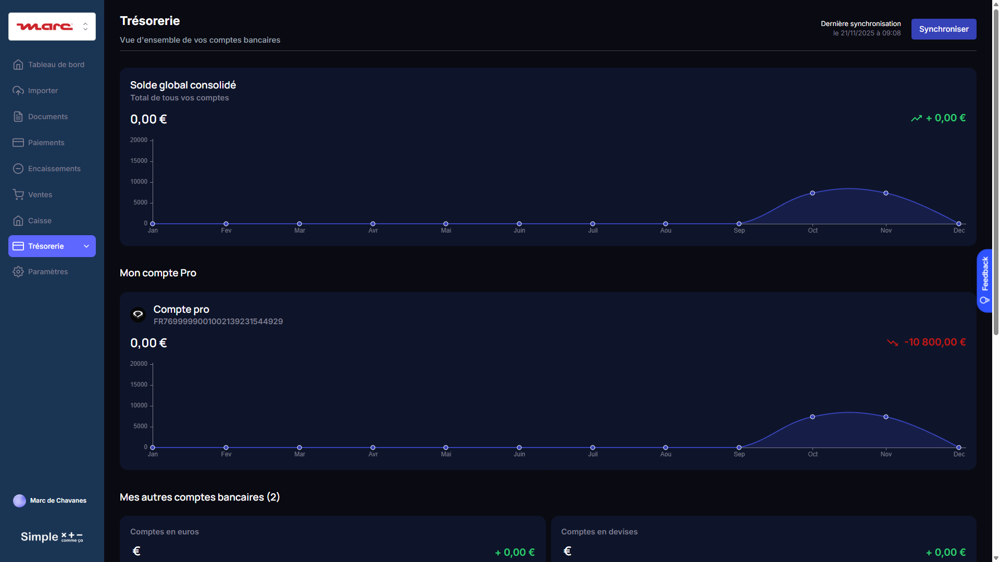

En tant qu'utilisateur Société ou Agence, je peux

* Voir le module **Trésorerie** dans le menu principal du portail
* Voir la **Vue d'ensemble** de tous mes comptes bancaires :
  * Solde global consolidé (somme de tous les comptes)
  * Variation mensuelle (vert si positif, rouge si négatif)
  * Graphique annuel de l'évolution du solde
* Voir le détail du **Compte Pro** :
  * IBAN affiché
  * Solde actuel
  * Variation mensuelle
  * Graphique annuel
* Voir les **autres comptes bancaires** regroupés :
  * Comptes en euros
  * Comptes en devises
* Voir la **date de dernière synchronisation**
* Cliquer sur **Synchroniser** pour mettre à jour les données

---

### **Portail / Trésorerie / Comptes Bancaires**

📸 **Screenshot:** [`tresorerie-comptes-bancaires-1920.png`](./screenshots/tresorerie-comptes-bancaires-1920.png)
**URL:** `/version-test/societe?tab=comptes&subtab=comptes_bancaires`

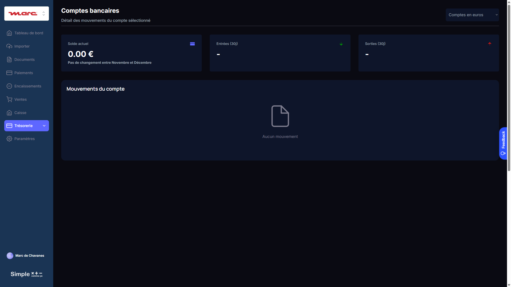

En tant qu'utilisateur Société ou Agence, je peux

* Voir le module Trésorerie dans le menu principal du portail
* **À l'ouverture de la page**, le système synchronise automatiquement les données :
  * Récupère les dernières transactions depuis Inqom (`GET /entry-lines`)
  * Recalcule les soldes immédiatement
  * Un loader s'affiche pendant la synchronisation : "Synchronisation en cours..."
* Sélectionner un compte bancaire dans un menu déroulant
  * Le menu déroulant affiche uniquement les comptes activés par l'Agence (voir Paramètres > Comptes Bancaires)
  * Le format d'affichage est : "{Nom de la banque} - {Numéro de compte}" (ex: "Société Générale - 512")
  * Le premier compte de la liste est sélectionné par défaut
* Voir le **solde actuel** du compte sélectionné
  * Le solde est **recalculé immédiatement** à chaque transaction : Solde initial + Σ Débits - Σ Crédits depuis la date du solde initial
  * Un indicateur affiche la date de dernière mise à jour
  * Un bouton **"Actualiser"** permet de relancer manuellement la synchronisation Inqom
* Voir les **entrées des 30 derniers jours** (total des virements entrants)
  * Somme des montants au débit sur le compte bancaire sur les 30 derniers jours
  * Affiché en vert avec un signe +
* Voir les **sorties des 30 derniers jours** (total des paiements sortants)
  * Somme des montants au crédit sur le compte bancaire sur les 30 derniers jours
  * Affiché en rouge avec un signe -
* Voir la **liste des mouvements** du compte sélectionné
  * Colonnes affichées : Date, Libellé, Montant
  * Les entrées (débit) sont affichées en vert avec un signe +
  * Les sorties (crédit) sont affichées en rouge avec un signe -
  * Les mouvements sont triés par date décroissante (plus récent en premier)
  * Pagination si plus de 50 mouvements

*Note : Si aucun compte bancaire n'est activé, un message invite l'utilisateur Agence à configurer les comptes dans Paramètres.*

![][maquette_tresorerie]

```
┌─────────────────────────────────────────────────────────────────────┐
│  TRÉSORERIE                                                          │
├─────────────────────────────────────────────────────────────────────┤
│                                                                      │
│  Compte bancaire: [▼ Société Générale - 512        ]                │
│                                                                      │
│  ┌──────────────┐  ┌──────────────┐  ┌──────────────┐               │
│  │ SOLDE ACTUEL │  │ ENTRÉES 30J  │  │ SORTIES 30J  │               │
│  │  +26 227 €   │  │  +45 800 €   │  │  -32 150 €   │               │
│  └──────────────┘  └──────────────┘  └──────────────┘               │
│                                                                      │
│  ─────────────────────────────────────────────────────────────────  │
│  MOUVEMENTS DU COMPTE                             [ Actualiser ]    │
│  ─────────────────────────────────────────────────────────────────  │
│                                                                      │
│  Date       │ Libellé                              │ Montant         │
│  ───────────┼──────────────────────────────────────┼─────────────── │
│  04/12/2025 │ VIREMENT RECU MARINA PLV             │ +7 500,00 €    │
│  03/12/2025 │ PRELEVEMENT URSSAF                   │ -6 407,00 €    │
│  02/12/2025 │ VIR PERM MARINA PLV                  │ -5 000,00 €    │
│  01/12/2025 │ VIREMENT RECU MARINA MULTI           │ +3 900,00 €    │
│  ...        │ ...                                  │ ...            │
│                                                                      │
│  Dernière mise à jour : 04/12/2025 14:32                            │
└─────────────────────────────────────────────────────────────────────┘
```

---

### **Portail / Paramètres / Comptes Bancaires**

*Ce sous-onglet n'est visible que par les utilisateurs Agence*

En tant qu'utilisateur Agence, je peux

* Accéder à l'onglet **Paramètres > Comptes Bancaires** pour la société sélectionnée
* Voir la liste de tous les comptes bancaires (512*) récupérés depuis Inqom
  * La liste affiche : Numéro de compte, Nom du compte, Nombre de transactions
  * Les comptes avec des transactions sont mis en avant (badge indiquant le nombre)
  * Les comptes sont affichés dans l'ordre hiérarchique (512, puis 5120, 5121, etc.)
* **Activer ou désactiver** un compte bancaire pour l'affichage dans le module Trésorerie
  * Je coche la case à côté du compte pour l'activer
  * Je décoche la case pour le désactiver
  * Par défaut, tous les comptes sont désactivés (non cochés)
* **Définir le solde initial** pour chaque compte que j'active
  * Le solde initial est **obligatoire** pour activer un compte
  * Si je coche un compte sans solde initial, une popup s'ouvre pour me demander de le saisir
  * Je dois renseigner :
    * La **date du solde** (date à laquelle j'ai relevé ce solde sur mon relevé bancaire)
    * Le **montant du solde** à cette date
  * *Astuce affichée : "Relevez le solde sur votre relevé bancaire à une date précise, idéalement au 1er janvier ou au début de votre exercice comptable."*
* **Modifier le solde initial** d'un compte déjà activé
  * Je clique sur le montant ou la date pour ouvrir la popup de modification
  * La modification recalcule automatiquement le solde actuel
* Cliquer sur **Enregistrer** pour sauvegarder mes modifications
  * Une notification grille-pain confirme "Les paramètres ont été enregistrés"
  * Les comptes activés apparaissent désormais dans le dropdown du module Trésorerie

*Note : La synchronisation des comptes depuis Inqom se fait automatiquement lors de la connexion au logiciel comptable, ou manuellement via le bouton "Synchroniser les comptes".*

![][maquette_parametres_comptes]

```
┌─────────────────────────────────────────────────────────────────────┐
│  PARAMÈTRES > COMPTES BANCAIRES                                      │
├─────────────────────────────────────────────────────────────────────┤
│                                                                      │
│  Sélectionnez les comptes à afficher dans le module Trésorerie :    │
│                                                                      │
│  ┌─────────────────────────────────────────────────────────────────┐│
│  │      │ Compte                        │ Solde initial │ Date     ││
│  │ ─────┼───────────────────────────────┼───────────────┼──────────││
│  │  ☑   │ 512 - Banques (SG)       435  │ [  25 000 € ] │ 01/01/25 ││
│  │  ☑   │ 5120 - SG                 49  │ [   5 000 € ] │ 01/10/25 ││
│  │  ☐   │ 5121 - Comptes en euros    0  │ [         € ] │          ││
│  │  ☐   │ 512101 - BPRP              6  │ [         € ] │          ││
│  │  ☐   │ 5121BPRP - Banque BPRP     0  │ [         € ] │          ││
│  │  ☐   │ 5121SOCIETEGENERALE1       0  │ [         € ] │          ││
│  │  ☐   │ 5124 - Comptes en devises  0  │ [         € ] │          ││
│  └─────────────────────────────────────────────────────────────────┘│
│                                                                      │
│  [ Synchroniser les comptes ]                    [ Enregistrer ]    │
│                                                                      │
└─────────────────────────────────────────────────────────────────────┘
```

---

### **Popup : Définir le solde initial**

En tant qu'utilisateur Agence, lorsque j'active un compte sans solde initial, je vois

* Une popup qui s'ouvre avec le titre "Définir le solde initial"
* Le nom du compte concerné (ex: "512 - Banques (Société Générale)")
* Un champ **Date du solde** (datepicker)
  * Par défaut : 1er janvier de l'année en cours
  * Format : JJ/MM/AAAA
* Un champ **Solde à cette date** (montant en euros)
  * Champ numérique avec formatage monétaire
  * Peut être positif ou négatif
* Un texte explicatif : "Le solde actuel sera calculé automatiquement : Solde initial + Σ Débits - Σ Crédits depuis cette date"
* Boutons **Annuler** et **Enregistrer**
  * Annuler : ferme la popup sans sauvegarder, décoche le compte
  * Enregistrer : sauvegarde le solde initial et active le compte

```
┌─────────────────────────────────────────────────────────────────────┐
│  DÉFINIR LE SOLDE INITIAL                                            │
├─────────────────────────────────────────────────────────────────────┤
│                                                                      │
│  Compte : 512 - Banques (Société Générale)                          │
│                                                                      │
│  Relevez le solde sur votre relevé bancaire à une date précise.     │
│                                                                      │
│  Date du solde :     [ 01/01/2025      ]                            │
│                                                                      │
│  Solde à cette date : [    25 000,00   ] €                          │
│                                                                      │
│  ─────────────────────────────────────────────────────────────────  │
│                                                                      │
│  Le solde actuel sera calculé ainsi :                               │
│  Solde actuel = Solde initial + Débits - Crédits (depuis la date)  │
│                                                                      │
│                           [ Annuler ]  [ Enregistrer ]              │
│                                                                      │
└─────────────────────────────────────────────────────────────────────┘
```

---

### **Comportement : Synchronisation en cours**

En tant qu'utilisateur Société ou Agence, lorsque je clique sur "Rafraîchir"

* Le bouton "Rafraîchir" devient inactif (grisé)
* Un indicateur de chargement s'affiche : "Synchronisation en cours..."
* Le système récupère tous les mouvements depuis la date du solde initial
  * Si plus de 1000 mouvements, le système pagine automatiquement (voir Backend Workflow)
* Une fois terminé :
  * Le solde actuel est mis à jour
  * Les totaux entrées/sorties 30j sont recalculés
  * La liste des mouvements est rafraîchie
  * La date de "Dernière mise à jour" est actualisée
  * Une notification grille-pain confirme "Synchronisation terminée"

```
┌──────────────────────────────────────────────────────────────────┐
│  SOLDE ACTUEL                                                     │
│                                                                   │
│  ⏳ Synchronisation en cours...                                  │
│     Veuillez patienter                                           │
│                                                                   │
└──────────────────────────────────────────────────────────────────┘
```

---

## Nouvelle table Bubble : Compte_Bancaire_Inqom

| Champ | Type | Description | Exemple |
|-------|------|-------------|---------|
| `account_number` | text | Numéro de compte Inqom | "512", "5120" |
| `name` | text | Nom du compte Inqom | "Banques", "SG" |
| `bank_name` | text | Nom de la banque (saisi manuellement ou déduit) | "Société Générale" |
| `iban` | text | IBAN (optionnel, saisi manuellement) | "FR76..." |
| `bic` | text | BIC (optionnel, saisi manuellement) | "SOGEFRPP" |
| `is_visible` | boolean | Affiché dans dropdown Trésorerie | true/false |
| `is_impactable` | boolean | Compte utilisable pour écritures | true/false |
| `parent_account` | text | Compte parent (hiérarchie) | "512" |
| `transaction_count` | number | Nombre de transactions (cache) | 435 |
| `current_balance` | number | Solde actuel (calculé) | 26227.53 |
| `last_sync` | date | Dernière synchronisation | 04/12/2025 |
| `Society` | Society | Lien vers la société | - |
| `journal_id` | number | ID du journal bancaire associé | 317121 |
| **`initial_balance`** | number | **Solde initial saisi par l'utilisateur** | 25000.00 |
| **`initial_balance_date`** | date | **Date du solde initial** | 01/01/2025 |

### Règles métier

| Règle | Description |
|-------|-------------|
| **Visibilité par défaut** | `is_visible = false` pour les nouveaux comptes |
| **Comptes recommandés** | Suggérer les comptes avec `transaction_count > 0` |
| **Hiérarchie** | Afficher en arbre si `parent_account` renseigné |
| **Accès** | Seuls les utilisateurs **Agence** peuvent modifier la visibilité |
| **Solde initial obligatoire** | Un compte ne peut être activé (`is_visible = true`) que si `initial_balance` et `initial_balance_date` sont renseignés |

---

## Calcul du solde actuel (avec solde initial)

### Formule

```
Solde actuel = Solde initial
             + Σ Débits (entry-lines depuis date initiale)
             - Σ Crédits (entry-lines depuis date initiale)
```

### Exemple concret

```
Compte : 512 - Société Générale
─────────────────────────────────────────────────────────

Solde initial :     25 000,00 €  (au 01/01/2025)

Mouvements depuis le 01/01/2025 :
├── 08/01 : +7 500€ (VIREMENT RECU MARINA PLV)
├── 08/01 : +3 900€ (VIREMENT RECU MARINA MULTI)
├── 10/01 : -5 000€ (VIR PERM MARINA PLV)
├── 16/01 : -10 800€ (PRELEVEMENT URSSAF)
└── ...

Calcul :
  Σ Débits  = 1 128 667,45 €
  Σ Crédits = 1 102 439,92 €

Solde actuel = 25 000 + 1 128 667,45 - 1 102 439,92
             = 51 227,53 €
```

### Workflow de calcul dans Bubble

```
1. Récupérer entry-lines depuis Inqom :
   GET /entry-lines?journalId={journalBQId}&startDate={initial_balance_date}&endDate={today}

2. Filtrer côté client :
   entries_512 = entries.filter(e => e.AccountNumber == account_number)

3. Calculer les totaux :
   total_debits = entries_512.sum(e => e.DebitAmount)
   total_credits = entries_512.sum(e => e.CreditAmount)

4. Appliquer la formule :
   current_balance = initial_balance + total_debits - total_credits

5. Stocker dans Bubble :
   UPDATE Compte_Bancaire_Inqom
   SET current_balance = {result}, last_sync = NOW()
```

### Pseudo-code Bubble (Backend Workflow)

```javascript
// Triggered: On page load OR manual sync button

// 1. Get initial balance info
let initial_balance = Current_Compte.initial_balance
let initial_date = Current_Compte.initial_balance_date
let account_number = Current_Compte.account_number

// 2. Call Inqom API
let entries = API_Inqom_GetEntryLines(
    journalId: Current_Compte.journal_id,
    startDate: initial_date,
    endDate: Current date/time
)

// 3. Filter for this account
let account_entries = entries.filter(
    item => item.AccountNumber == account_number
)

// 4. Calculate
let total_debits = account_entries.sum(DebitAmount)
let total_credits = account_entries.sum(CreditAmount)
let current_balance = initial_balance + total_debits - total_credits

// 5. Update Bubble
Current_Compte.current_balance = current_balance
Current_Compte.last_sync = Current date/time
```

### Affichage dans Trésorerie

```
┌──────────────────────────────────────────────────────────────────┐
│  SOLDE ACTUEL                                                     │
│                                                                   │
│  51 227,53 €                                                     │
│                                                                   │
│  Calculé à partir du solde initial de 25 000,00 €                │
│  au 01/01/2025 + mouvements depuis cette date                    │
│                                                                   │
│  Dernière mise à jour : 04/12/2025 14:32                         │
│                                                   [ 🔄 Refresh ] │
└──────────────────────────────────────────────────────────────────┘
```

---

## ⚠️ LIMITE API INQOM : 1000 entry-lines par appel

### Découverte (tests du 04/12/2025)

| Test | Résultat |
|------|----------|
| Journal BQ seul (2024-2025) | 982 ✅ |
| Tous journaux (1 an) | 1000 (tronqué!) ❌ |
| Paramètre `page=2` | ✅ Fonctionne |
| `TotalPages` / `TotalCount` | ❌ Non fournis |

### Règle de pagination

```
SI response.EntryLines.count = 1000 ALORS
    Il y a une page suivante → appeler page+1
SINON
    C'est la dernière page
```

---

## Backend Workflow Bubble.io : Pagination récursive

### Workflow 1 : `API_Sync_Bank_Balance` (déclencheur)

**Type:** Backend Workflow
**Déclencheur:** Bouton "Refresh" ou Scheduled (quotidien)

```
┌─────────────────────────────────────────────────────────────────────┐
│  Backend Workflow: "API_Sync_Bank_Balance"                          │
├─────────────────────────────────────────────────────────────────────┤
│                                                                      │
│  Paramètre:                                                          │
│  - compte (Compte_Bancaire_Inqom)                                   │
│                                                                      │
│  Step 1: Reset du compte avant calcul                               │
│          Make changes to compte:                                    │
│          - sync_in_progress = yes                                   │
│          - temp_total_debit = 0                                     │
│          - temp_total_credit = 0                                    │
│                                                                      │
│  Step 2: Schedule API Workflow                                      │
│          Workflow: "API_Fetch_Bank_Entries_Page"                    │
│          - compte: compte                                           │
│          - page: 1                                                  │
│                                                                      │
└─────────────────────────────────────────────────────────────────────┘
```

### Workflow 2 : `API_Fetch_Bank_Entries_Page` (récursif)

**Type:** Backend Workflow (API Workflow)
**Récursif:** Oui, s'appelle lui-même si page suivante existe

```
┌─────────────────────────────────────────────────────────────────────┐
│  Backend Workflow: "API_Fetch_Bank_Entries_Page"                    │
├─────────────────────────────────────────────────────────────────────┤
│                                                                      │
│  Paramètres:                                                         │
│  - compte (Compte_Bancaire_Inqom)                                   │
│  - page (number)                                                    │
│                                                                      │
│  ═══════════════════════════════════════════════════════════════    │
│  Step 1: API Call - Inqom Get Entry Lines                           │
│  ═══════════════════════════════════════════════════════════════    │
│                                                                      │
│  URL: https://wa-fred-accounting-services-prod.azurewebsites.net    │
│       /v1/dossiers/[dossierId]/entry-lines                          │
│                                                                      │
│  Paramètres:                                                         │
│  - journalId: compte's journal_id                                   │
│  - startDate: compte's initial_balance_date:formatted as YYYY-MM-DD │
│  - endDate: Current date/time:formatted as YYYY-MM-DD               │
│  - page: page                                                       │
│                                                                      │
│  → Stocker résultat dans: api_result                                │
│                                                                      │
│  ═══════════════════════════════════════════════════════════════    │
│  Step 2: Filtrer les entry-lines du compte 512*                     │
│  ═══════════════════════════════════════════════════════════════    │
│                                                                      │
│  entries_this_account = api_result's EntryLines:filtered            │
│      Constraint: AccountNumber = compte's account_number            │
│                                                                      │
│  ═══════════════════════════════════════════════════════════════    │
│  Step 3: Calculer les totaux de cette page                          │
│  ═══════════════════════════════════════════════════════════════    │
│                                                                      │
│  page_debit = entries_this_account:each item's DebitAmount:sum      │
│  page_credit = entries_this_account:each item's CreditAmount:sum    │
│                                                                      │
│  ═══════════════════════════════════════════════════════════════    │
│  Step 4: Accumuler dans le compte                                   │
│  ═══════════════════════════════════════════════════════════════    │
│                                                                      │
│  Make changes to compte:                                            │
│  - temp_total_debit = compte's temp_total_debit + page_debit        │
│  - temp_total_credit = compte's temp_total_credit + page_credit     │
│                                                                      │
│  ═══════════════════════════════════════════════════════════════    │
│  Step 5: Condition - Y a-t-il une page suivante ?                   │
│  ═══════════════════════════════════════════════════════════════    │
│                                                                      │
│  ONLY WHEN: api_result's EntryLines:count = 1000                    │
│                                                                      │
│  → Schedule API Workflow: "API_Fetch_Bank_Entries_Page"             │
│    - compte: compte                                                 │
│    - page: page + 1                                                 │
│                                                                      │
│  ═══════════════════════════════════════════════════════════════    │
│  Step 6: Condition - C'est la dernière page                         │
│  ═══════════════════════════════════════════════════════════════    │
│                                                                      │
│  ONLY WHEN: api_result's EntryLines:count < 1000                    │
│                                                                      │
│  → Make changes to compte:                                          │
│    - current_balance = compte's initial_balance                     │
│                      + compte's temp_total_debit                    │
│                      - compte's temp_total_credit                   │
│    - last_sync = Current date/time                                  │
│    - sync_in_progress = no                                          │
│    - temp_total_debit = (clear)                                     │
│    - temp_total_credit = (clear)                                    │
│                                                                      │
└─────────────────────────────────────────────────────────────────────┘
```

### Schéma du flux récursif

```
┌──────────────────┐
│ Bouton Refresh   │
└────────┬─────────┘
         │
         ▼
┌──────────────────────────────┐
│ API_Sync_Bank_Balance        │
│ - Reset temp_total = 0       │
│ - Lance page 1               │
└────────┬─────────────────────┘
         │
         ▼
┌──────────────────────────────┐
│ API_Fetch_Bank_Entries_Page  │◄─────────────────┐
│ page = 1                     │                  │
│ - Appel API                  │                  │
│ - Filtre 512*                │                  │
│ - Cumule débits/crédits      │                  │
│ - count = 1000 ?             │                  │
│   └─ OUI → page + 1 ─────────┼──────────────────┘
│   └─ NON → Calcul final      │
└──────────────────────────────┘
         │
         ▼ (si count < 1000)
┌──────────────────────────────┐
│ Calcul final:                │
│ balance = initial            │
│         + temp_total_debit   │
│         - temp_total_credit  │
└──────────────────────────────┘
```

### Champs temporaires à ajouter (table Compte_Bancaire_Inqom)

| Champ | Type | Usage |
|-------|------|-------|
| `sync_in_progress` | boolean | Indique si une sync est en cours |
| `temp_total_debit` | number | Cumul temporaire des débits |
| `temp_total_credit` | number | Cumul temporaire des crédits |

### Configuration API Connector

```
┌─────────────────────────────────────────────────────────────────────┐
│  API Connector: Inqom_GetEntryLines                                 │
├─────────────────────────────────────────────────────────────────────┤
│                                                                      │
│  Name: Inqom_GetEntryLines                                          │
│  Use as: Action                                                      │
│                                                                      │
│  URL: https://wa-fred-accounting-services-prod.azurewebsites.net    │
│       /v1/dossiers/[dossierId]/entry-lines                          │
│                                                                      │
│  Method: GET                                                         │
│                                                                      │
│  Headers:                                                            │
│  - Authorization: Bearer [token]                                    │
│                                                                      │
│  Parameters:                                                         │
│  - dossierId (path) : <dossierId>                                   │
│  - journalId (query) : <journalId>                                  │
│  - startDate (query) : <startDate>                                  │
│  - endDate (query) : <endDate>                                      │
│  - page (query) : <page>                                            │
│                                                                      │
│  ─────────────────────────────────────────────────────────────────  │
│  Response parsing:                                                   │
│                                                                      │
│  EntryLines (list):                                                  │
│  - Id (number)                                                       │
│  - AccountNumber (text)                                              │
│  - DebitAmount (number)                                              │
│  - CreditAmount (number)                                             │
│  - Label (text)                                                      │
│  - Entry.Date (date)                                                 │
│                                                                      │
└─────────────────────────────────────────────────────────────────────┘
```

### Gestion de l'affichage pendant la sync

```
┌──────────────────────────────────────────────────────────────────┐
│  SOLDE ACTUEL                                                     │
│                                                                   │
│  [SI sync_in_progress = yes]                                     │
│  ┌────────────────────────────────────────────────────────────┐  │
│  │  ⏳ Synchronisation en cours...                             │  │
│  │     Veuillez patienter                                      │  │
│  └────────────────────────────────────────────────────────────┘  │
│                                                                   │
│  [SINON]                                                         │
│  51 227,53 €                                                     │
│  Dernière mise à jour : 04/12/2025 14:32                         │
│                                                   [ 🔄 Refresh ] │
│                                                                   │
└──────────────────────────────────────────────────────────────────┘
```

---

## Hiérarchie des comptes bancaires (Exemple réel BONIATZIS)

```
512 - Banques [COMPTE PRINCIPAL]                 ✅ 435 transactions, Solde +26 227€
├── 5120 - SG (Société Générale)                 ✅ 49 transactions, Solde -10 303€
│
5121 - Comptes en euros [PARENT]                 ❌ 0 transactions
├── 512101 - BPRP (Banque Populaire)             ⚠️ 6 transactions, Solde -56€
├── 5121BPRP - Banque BPRP                       ❌ 0 transactions
├── 5121SOCIETEGENERALE1 - Société Générale      ❌ 0 transactions
│
5124 - Comptes en devises                        ❌ 0 transactions
```

**Recommandation :** Pour ce dossier, activer uniquement `512` et `5120` (comptes opérationnels).

## Endpoints Chift utilisés actuellement

### 1. Récupération des comptes bancaires

```
GET https://api.chift.eu/consumers/{consumer_id}/accounting/bank-accounts
```

**Réponse Chift attendue:**
```json
{
  "items": [
    {
      "id": "BA-001",
      "name": "Compte Courant BNPP",
      "account_number": "5121",
      "iban": "FR76XXXXXXXXXXXXXXXXXX",
      "bic": "BNPAFRPP",
      "bank_name": "BNP Paribas",
      "balance": 15420.50,
      "currency": "EUR",
      "folder_id": "80548"
    }
  ]
}
```

### 2. Récupération des transactions bancaires

```
GET https://api.chift.eu/consumers/{consumer_id}/accounting/bank-transactions
```

**Réponse Chift attendue:**
```json
{
  "items": [
    {
      "id": "TRX-001",
      "date": "2025-12-03",
      "description": "VIREMENT DE CLIENT DURAND",
      "amount": 1500.00,
      "type": "credit",
      "bank_account_id": "BA-001",
      "balance_after": 16920.50,
      "reference": "VIR-202512-001"
    },
    {
      "id": "TRX-002",
      "date": "2025-12-02",
      "description": "PAIEMENT FOURNISSEUR MH FRANCE",
      "amount": -500.00,
      "type": "debit",
      "bank_account_id": "BA-001",
      "balance_after": 15420.50,
      "reference": "PAY-202512-001"
    }
  ]
}
```

### 3. Création d'une transaction (POST)

```
POST https://api.chift.eu/consumers/{consumer_id}/accounting/bank-transactions
```

**Body Chift:**
```json
{
  "date": "2025-12-03",
  "description": "Paiement facture FA-001",
  "amount": -120.00,
  "bank_account_id": "BA-001",
  "reference": "VIR-001"
}
```

---

## Équivalents Inqom

### 1. Comptes bancaires → Comptes 512*

**Endpoint Inqom:**
```
GET https://wa-fred-accounting-services-prod.azurewebsites.net/v1/dossiers/{dossierId}/accounts?accountNumberPrefix=512&accountType=All
```

**Réponse Inqom (testée):**
```json
[
  {
    "Number": "512",
    "Name": "Banques",
    "IsImpactable": false,
    "IsDivisible": true
  },
  {
    "Number": "5121",
    "Name": "Banque - Compte courant BNP",
    "IsImpactable": true,
    "ParentAccountNumber": "512"
  },
  {
    "Number": "5124",
    "Name": "Banque - Compte épargne",
    "IsImpactable": true,
    "ParentAccountNumber": "512"
  }
]
```

> **⚠️ Limitation Inqom:** Les informations bancaires détaillées (IBAN, BIC, nom banque) ne sont PAS dans l'API.
> Ces données doivent être stockées dans Bubble (table Compte).

### 2. Transactions bancaires → Entry-Lines journal BQ

**Endpoint Inqom: ✅ VÉRIFIÉ**
```
GET https://wa-fred-accounting-services-prod.azurewebsites.net/v1/dossiers/{dossierId}/entry-lines?journalId={journalBQId}&startDate=2025-01-01&endDate=2025-12-31
```

> ⚠️ **IMPORTANT:** Utiliser `journalId` (numérique) et NON `journalCode` (le filtre par code ne fonctionne pas).
> Exemple: `journalId=948157` pour le journal BQ

**Réponse Inqom (testée le 04/12/2025):**
```json
{
  "EntryLines": [
    {
      "TypeOfChange": "Update",
      "Id": 2105616480,
      "Label": "REGLEMENT FOURNISSEUR TEST MARC",
      "DebitAmount": 120.00000,
      "CreditAmount": 0.0,
      "LetterId": 136341101,
      "Letter": "A",
      "LetterDate": "2025-12-03T00:00:00Z",
      "Currency": "EUR",
      "Entry": {
        "Id": 570859689,
        "Date": "2025-12-03T00:00:00Z"
      },
      "AccountNumber": "4011TESTMARC",
      "Journal": {
        "Id": 948157,
        "Code": "BQ"
      },
      "AccountingDocument": {
        "Reference": "REG-MARC-001"
      }
    },
    {
      "TypeOfChange": "Update",
      "Id": 2105616481,
      "Label": "REGLEMENT PAR BANQUE",
      "DebitAmount": 0.0,
      "CreditAmount": 120.00000,
      "Currency": "EUR",
      "Entry": {
        "Id": 570859689,
        "Date": "2025-12-03T00:00:00Z"
      },
      "AccountNumber": "5121",
      "Journal": {
        "Id": 948157,
        "Code": "BQ"
      },
      "AccountingDocument": {
        "Reference": "REG-MARC-001"
      }
    }
  ],
  "CurrentPage": 1
}
```

> **Interprétation:** Cette écriture représente un paiement fournisseur de 120€ :
> - Ligne 1 : Débit 4011TESTMARC → On solde la dette fournisseur
> - Ligne 2 : Crédit 5121 → Sortie de la banque (paiement effectué)

### 3. Solde bancaire → Calcul depuis Entry-Lines

**Inqom n'a PAS d'endpoint dédié pour le solde.** Il faut le calculer :

**Option A : Via balances (si disponible)**
```
GET https://wa-fred-accounting-services-prod.azurewebsites.net/v1/dossiers/{dossierId}/balances?accountNumbers=5121&endDate=2025-12-31
```

**Option B : Calcul manuel depuis entry-lines**

```
Solde compte 512X = Σ DebitAmount - Σ CreditAmount
```

Pour un compte bancaire (actif), convention PCG :
- **Débit** = Entrée d'argent (virement reçu)
- **Crédit** = Sortie d'argent (paiement effectué)

> **Note comptable:** Pour les comptes de classe 5 (banque), un solde débiteur = solde positif (on a de l'argent).

### 4. Création transaction → POST entries journal BQ

**Endpoint Inqom:**
```
POST https://wa-fred-accounting-services-prod.azurewebsites.net/v1/dossiers/{dossierId}/entries
```

**Body Inqom (paiement fournisseur):**
```json
[
  {
    "JournalId": 948157,
    "Date": "2025-12-03",
    "Document": {
      "Reference": "VIR-001",
      "Date": "2025-12-03"
    },
    "ExternalId": "SCC-TRX-001",
    "Lines": [
      {
        "Label": "Paiement fournisseur MH FRANCE",
        "DebitAmount": 500.00,
        "CreditAmount": 0,
        "Currency": "EUR",
        "AccountNumber": "4011MHFR"
      },
      {
        "Label": "Banque BNP",
        "DebitAmount": 0,
        "CreditAmount": 500.00,
        "Currency": "EUR",
        "AccountNumber": "5121"
      }
    ]
  }
]
```

**Body Inqom (encaissement client):**
```json
[
  {
    "JournalId": 948157,
    "Date": "2025-12-03",
    "Document": {
      "Reference": "ENC-001",
      "Date": "2025-12-03"
    },
    "ExternalId": "SCC-ENC-001",
    "Lines": [
      {
        "Label": "Encaissement client DURAND",
        "DebitAmount": 1500.00,
        "CreditAmount": 0,
        "Currency": "EUR",
        "AccountNumber": "5121"
      },
      {
        "Label": "Client DURAND",
        "DebitAmount": 0,
        "CreditAmount": 1500.00,
        "Currency": "EUR",
        "AccountNumber": "4111DURAND"
      }
    ]
  }
]
```

---

## Mapping des attributs : Transactions bancaires

| Champ Bubble | Attribut Chift | Attribut Inqom | Comment obtenir |
|--------------|----------------|----------------|-----------------|
| id | id | **Entry.Id** ou **Id** (entry-line) | ID de la ligne |
| date | date | **Entry.Date** | Date de l'écriture |
| description | description | **Label** | Libellé de la ligne |
| valeur | amount | **DebitAmount** ou **CreditAmount** | Voir logique ci-dessous |
| type (entrée/sortie) | type | Déduit du compte | Débit 512 = entrée, Crédit 512 = sortie |
| reference | reference | **AccountingDocument.Reference** | Référence du document |
| bank_account_id | bank_account_id | **AccountNumber** (512*) | Numéro compte bancaire |
| solde | balance_after | ❌ Non disponible | Calculer manuellement |

### Logique pour déterminer le type de transaction

```
SI AccountNumber commence par "512" ALORS
    SI DebitAmount > 0 ALORS
        type = "credit" (entrée d'argent)
        valeur = +DebitAmount
    SINON SI CreditAmount > 0 ALORS
        type = "debit" (sortie d'argent)
        valeur = -CreditAmount
    FIN SI
FIN SI
```

---

## Mapping des attributs : Comptes bancaires

| Champ Bubble | Attribut Chift | Attribut Inqom | Comment obtenir |
|--------------|----------------|----------------|-----------------|
| id | id | **Number** (512*) | Numéro compte |
| Nom | name | **Name** | Nom du compte |
| Iban | iban | ❌ Non disponible | Garder dans Bubble |
| Bic | bic | ❌ Non disponible | Garder dans Bubble |
| Bank | bank_name | ❌ Non disponible | Garder dans Bubble |
| Solde | balance | Calculé | Σ Débits - Σ Crédits |
| journal_id | - | **Journal.Id** (BQ) | ID du journal banque |

---

## Calcul du solde bancaire

### Méthode recommandée

1. Récupérer toutes les entry-lines du compte 512X
2. Calculer : `Solde = Σ DebitAmount - Σ CreditAmount`
3. Un résultat positif = solde créditeur (on a de l'argent)

### Exemple de calcul

```
Compte 5121 :
├── Entrée 1 : Débit 1500€, Crédit 0€
├── Entrée 2 : Débit 0€, Crédit 500€
├── Entrée 3 : Débit 3000€, Crédit 0€
└── Entrée 4 : Débit 0€, Crédit 200€

Solde = (1500 + 3000) - (500 + 200) = 4500 - 700 = 3800€
```

### Endpoint pour solde par période

> ⚠️ **Attention:** Le filtre `accountNumber` ne fonctionne pas côté API.
> Récupérer toutes les entry-lines et filtrer côté client.

```
GET /v1/dossiers/{dossierId}/entry-lines?startDate=2025-01-01&endDate=2025-12-31
# Puis filtrer côté client: AccountNumber.startsWith("5121")
```

Puis agréger côté Bubble :
```javascript
solde = entryLines.reduce((acc, line) => {
    return acc + line.DebitAmount - line.CreditAmount;
}, 0);
```

---

## Journaux bancaires Inqom

Les journaux de type "Bank" dans Inqom pour le dossier testé :

| Journal.Id | Journal.Code | Journal.Name | Compte associé |
|------------|--------------|--------------|----------------|
| 948157 | BQ | Journal Banque | 5121 |
| (autre) | BQ2 | 2ème compte banque | 5124 |

> **Recommandation:** Stocker l'association `Journal.Id ↔ Compte 512X ↔ Compte Bubble` pour faciliter les écritures.

---

## Nouveaux champs Bubble recommandés

### Table Compte (existante)

| Champ Bubble (nouveau) | Type | Usage |
|------------------------|------|-------|
| Inqom_journal_id | number | ID journal BQ Inqom |
| Inqom_account_number | text | Compte 512* correspondant |
| Inqom_last_balance | number | Dernier solde calculé |
| Inqom_balance_date | date | Date du dernier calcul |

### Table Transaction (existante)

| Champ Bubble (nouveau) | Type | Usage |
|------------------------|------|-------|
| Inqom_entry_id | number | ID de l'écriture |
| Inqom_entry_line_id | number | ID de la ligne |
| sent_to_inqom | boolean | Envoyé à Inqom? |
| type_transaction | option | "credit" (entrée) / "debit" (sortie) |

---

## ⚠️ LIMITATIONS DÉCOUVERTES (Tests API 04/12/2025)

| Paramètre | Comportement | Workaround |
|-----------|--------------|------------|
| `accountNumberPrefix` | **NE FILTRE PAS** les entry-lines | Filtrer côté client |
| `accountNumber` | **NE FILTRE PAS** les entry-lines | Filtrer côté client |
| `journalCode` | **NE FONCTIONNE PAS** | Utiliser `journalId` (numérique) |
| `startDate` / `endDate` | **OBLIGATOIRES** | Toujours spécifier les dates |

### Filtres qui fonctionnent ✅
- `journalId=948157` → Filtre correctement par journal
- `accountNumberPrefix=512` sur `/accounts` → Fonctionne pour les comptes

### Filtres qui ne fonctionnent pas ❌
- `accountNumberPrefix` sur `/entry-lines` → Retourne toutes les lignes
- `journalCode=BQ` sur `/entry-lines` → Ignoré

---

## Résumé des différences Chift vs Inqom

| Aspect | Chift | Inqom |
|--------|-------|-------|
| **Comptes bancaires** | Endpoint dédié avec IBAN/BIC/solde | Comptes 512* via /accounts (sans IBAN) |
| **Transactions** | Endpoint dédié bank-transactions | Entry-lines filtrées par journal BQ |
| **Solde** | Fourni dans la réponse | À calculer (Σ Débits - Σ Crédits) |
| **Type transaction** | Champ `type` | Déduit du sens (débit/crédit) |
| **Création** | POST bank-transactions | POST entries (journal BQ) |
| **Filtrage API** | Paramètres fiables | ⚠️ Filtrer côté client |

---

## Workflow de synchronisation Trésorerie

### Étape 1 : Récupérer les comptes bancaires
```
GET /v1/dossiers/{dossierId}/accounts?accountNumberPrefix=512&accountType=All
```
→ Mettre à jour table Compte avec Number, Name

### Étape 2 : Récupérer les transactions du journal BQ

> ⚠️ **IMPORTANT (Testé le 04/12/2025):** Les paramètres `startDate` et `endDate` sont **OBLIGATOIRES**.
> Le filtre `accountNumberPrefix` ne filtre PAS les entry-lines. Utiliser `journalId` à la place.

```
GET /v1/dossiers/{dossierId}/entry-lines?journalId={journalBQId}&startDate={dernièreSync}&endDate={aujourd'hui}
```
→ Filtrer côté client les lignes avec `AccountNumber.startsWith("512")`
→ Créer/MAJ table Transaction

**Exemple testé:**
```
GET /v1/dossiers/80548/entry-lines?journalId=948157&startDate=2025-01-01&endDate=2025-12-31
```
Résultat: 2 entry-lines du journal BQ, dont 1 sur compte 5121

### Étape 3 : Calculer les soldes
Pour chaque compte 512X :
```
GET /v1/dossiers/{dossierId}/entry-lines?startDate=2000-01-01&endDate={aujourd'hui}
```
→ Filtrer côté client : `AccountNumber.startsWith("512")`
→ Calculer Σ Débits - Σ Crédits
→ Stocker dans Compte.Inqom_last_balance

**Exemple testé (dossier 80548):**
- Compte 5121: Débit=0€, Crédit=120€ → Solde = -120€ (sortie de trésorerie)

### Étape 4 : Affichage dans Bubble
- Liste des comptes avec solde actuel
- Liste des dernières transactions
- Graphique d'évolution (optionnel)

---

## Améliorations possibles vs Chift

| Amélioration | Description |
|--------------|-------------|
| **Solde temps réel** | Recalculer à chaque affichage (pas de cache Chift) |
| **Historique complet** | Entry-lines donnent tout l'historique comptable |
| **Rapprochement natif** | Lien direct Entry.Id ↔ facture via AccountingDocument |
| **Multi-journaux** | Gérer plusieurs comptes bancaires (BQ, BQ2...) |

---

# 14. CADRAGES FONCTIONNELS V0 - INTÉGRATION INQOM

> **Note :** Cette section contient les cadrages fonctionnels au format V0 (user stories) pour toutes les fonctionnalités liées à l'intégration Inqom. Ces cadrages complètent les informations techniques des sections précédentes.

---

## ***Paiements : Cadrage fonctionnel V0***

### **Portail / Paiements**

📸 **Screenshot:** [`paiements-1920.png`](./screenshots/paiements-1920.png)
**URL:** `/version-test/societe?tab=Paiements`

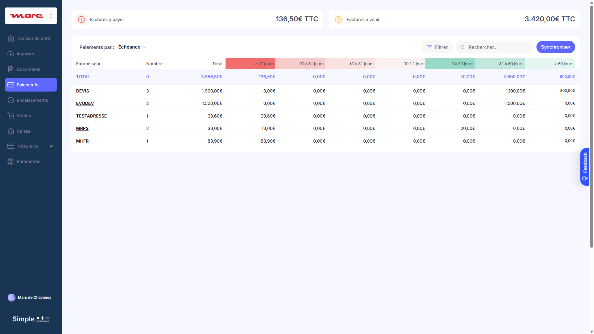

*Les données de cet onglet sont reliées à la société sélectionnée dans le sélecteur de sociétés.*

En tant qu'utilisateur Société ou Agence, je peux

* Voir l'onglet **Paiements** dans le menu principal
* Voir un **tableau récapitulatif** des factures d'achat à payer
  * Une ligne par fournisseur qui a au moins 1 facture à payer
  * Colonnes : Fournisseur, Nombre de factures, Total, colonnes par échéance (échues et non échues)
  * Les factures sont classées par tranches d'échéance :
    * Échues : > 90 jours, 90-61 jours, 60-31 jours, 30-1 jour
    * Non échues : 0-30 jours, 31-60 jours, > 60 jours
  * La dernière ligne affiche les totaux de chaque colonne
* Voir les **KPIs en haut du tableau** :
  * Total des factures échues (en rouge)
  * Total des factures non échues
  * Date de dernière synchronisation
* **Filtrer** le tableau :
  * Switch "N'afficher que les factures à régler par virement" (désactivé par défaut)
n📸 **Screenshot Filtres:** [`paiements-filtres-1920.png`](./screenshots/paiements-filtres-1920.png)

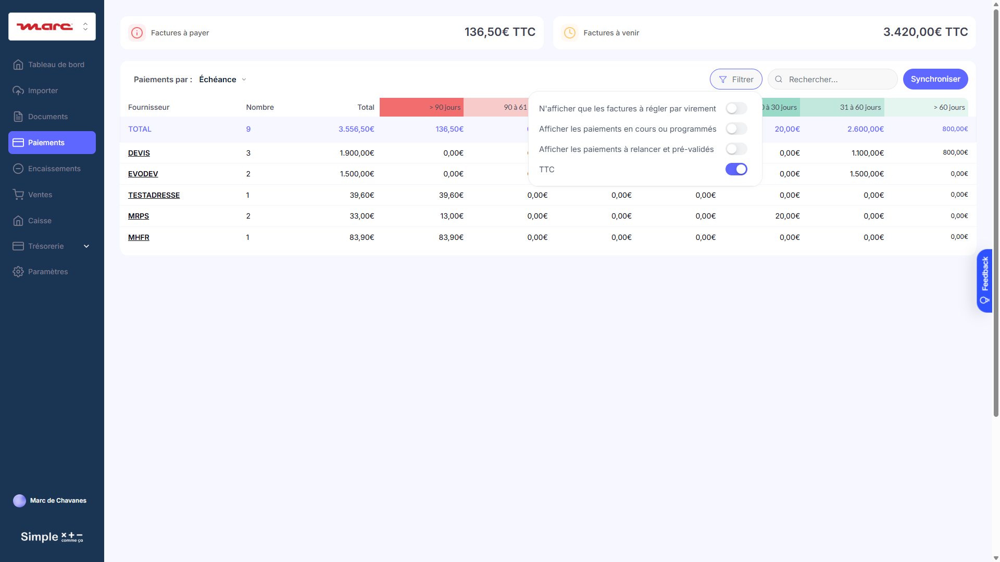

* Cliquer sur **Synchroniser** pour récupérer les factures depuis Inqom
  * Si la société n'est pas connectée à Inqom, un popup m'informe "La société [Nom] n'est pas connectée à un logiciel compta."
  * Si connectée :
    1. Synchronise d'abord les fournisseurs (comptes 401*)
    2. Récupère les factures via `GET /entry-lines` sur le journal Achats (HA)
    3. Pour chaque entry-line sur compte 401* avec CreditAmount > 0 :
       * Si `LetterId = null` → facture non payée → statut "à payer"
       * Si `LetterId ≠ null` → facture payée → statut "payé"
    4. Notification grille-pain "La synchronisation des onglets Paiement et Fournisseurs est terminée."
* Cliquer sur une **cellule du tableau** pour ouvrir le tiroir des factures concernées

*Note : Le statut SCC est déduit du LetterId Inqom : présent = payé, absent = à payer.*

---

### **Tiroir Paiements**

n📸 **Screenshot:** [`paiements-tiroir-factures-1920.png`](./screenshots/paiements-tiroir-factures-1920.png)

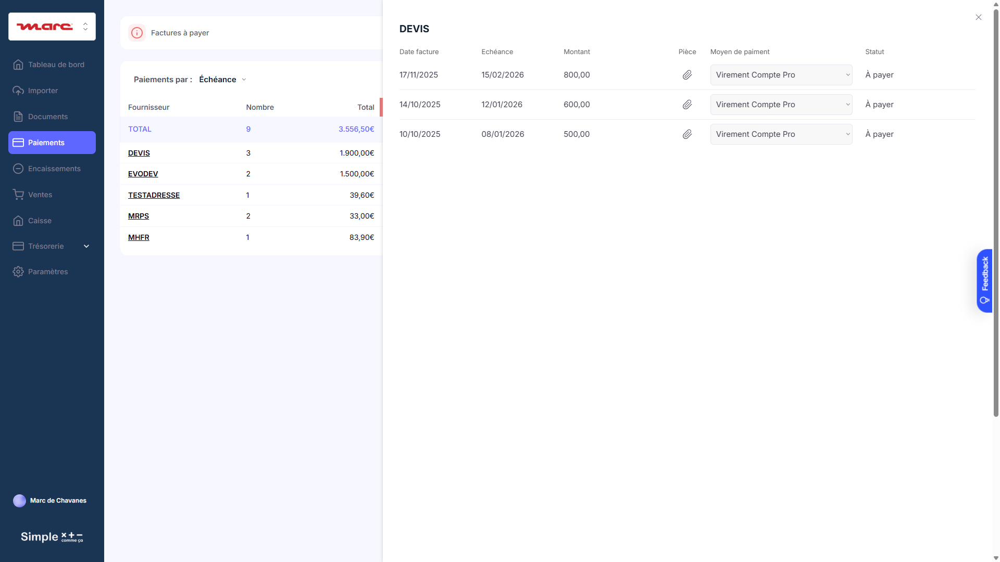

En tant qu'utilisateur Société ou Agence, lorsque j'ouvre le tiroir Paiements, je peux

* Voir la **liste des factures** correspondant à la cellule cliquée
  * Colonnes : Montant, Échéance, Fournisseur (si multi-fournisseurs), Moyen de paiement, Statut
  * Triées par ordre décroissant d'échéance
* Cliquer sur une facture pour **modifier son statut** :
  * Si moyen de paiement = "Virement Compte Pro" et statut = "à payer" :
    * Popup avec options "Dès que possible" ou "À une date ultérieure"
    * Sur confirmation : statut devient "En cours" ou "Programmé pour le [date]"
  * Sinon :
    * Popup permettant de changer le statut entre "à payer" et "bon à payer"
* **Sélectionner plusieurs factures** (multi-sélection) pour les payer en lot
  * Cases à cocher visibles uniquement pour les factures "Virement Compte Pro" avec statut "à payer"
  * Bouton "Payer X€" affiche la somme des montants sélectionnés

---

### **Comportement : Création d'écriture de paiement dans Inqom**

En tant que système, lorsqu'un paiement est confirmé :

* Je crée une **écriture dans le journal Banque (BQ)** via `POST /entries` :
  ```
  Journal BQ (Banque)
  ├── Débit compte 4011XXXX (fournisseur) : solde la dette
  └── Crédit compte 512X (banque) : sortie d'argent
  ```
* Je crée le **lettrage** via `POST /letterings` pour rapprocher :
  * La ligne 401* de la facture d'origine
  * La ligne 401* du règlement
* Le statut de la facture passe à "payé" (car `LetterId` est maintenant renseigné)

---

## ***Encaissements : Cadrage fonctionnel V0***

### **Portail / Encaissements**

📸 **Screenshot:** [`encaissements-1920.png`](./screenshots/encaissements-1920.png)
**URL:** `/version-test/societe?tab=Encaissements`


*Les données de cet onglet sont reliées à la société sélectionnée dans le sélecteur de sociétés.*

En tant qu'utilisateur Société ou Agence, je peux

* Voir l'onglet **Encaissements** dans le menu principal
* Voir un **tableau récapitulatif** des factures de vente à encaisser (échéancier)
  * Une ligne par client qui a au moins 1 facture à percevoir
  * Colonnes : Client, Nombre de factures, Total HT, colonnes par échéance
  * Les avoirs apparaissent comme des montants négatifs
* Voir les **KPIs en haut du tableau** :
  * Total HT à percevoir
  * Total HT impayés (factures échues)
  * Date de dernière synchronisation
* Cliquer sur **Synchroniser** pour récupérer les factures depuis Inqom
  * Si la société n'est pas connectée à Inqom, un popup m'informe "La société [Nom] n'est pas connectée à un logiciel compta."
  * Si connectée :
    1. Synchronise d'abord les clients (comptes 411*)
    2. Récupère les factures via `GET /entry-lines` sur le journal Ventes (VT)
    3. Pour chaque entry-line sur compte 411* avec DebitAmount > 0 :
       * Type = "Facture" si journal VT
       * Type = "Avoir" si montant négatif ou journal AV
       * Si `LetterId = null` → facture non encaissée → statut "à percevoir"
       * Si `LetterId ≠ null` → facture encaissée → statut "encaissé"
    4. Notification grille-pain "La synchronisation des Clients et Encaissements est terminée."
* **Filtrer** le tableau :
  * Switch "Afficher les paiements à relancer et pré-validés"
  * Switch "TTC" (activé par défaut)

📸 **Screenshot Filtres:** [`encaissements-filtres-1920.png`](./screenshots/encaissements-filtres-1920.png)

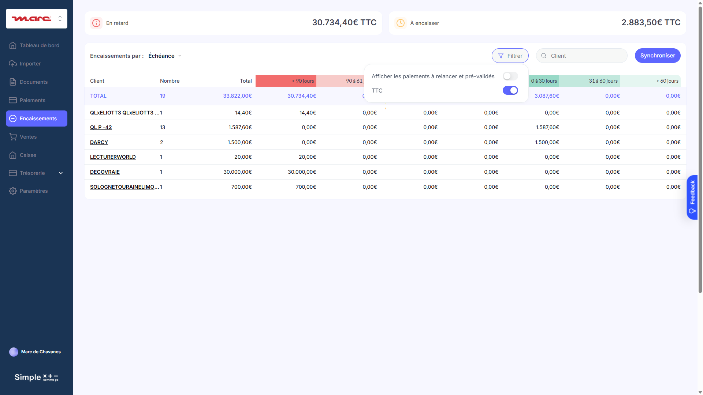

* Cliquer sur une **cellule du tableau** pour voir le détail des factures

---

---

### **Tiroir Encaissements**

📸 **Screenshot:** [`encaissements-tiroir-factures-1920.png`](./screenshots/encaissements-tiroir-factures-1920.png)

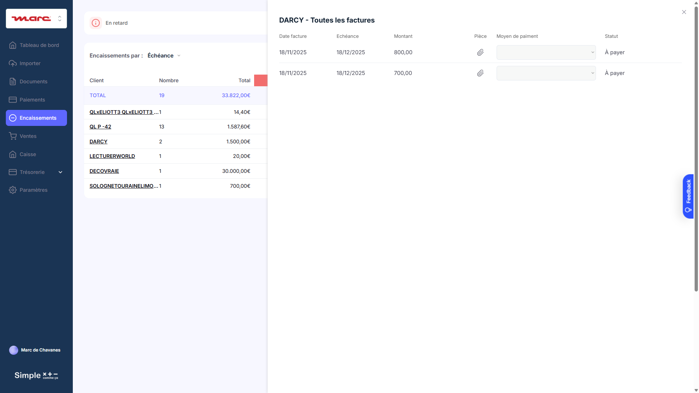

En tant qu'utilisateur Société ou Agence, lorsque je clique sur une cellule du tableau Encaissements, je peux voir le détail des factures avec :
* Date facture, Échéance, Montant, Moyen de paiement, Statut


### **Sous-onglet Clients**

n📸 **Screenshot:** [`ventes-clients-1920.png`](./screenshots/ventes-clients-1920.png)

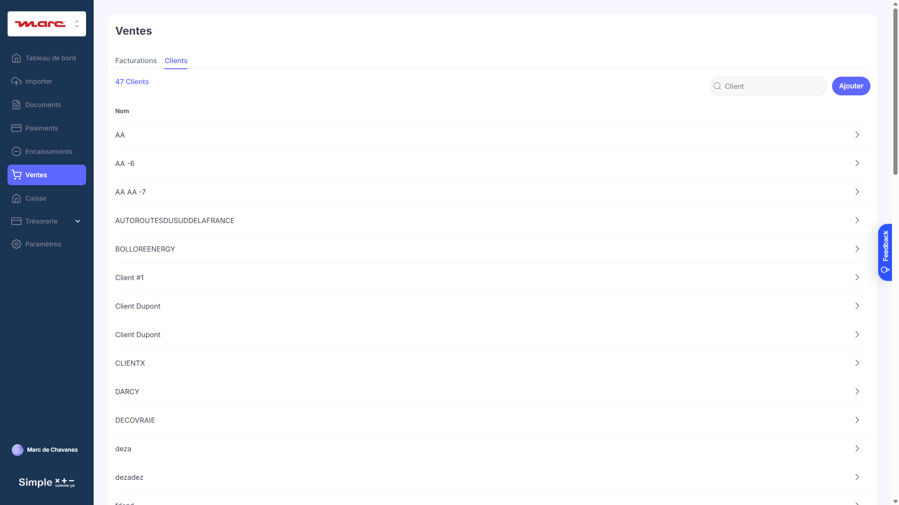

En tant qu'utilisateur Société ou Agence, je peux

* Voir la **liste des clients** synchronisés depuis Inqom (comptes 411*)
  * Rangés par ordre alphabétique
  * Colonnes : Nom, IBAN (oui/non)
* **Rechercher** un client par nom
* Cliquer sur un client pour ouvrir le **tiroir Client** avec les onglets :
  * **Général** : Compte comptable, SIRET, Téléphone, Email, TVA intracom
  * **Adresses** : Liste des adresses (facturation, livraison)
  * **Paiement** : IBAN, BIC, Devise
  * **Factures** : Liste de toutes les factures du client avec statut
n📸 **Screenshot Fiche Client:** [`ventes-fiche-client-detail-1920.png`](./screenshots/ventes-fiche-client-detail-1920.png)

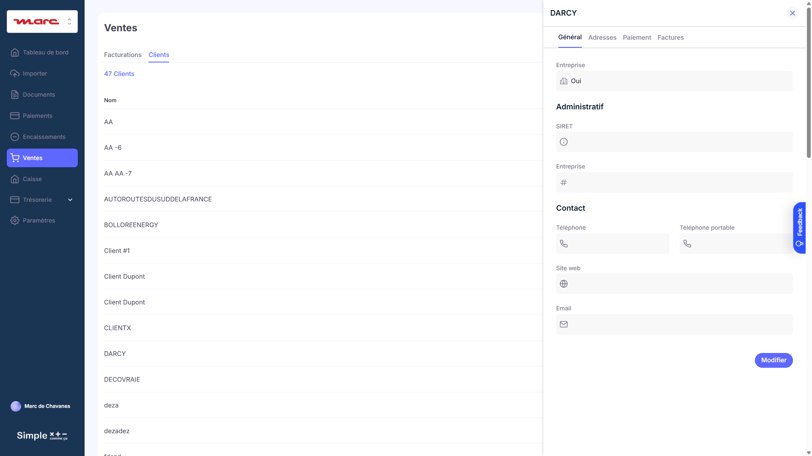

* **Ajouter un client** :
  * Popup avec Nom et Adresse
  * Sur confirmation :
    * Création du compte 411* dans Inqom via `POST /accounts`
    * Enregistrement en BDD Bubble
    * Notification "Le client a été créé"

---

### **Comportement : Enregistrement d'un encaissement dans Inqom**

En tant que système, lorsqu'un encaissement est enregistré :

* Je crée une **écriture dans le journal Banque (BQ)** via `POST /entries` :
  ```
  Journal BQ (Banque)
  ├── Débit compte 512X (banque) : entrée d'argent
  └── Crédit compte 411XXXX (client) : solde la créance
  ```
* Je crée le **lettrage** via `POST /letterings` pour rapprocher :
  * La ligne 411* de la facture d'origine
  * La ligne 411* de l'encaissement
* Le statut de la facture passe à "encaissé" (car `LetterId` est maintenant renseigné)

---

## ***Ventes (Facturation) : Cadrage fonctionnel V0***

### **Portail / Ventes**

📸 **Screenshot:** [`ventes-1920.png`](./screenshots/ventes-1920.png)
**URL:** `/version-test/societe?tab=Ventes`

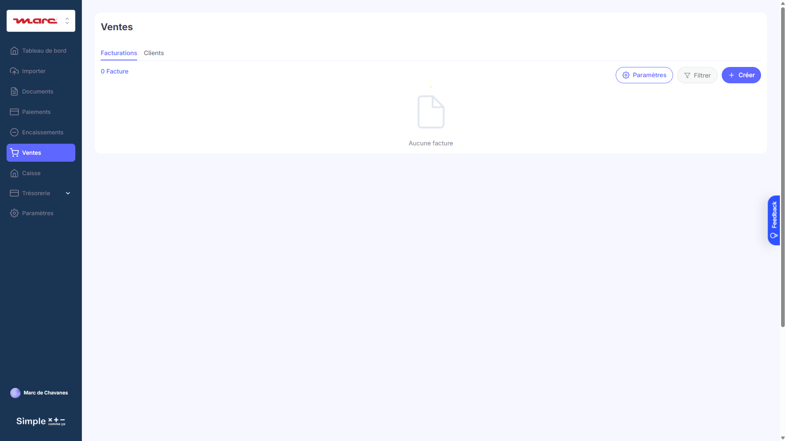

En tant qu'utilisateur Société ou Agence, je peux

* Voir l'onglet **Ventes** dans le menu principal
* Voir la **liste des factures et avoirs** créés depuis l'application
  * Rangées par ordre décroissant de date de création
  * Colonnes : Num., Type (Facture/Avoir), Client, Date, Montant TTC, Statut, Validée le, Envoyée le
* **Créer** une nouvelle facture ou un avoir :
  * Je choisis entre "Facture" ou "Avoir"
  * Je suis redirigé vers l'écran d'édition
* Pour chaque facture, accéder aux **options** :
  * **Modifier** : ouvre l'écran d'édition (grisé si déjà validée)
  * **Ouvrir PDF** : ouvre le PDF dans un nouvel onglet (grisé si non validée)
  * **Envoyer au client** : popup avec destinataire, objet, corps de l'email pré-remplis
* **Rechercher** un client dans la barre de recherche
* Accéder aux **Paramètres de facturation** via la roue crantée

---

### **Écran d'édition de facture**

n📸 **Screenshot:** [`ventes-edition-facture-1920.png`](./screenshots/ventes-edition-facture-1920.png)

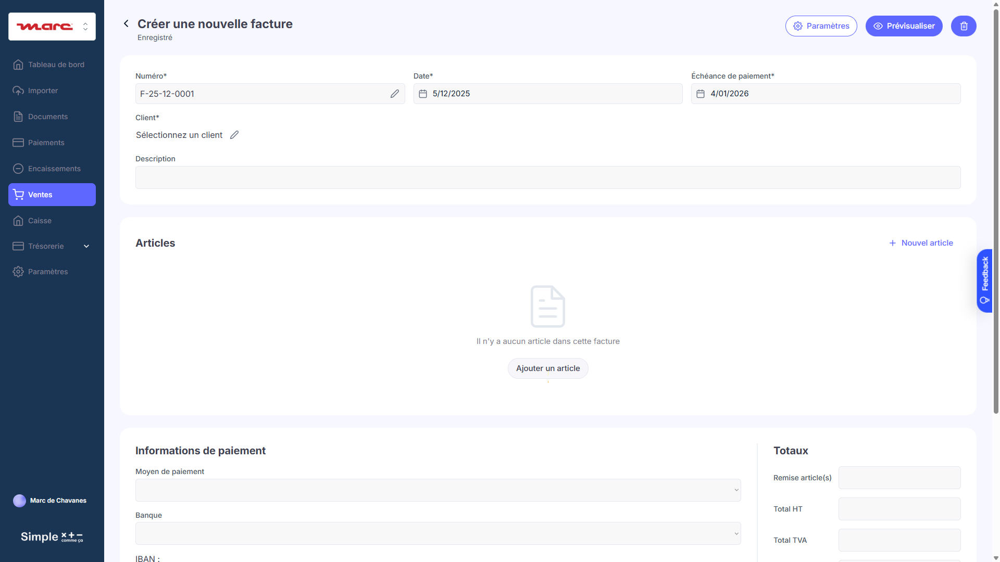

En tant qu'utilisateur Société ou Agence, dans l'écran d'édition, je peux

* Voir le **numéro de facture** généré automatiquement : F-(année)-(mois)-[numéro]
  * "AV" pour les avoirs
  * Premier numéro modifiable si première facture de la société
* Sélectionner une **date d'émission** et une **date d'échéance**
  * L'échéance est calculée automatiquement selon le délai de paiement défini
* Sélectionner un **client** parmi la liste synchronisée depuis Inqom
  * L'adresse du client s'affiche automatiquement
  * Je peux ajouter un nouveau client directement depuis ce popup
* Ajouter des **lignes d'articles** :
  * Code, Libellé, Description, Quantité, Unité, PU HT, Remise, Taux TVA
  * Le Total HT de chaque ligne est calculé automatiquement
n📸 **Screenshot popup ajout article:** [`ventes-ajout-article-popup-1920.png`](./screenshots/ventes-ajout-article-popup-1920.png)

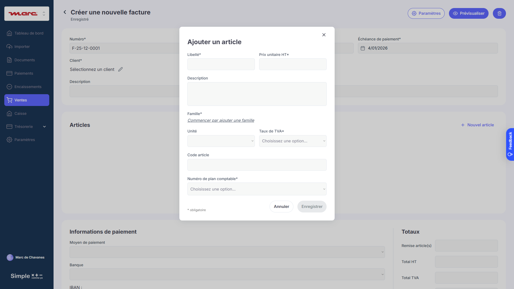

* Voir le **récapitulatif** :
  * Total des remises HT
  * Total HT
  * Total TVA (par taux)
  * Total TTC
* Sélectionner un **compte bancaire** pour les informations de paiement
* Ajouter des **informations complémentaires**
* **Prévisualiser** la facture avant validation
* **Valider** la facture :
  * Le PDF est généré
  * L'écriture comptable est créée dans Inqom (voir ci-dessous)
  * La facture apparaît dans l'échéancier Encaissements

---

### **Comportement : Création d'écriture de vente lors de la validation**

En tant que système, **lorsqu'une facture de vente est validée** :

> **Important** : Contrairement au paiement des factures d'achat (section 9), la validation d'une facture de vente **GÉNÈRE une écriture comptable**.

```
┌─────────────────────────────────────────────────────────────────────────────┐
│  VALIDATION FACTURE DE VENTE → Création écriture comptable                  │
├─────────────────────────────────────────────────────────────────────────────┤
│                                                                             │
│  1. User clique "Valider" sur la facture de vente                           │
│                                                                             │
│  2. Bubble génère le PDF de la facture                                      │
│                                                                             │
│  3. Bubble appelle l'API du logiciel comptable :                            │
│     → Chift : POST /consumers/{id}/accounting/invoices                      │
│     → Inqom : POST /v1/dossiers/{id}/entries                                │
│                                                                             │
│  4. L'écriture est créée dans le journal Ventes (VT)                        │
│                                                                             │
│  5. La facture apparaît dans l'échéancier Encaissements (statut "à encaisser") │
│                                                                             │
└─────────────────────────────────────────────────────────────────────────────┘
```

#### Structure comptable de l'écriture

```
Journal VT (Ventes)
Pour chaque ligne d'article :
├── Crédit compte 7XX (produit) : montant HT de la ligne
├── Crédit compte 44571 (TVA collectée) : montant TVA de la ligne
└── Débit compte 411XXXX (client) : montant TTC total
```

**Règles :**
* L'écriture respecte l'équilibre comptable : Σ Débits = Σ Crédits
* La facture est associée via le champ `Document.Reference` (Inqom) ou `invoice_number` (Chift)
* Le compte 411* du client doit exister dans le plan comptable (synchronisé depuis le logiciel)
* Les comptes TVA (44571, etc.) sont déterminés par la table VAT_Linked (voir section Paramètres TVA)

---

### **API : Création de facture de vente**

#### Chift

```
POST https://api.chift.eu/consumers/{consumer_id}/accounting/invoices
Content-Type: application/json
```

**Payload Chift :**
```json
{
  "invoice_type": "customer_invoice",
  "invoice_number": "F-2025-12-001",
  "date": "2025-12-09",
  "due_date": "2025-12-31",
  "partner_id": "CLI-001",
  "lines": [
    {
      "description": "Prestation de service",
      "quantity": 1,
      "unit_price": 100.00,
      "tax_rate": 20.0,
      "account_code": "706"
    }
  ],
  "currency": "EUR"
}
```

**Réponse Chift :**
```json
{
  "id": "INV-12345",
  "invoice_number": "F-2025-12-001",
  "status": "posted",
  "total": 120.00,
  "untaxed_amount": 100.00,
  "tax_amount": 20.00
}
```

#### Inqom

```
POST https://wa-fred-accounting-services-prod.azurewebsites.net/v1/dossiers/{dossierId}/entries
Content-Type: application/json
```

**Payload Inqom :**
```json
[
  {
    "JournalId": 948156,
    "Date": "2025-12-09",
    "Document": {
      "Reference": "F-2025-12-001",
      "Date": "2025-12-09"
    },
    "ExternalId": "SCC-FACTURE-VENTE-001",
    "Lines": [
      {
        "Label": "Prestation de service",
        "DebitAmount": 0,
        "CreditAmount": 100.00,
        "Currency": "EUR",
        "AccountNumber": "706"
      },
      {
        "Label": "TVA collectée 20%",
        "DebitAmount": 0,
        "CreditAmount": 20.00,
        "Currency": "EUR",
        "AccountNumber": "44571"
      },
      {
        "Label": "Client ABC",
        "DebitAmount": 120.00,
        "CreditAmount": 0,
        "Currency": "EUR",
        "AccountNumber": "411ABC"
      }
    ]
  }
]
```

**Réponse Inqom :**
```json
[
  {
    "Id": 570817800,
    "ExternalId": "SCC-FACTURE-VENTE-001",
    "Lines": [
      {"Id": 2105484500, "AccountNumber": "706", "CreditAmount": 100.00},
      {"Id": 2105484501, "AccountNumber": "44571", "CreditAmount": 20.00},
      {"Id": 2105484502, "AccountNumber": "411ABC", "DebitAmount": 120.00}
    ]
  }
]
```

#### ACD

> À définir - Même logique à implémenter

---

### **Champs Bubble mis à jour après création**

| Champ | Type | Valeur après création | Intégration |
|-------|------|----------------------|-------------|
| `Inqom_entry_id` | number | ID de l'écriture Inqom | Inqom |
| `Inqom_entry_line_ids` | list of text | IDs des lignes créées | Inqom |
| `Chift_invoice_id` | text | ID de la facture Chift | Chift |
| `Chift_status` | option | "posted" | Chift |
| `ACD_invoice_id` | text | ID de la facture ACD | ACD |
| `ACD_status` | option | Statut ACD | ACD |
| `scc_status` | option | "à encaisser" | Tous |
| `validated_at` | date | Date/heure de validation | Tous |

---

## ***Paramètres TVA : Cadrage fonctionnel V0***

### **Portail / Paramètres / Logiciel Comptable / Codes TVA**

📸 **Screenshot:** [`parametres-codes-tva-1920.png`](./screenshots/parametres-codes-tva-1920.png)
**URL:** `/version-test/societe?tab=Paramètres` → Onglet "Logiciel comptable" → Sous-onglet "Codes TVA"

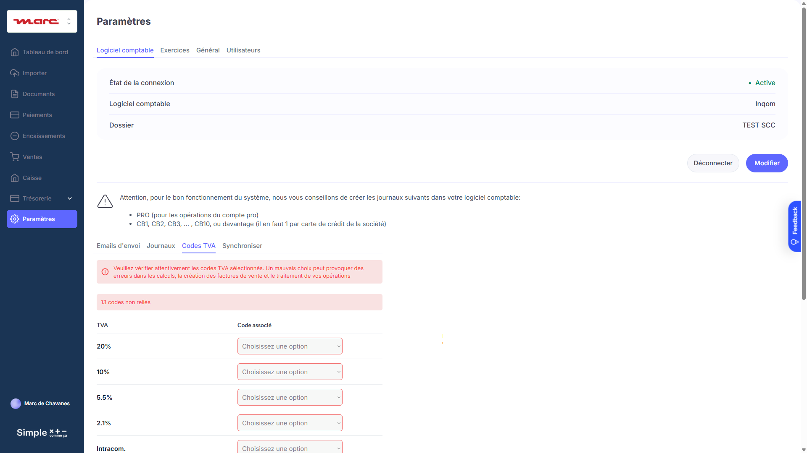

*Ce sous-onglet n'est visible que par les utilisateurs Agence et uniquement si un logiciel comptable est connecté.*

En tant qu'utilisateur Agence, je peux

* Accéder à l'onglet **Paramètres > Logiciel Comptable > Codes TVA** pour la société sélectionnée
* Voir un **avertissement en haut de page** :
  > ⚠️ Veuillez vérifier attentivement les codes TVA sélectionnés. Un mauvais choix peut provoquer des erreurs dans les calculs, la création des factures de vente et le traitement de vos opérations.
* Voir un **indicateur de codes non reliés** : `🔴 X codes non reliés`
* Voir la **table de mapping TVA** avec deux colonnes :
  * **Colonne gauche "TVA"** : Liste fixe des taux TVA (non modifiable)
  * **Colonne droite "Code associé"** : Dropdown pour sélectionner le compte comptable

**Taux TVA affichés (colonne gauche - valeurs fixes) :**

| Label | Taux réel |
|-------|-----------|
| 20% | 20% |
| 10% | 10% |
| 5.5% | 5.5% |
| 2.1% | 2.1% |
| Intracom. | 0% |
| 13% (Corse) | 13% |
| 0.9% (Corse) | 0.9% |
| 8.5% (DOM) | 8.5% |
| 1.75% (DOM) | 1.75% |
| 1.05% (DOM) | 1.05% |
| Export. | 0% |
| Autre Exo. | 0% |
| Autoliquidation | 0% |

**Dropdowns (colonne droite) :**
* Alimentés par l'API du logiciel comptable connecté (Chift ou Inqom)
* **Format d'affichage** : `Nom (code)` - Exemple : `TVA collectée (44571)`
* Les taux éventuellement remontés par Chift sont **ignorés** - seuls le nom et le code sont utilisés

* **Associer un code TVA** :
  * Sélectionner un compte dans le dropdown à droite de chaque taux
  * La sélection est sauvegardée automatiquement
  * L'indicateur "codes non reliés" se met à jour

*Note : Ce mapping est utilisé lors de la création des factures de vente pour générer les écritures comptables avec le bon compte TVA.*

---

## ***Paramètres Journaux & GED : Cadrage fonctionnel V0***

### **Portail / Paramètres / Logiciel Comptable / Journaux**

📸 **Screenshot:** [`parametres-journaux-1920.png`](./screenshots/parametres-journaux-1920.png)
**URL:** `/version-test/societe?tab=Paramètres` → Onglet "Logiciel comptable" → Sous-onglet "Journaux"

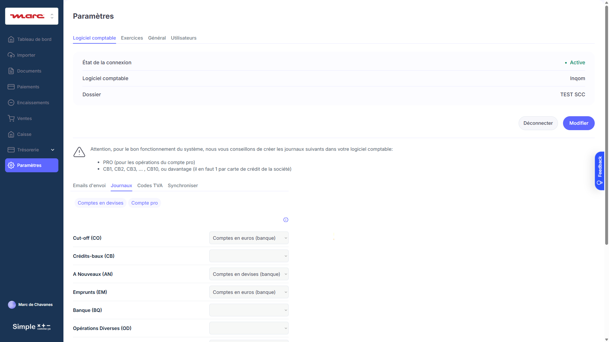

*Ce sous-onglet n'est visible que par les utilisateurs Agence et n'apparaît que si un logiciel comptable est connecté.*

En tant qu'utilisateur Agence, je peux

* Voir la **liste des journaux** synchronisés depuis Inqom
  * Récupérés via `GET /journals`
  * Colonnes : Code, Nom, Type
* **Associer chaque journal à un dossier GED** via un menu déroulant :
  * Options : Factures d'achats, Factures de vente, Notes de frais, (Banques détectées)
  * Changer une valeur enregistre automatiquement + notification "Modification sauvegardée"
* **Comprendre le mapping type de journal** :
  * Journal type "Buy" (HA) → Factures d'achats
  * Journal type "Sell" (VT) → Factures de vente
  * Journal type "Bank" (BQ) → Compte bancaire correspondant
  * Journal type "Miscellaneous" (OD) → Opérations diverses
* **Voir les journaux de type Bank** qui correspondent aux comptes bancaires :
  * Un journal BQ = un compte 512* dans le plan comptable
  * Ces journaux apparaissent dans la liste pour être associés à la GED (relevés bancaires)

*Note : Les journaux CBX (cartes bancaires) ne peuvent pas être associés manuellement - ils sont gérés automatiquement pour le Compte Pro.*

---

### **Portail / Paramètres / Logiciel Comptable / Synchroniser**

En tant qu'utilisateur Agence, je peux

* Voir les **différents types de synchronisation** avec leur date de dernière exécution :
  * Fournisseurs et Paiements
  * Clients et Encaissements
  * Factures (pour la GED)
  * Journaux (pour le classement)
* Cliquer sur **Synchroniser** pour chaque type :
  * Pendant la sync : bouton grisé + gif de chargement
  * À la fin : notification grille-pain "La synchronisation de [type] est terminée"
* **Comprendre que la synchronisation est automatique** :
  * Les données sont rafraîchies automatiquement toutes les 24h
  * La synchronisation manuelle permet de forcer une mise à jour

---

## ***GED Classement Automatique : Cadrage fonctionnel V0***

### **Portail / Documents**

📸 **Screenshot:** [`documents-1920.png`](./screenshots/documents-1920.png)
**URL:** `/version-test/societe?tab=Documents`

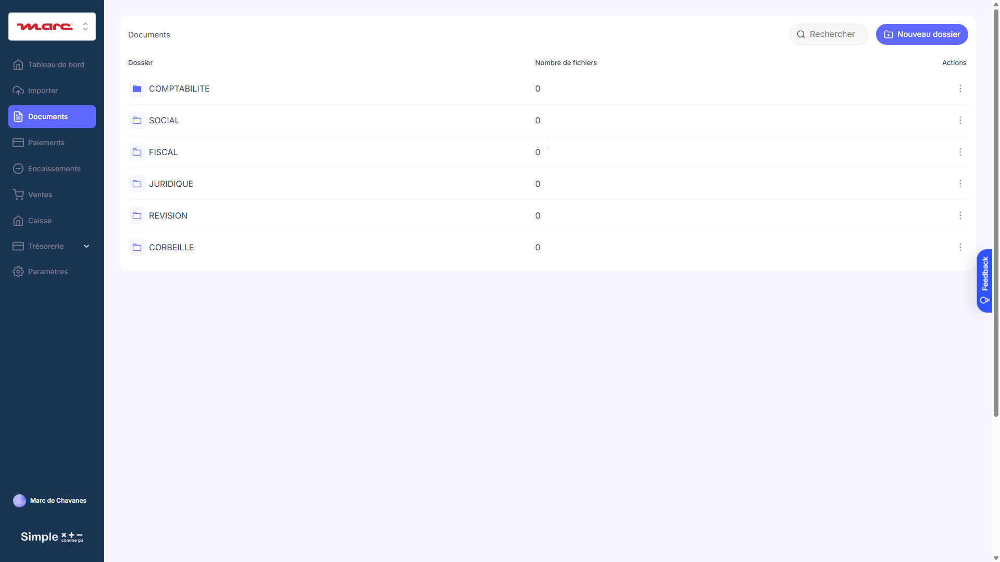

### **Comportement : Classement automatique des pièces jointes**

En tant que système, lors de la synchronisation des factures :

* Je récupère les **documents attachés** aux écritures via `GET /Documents`
* Pour chaque document avec une pièce jointe (PDF) :
  1. Je détermine le **type de document** :
     * `Type = "Supplier"` → Facture d'achat
     * `Type = "Customer"` → Facture de vente
     * `Type = "Miscellaneous"` → Autre document
  2. Je détermine la **date du document** via `EffectifDate`
  3. Je classe le fichier dans la **GED selon le journal associé** :
     * Dossier : selon l'association journal ↔ dossier GED (Paramètres)
     * Sous-dossier : Exercice correspondant à la date
     * Sous-sous-dossier : Mois correspondant à la date
* **Exemple de classement** :
  ```
  Facture fournisseur du 15/03/2025
  → Envoi / Exercice 2025 / Factures d'achats / Mars 2025 / facture.pdf
  ```

---

### **Portail / Documents - Synchronisation automatique**

En tant qu'utilisateur Société ou Agence, lorsque je visite l'onglet Documents :

* Si les factures n'ont **pas été mises à jour dans les 24 dernières heures** :
  * La synchronisation GED se lance automatiquement
  * Un gif de chargement s'affiche à côté du dossier "Envoi"
* Les **nouvelles factures** apparaissent dans les bons dossiers avec un badge rouge (non lu)
* Je peux voir les **pièces jointes OCR** récupérées depuis Inqom :
  * Informations extraites automatiquement : Fournisseur, Montant, Date, Référence
  * Ces données sont stockées dans le champ `AccountingDocument` de l'entry-line

---

### **Portail / Importer (Envoi)**

📸 **Screenshot:** [`importer-1920.png`](./screenshots/importer-1920.png)
**URL:** `/version-test/societe?tab=Importer`

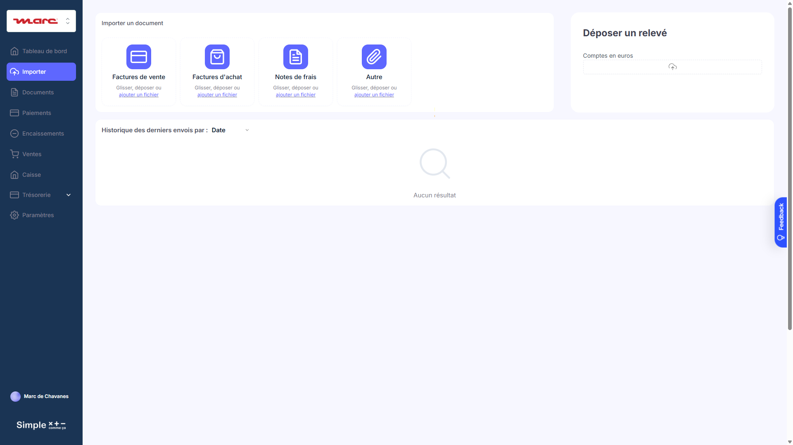

En tant qu'utilisateur Société ou Agence, je peux

* **Déposer des fichiers** dans les zones de dépôt :
  * Factures d'achat
  * Factures de vente
  * Notes de frais
  * Autres
* Les fichiers sont **envoyés par email** à l'adresse configurée dans Paramètres
* Les fichiers sont **classés dans la GED** automatiquement selon la zone de dépôt
* Voir l'**historique des envois** avec : nom du fichier, date d'envoi, type

*Note : Si une adresse email n'est pas configurée pour une zone, cette zone est grisée et désactivée.*

---

## ***Connexion Logiciel Comptable : Cadrage fonctionnel V0***

### **Portail / Paramètres / Logiciel Comptable - État initial**

📸 **Screenshot:** [`parametres-logiciel-comptable-1920.png`](./screenshots/parametres-logiciel-comptable-1920.png)
**URL:** `/version-test/societe?tab=Paramètres` → Onglet "Logiciel comptable"

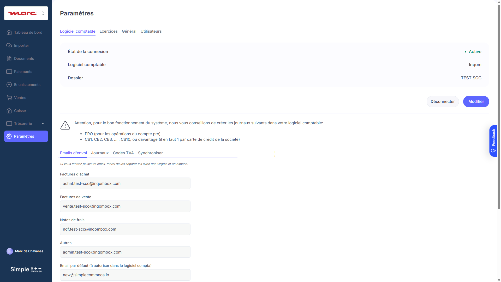

*Ce sous-onglet n'est visible que par les utilisateurs Agence.*

En tant qu'utilisateur Agence, lorsque j'accède à Paramètres > Logiciel Comptable :

**CAS 1 : Aucun logiciel n'est connecté (état par défaut)**

* Je vois :
  * Titre : "Logiciel comptable"
  * Status : pastille rouge 🔴 + texte "Non connecté"
  * Logiciel : "-"
  * Dossier : "-"
  * Bouton "Connecter" (bleu, actif)
* Le bouton "Déconnecter" n'est PAS visible
* Le bouton "Modifier" n'est PAS visible

**CAS 2 : Un logiciel est connecté**

* Je vois :
  * Titre : "Logiciel comptable"
  * Status : pastille verte 🟢 + texte "Connecté"
  * Logiciel : "Inqom", "Chift → [logiciel]" ou "ACD"
  * Dossier : "[Nom du dossier sélectionné]" (ex: "FIDUCIAIRE BONIATZIS")
  * Dernière synchronisation : "[JJ/MM/AAAA à HH:MM]"
  * Bouton "Modifier" (gris/outline, actif)
  * Bouton "Déconnecter" (rouge/outline, actif)
* Le bouton "Connecter" n'est PAS visible

**CAS 3 : Connexion en erreur (token expiré ou credentials invalides)**

* Je vois :
  * Titre : "Logiciel comptable"
  * Status : pastille orange 🟠 + texte "Erreur de connexion"
  * Message d'erreur en rouge : "La connexion à Inqom a échoué. Veuillez vérifier vos identifiants."
  * Logiciel : "Inqom"
  * Dossier : "[Nom du dossier]" (conservé)
  * Bouton "Reconnecter" (bleu, actif)
  * Bouton "Déconnecter" (rouge/outline, actif)

---

### **Popup Connexion - Étape par étape**

En tant qu'utilisateur Agence, lorsque je clique sur "Connecter" :

**ÉTAPE 1 : Choix du logiciel**

* Une popup s'ouvre avec le titre "Connexion au logiciel comptable"
* En haut à droite : "[Société : NOM DE LA SOCIÉTÉ]" (rappel de la société sélectionnée)
* Je vois 4 options radio :
  * ○ Inqom
  * ○ Chift (connecteur multi-logiciels)
  * ○ ACD (grisé + mention "Bientôt disponible")
  * ○ Aucun
* Par défaut, aucune option n'est sélectionnée
* Le bouton "Suivant" est grisé et non cliquable tant qu'aucune option n'est sélectionnée
* Boutons : "Annuler" (ferme la popup) | "Suivant" (grisé → devient actif quand option sélectionnée)

**ÉTAPE 2a : Saisie des identifiants (si Inqom sélectionné)**

* La popup affiche :
  * Titre : "Identifiants Inqom"
  * Champ "Email" : input text, placeholder "votre.email@exemple.com"
  * Champ "Mot de passe" : input password, placeholder "••••••••"
  * Bouton "Tester la connexion" (bleu, actif)
* Les champs sont vides par défaut
* Le bouton "Tester la connexion" est **grisé** si email OU mot de passe est vide
* Boutons : "Retour" | "Tester la connexion"


**ÉTAPE 2b : Saisie des credentials Chift (si Chift sélectionné)**

* La popup affiche :
  * Titre : "Configuration Chift"
  * Message info : "Chift permet de connecter plusieurs logiciels comptables (Pennylane, Cegid, Sage, etc.). Vous devez d'abord créer un compte sur chift.eu et obtenir vos credentials API."
  * Champ "Client ID" : input text, placeholder "votre_client_id"
  * Champ "Client Secret" : input password, placeholder "••••••••"
  * Champ "Account ID" : input text, placeholder "votre_account_id"
  * Lien externe : "Créer un compte Chift →" (ouvre chift.eu dans un nouvel onglet)
* Les 3 champs sont obligatoires
* Le bouton "Connecter via Chift" est **grisé** si un champ est vide
* Boutons : "Retour" | "Connecter via Chift"

---

### **Comportement du bouton "Connecter via Chift"**

En tant qu'utilisateur Agence, lorsque je clique sur "Connecter via Chift" :

**PENDANT LA CONNEXION :**

* Le bouton devient grisé avec un spinner + texte "Redirection..."
* Les champs deviennent non modifiables (grisés)

**Le système effectue :**

1. Sauvegarde temporaire des credentials Chift dans la session :
   * `Chift_client_id` = client_id saisi
   * `Chift_client_secret` = client_secret saisi
   * `Chift_account_id` = account_id saisi

2. Génère une URL d'autorisation OAuth Chift :
   * `https://app.chift.eu/oauth/authorize`
   * Paramètres :
     * `client_id` = Chift_client_id
     * `redirect_uri` = `https://simple-comme-ca.bubbleapps.io/oauth/chift/callback`
     * `response_type` = "code"
     * `state` = token unique pour sécuriser le callback (contient Society.ID)
     * `scope` = "accounting" (ou scope approprié)

3. Ouvre une **nouvelle fenêtre/onglet** vers cette URL OAuth
   * L'utilisateur est redirigé vers le portail Chift
   * L'utilisateur se connecte et autorise l'accès
   * L'utilisateur sélectionne le logiciel comptable et le dossier à connecter

📸 **Screenshot Portail Chift:** [`connexion-chift-inqom-1920.png`](./screenshots/connexion-chift-inqom-1920.png)

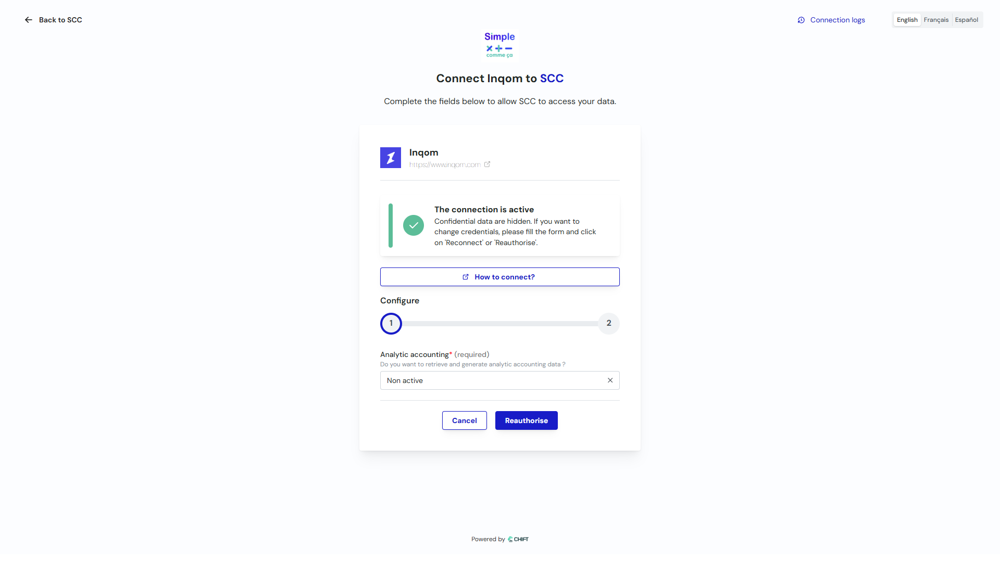

---

### **Callback OAuth Chift**

En tant que système, lorsque Chift redirige vers le callback :

**URL de callback :** `https://simple-comme-ca.bubbleapps.io/oauth/chift/callback?code=XXX&state=YYY`

**SUCCÈS : code présent dans l'URL**

1. Je vérifie que le `state` correspond à une session valide
2. J'échange le `code` contre un `access_token` via :
   * `POST https://api.chift.eu/oauth/token`
   * Body :
     * `grant_type` = "authorization_code"
     * `code` = code reçu
     * `client_id` = Chift_client_id
     * `client_secret` = Chift_client_secret
     * `redirect_uri` = URI de callback

3. Je reçois :
   * `access_token` : token d'accès
   * `refresh_token` : token de rafraîchissement
   * `expires_in` : durée de validité
   * Informations sur la connexion (logiciel connecté, dossier, etc.)

4. Je sauvegarde dans `Society` :
   * `logiciel_comptable` = "chift"
   * `Chift_client_id` = client_id
   * `Chift_client_secret` = client_secret (chiffré)
   * `Chift_account_id` = account_id
   * `Chift_access_token` = access_token
   * `Chift_refresh_token` = refresh_token (chiffré)
   * `Chift_token_expiry` = date expiration
   * `Chift_connected` = true
   * `Chift_connected_software` = logiciel sélectionné (ex: "Pennylane", "Cegid", "Sage")
   * `Chift_folder_name` = nom du dossier sélectionné
   * `Chift_last_sync` = null

5. Je ferme la fenêtre OAuth et rafraîchis la popup principale
   * Notification grille-pain verte : "✓ Connexion à Chift établie avec succès"
   * L'écran Paramètres > Logiciel Comptable affiche l'état "Connecté" avec le logiciel via Chift

**ÉCHEC : erreur dans l'URL ou utilisateur a annulé**

* Si `error=access_denied` : L'utilisateur a refusé l'autorisation
  * Message : "✗ Connexion annulée. Vous avez refusé l'autorisation Chift."
* Si `error=invalid_request` : Paramètres incorrects
  * Message : "✗ Erreur de configuration. Vérifiez vos credentials Chift."
* Si timeout (fenêtre fermée sans callback) :
  * Message : "✗ Connexion expirée. Veuillez réessayer."

---

### **État connecté via Chift**

Lorsque la société est connectée via Chift :

* Je vois :
  * Status : pastille verte 🟢 + texte "Connecté via Chift"
  * Logiciel : "Chift → [Nom du logiciel]" (ex: "Chift → Pennylane")
  * Dossier : "[Nom du dossier sélectionné]"
  * Dernière synchronisation : "[JJ/MM/AAAA à HH:MM]"
  * Bouton "Modifier" (gris/outline, actif)
  * Bouton "Déconnecter" (rouge/outline, actif)

**Comportement spécifique Chift :**

* Le bouton "Modifier" ouvre la page Chift pour modifier la connexion (même workflow OAuth)
* La synchronisation utilise l'API unifiée Chift (pas directement l'API du logiciel comptable)
* Les endpoints restent les mêmes mais passent par le proxy Chift

---

### **Comportement du bouton "Tester la connexion"**

En tant qu'utilisateur Agence, lorsque je clique sur "Tester la connexion" :

**PENDANT LE TEST :**

* Le bouton devient grisé avec un spinner + texte "Test en cours..."
* Les champs email et mot de passe deviennent non modifiables (grisés)
* Le bouton "Retour" reste cliquable

**Le système effectue :**

1. Appel API `POST https://auth.inqom.com/identity/connect/token` avec :
   * `username` = email saisi
   * `password` = mot de passe saisi
   * `client_id` = Agence.Inqom_client_id
   * `client_secret` = Agence.Inqom_client_secret
   * `grant_type` = "password"
   * `scope` = "openid apidata"

---

### **Résultats possibles du test de connexion**

**SUCCÈS : Code HTTP 200**

* Le système :
  1. Reçoit un `access_token` JWT
  2. Extrait le `company_id` du token (claim "company")
  3. Appelle `GET /accounting-folders?companyId={company_id}`
  4. Récupère la liste des dossiers comptables

* Affichage :
  * Message vert : "✓ Connexion réussie"
  * Le dropdown "Dossier comptable" apparaît et se remplit avec la liste des dossiers
  * Format dropdown : "[Nom du dossier]" (ex: "FIDUCIAIRE BONIATZIS", "TEST SCC")
  * Le dropdown est trié par ordre alphabétique
  * Par défaut, aucun dossier n'est sélectionné (placeholder: "Sélectionner un dossier...")
  * Le bouton "Enregistrer" apparaît mais reste **grisé** tant qu'aucun dossier n'est sélectionné

---

**ÉCHEC : Code HTTP 400 - "invalid_grant"**

* **Signification** : Email ou mot de passe incorrect
* **Affichage** :
  * Message rouge : "✗ Identifiants incorrects. Vérifiez votre email et mot de passe Inqom."
  * Les champs email et mot de passe redeviennent modifiables
  * Le bouton "Tester la connexion" redevient actif
  * Aucun dropdown n'apparaît

---

**ÉCHEC : Code HTTP 400 - "invalid_client"**

* **Signification** : Le client_id ou client_secret de l'Agence est invalide
* **Affichage** :
  * Message rouge : "✗ Erreur de configuration. Contactez votre administrateur (client_id/client_secret invalide)."
  * Les champs restent modifiables mais le problème vient de la config Agence
  * L'utilisateur ne peut pas résoudre ce problème seul

---

**ÉCHEC : Code HTTP 401 - "unauthorized"**

* **Signification** : Le compte Inqom n'a pas accès à l'API
* **Affichage** :
  * Message rouge : "✗ Ce compte n'a pas accès à l'API Inqom. Contactez Inqom pour activer l'accès API."

---

**ÉCHEC : Code HTTP 5xx ou Timeout (> 30 secondes)**

* **Signification** : Serveur Inqom indisponible ou problème réseau
* **Affichage** :
  * Message orange : "⚠ Le serveur Inqom ne répond pas. Veuillez réessayer dans quelques minutes."
  * Bouton "Réessayer" apparaît

---

**ÉCHEC : Aucun dossier trouvé (liste vide)**

* **Signification** : L'utilisateur n'a accès à aucun dossier comptable dans Inqom
* **Affichage** :
  * Message orange : "⚠ Aucun dossier comptable trouvé pour ce compte. Vérifiez vos droits dans Inqom."
  * Pas de dropdown

---

### **Sélection du dossier et enregistrement**

En tant qu'utilisateur Agence, après un test de connexion réussi :

* Je clique sur le dropdown "Dossier comptable"
* Je vois la liste des dossiers disponibles (ex: "FIDUCIAIRE BONIATZIS", "TEST SCC", "AUTRE DOSSIER")
* Je sélectionne un dossier
* Le bouton "Enregistrer" devient **actif** (bleu)

**Lorsque je clique sur "Enregistrer" :**

* Le bouton devient grisé avec spinner + "Enregistrement..."
* Le système :
  1. Sauvegarde dans `Society` :
     * `logiciel_comptable` = "inqom"
     * `Inqom_username` = email saisi
     * `Inqom_password` = mot de passe saisi (chiffré)
     * `Inqom_company_id` = company_id extrait du token
     * `Inqom_folder_id` = ID du dossier sélectionné
     * `Inqom_folder_name` = Nom du dossier sélectionné
     * `Inqom_access_token` = token reçu
     * `Inqom_token_expiry` = date expiration (maintenant + expires_in)
     * `Inqom_connected` = true
     * `Inqom_last_sync` = null (pas encore synchronisé)
  2. Lance la synchronisation initiale des journaux (`GET /journals`)

* **SUCCÈS de l'enregistrement :**
  * La popup se ferme
  * Notification grille-pain verte : "✓ Connexion à Inqom établie avec succès"
  * L'écran Paramètres > Logiciel Comptable se rafraîchit et affiche l'état "Connecté"

* **ÉCHEC de l'enregistrement (erreur BDD) :**
  * Message rouge dans la popup : "✗ Erreur lors de l'enregistrement. Veuillez réessayer."
  * La popup reste ouverte
  * L'utilisateur peut cliquer à nouveau sur "Enregistrer"

---

### **Popup Modifier la connexion**

En tant qu'utilisateur Agence, lorsque je clique sur "Modifier" :
n📸 **Screenshot Portail Connexion Chift:** [`connexion-chift-inqom-1920.png`](./screenshots/connexion-chift-inqom-1920.png)


* Une popup s'ouvre pré-remplie avec :
  * Logiciel : "Inqom" (sélectionné, mais modifiable)
  * Email : "[email actuel]" (masqué partiellement : "m***@exemple.com")
  * Mot de passe : "••••••••" (masqué, champ vide pour ressaisir)
  * Dossier actuel affiché : "[Nom du dossier actuel]"
* Message d'info : "Pour modifier la connexion, ressaisissez votre mot de passe Inqom."
* Le bouton "Tester la connexion" est grisé tant que le mot de passe n'est pas ressaisi
* Même workflow que la connexion initiale

---

### **Popup Déconnecter un logiciel comptable (Inqom, Chift, ACD)**

> ⚠️ **IMPORTANT** : Cette popup est générique et s'applique aux 3 types d'intégration.
> Le comportement est identique quel que soit le logiciel connecté (Inqom, Chift ou ACD).

En tant qu'utilisateur Agence, lorsque je clique sur "Déconnecter" :

#### Maquette popup de déconnexion

```
┌───────────────────────────────────────────────────────────────────────┐
│  ⚠️ Se déconnecter ?                                                   │
├───────────────────────────────────────────────────────────────────────┤
│                                                                       │
│  Êtes-vous sûr de vouloir vous déconnecter de votre logiciel de       │
│  comptabilité ?                                                       │
│                                                                       │
│  ⚠️ Toutes les données provenant du logiciel compta ne seront plus    │
│  accessibles et les données des onglets **Emails d'Envoi** et         │
│  **Journaux** vont être supprimées.                                   │
│                                                                       │
│  ─────────────────────────────────────────────────────────────────    │
│                                                                       │
│  Merci d'écrire "DECONNECTER ET SUPPRIMER" dans le champ suivant      │
│  pour confirmer :                                                     │
│                                                                       │
│  [                                                          ]         │
│                                                                       │
│  ─────────────────────────────────────────────────────────────────    │
│                                                                       │
│  Société : [Nom de la société]                                        │
│  Logiciel : [Inqom / Chift (via Pennylane) / ACD]                     │
│                                                                       │
├───────────────────────────────────────────────────────────────────────┤
│                      [ Annuler ]  [ Déconnecter ] (rouge, désactivé)  │
└───────────────────────────────────────────────────────────────────────┘
```

#### Comportement du bouton "Déconnecter"

| État | Condition | Apparence bouton |
|------|-----------|------------------|
| Désactivé | Champ de confirmation vide ou texte incorrect | Grisé, non cliquable |
| Actif | Texte = "DECONNECTER ET SUPPRIMER" (exact, sensible à la casse) | Rouge, cliquable |

#### Validation du champ de confirmation

* **Texte attendu** : `DECONNECTER ET SUPPRIMER` (en majuscules, sans espaces avant/après)
* **Vérification** : Comparaison exacte, sensible à la casse
* **Feedback** : Le bouton s'active dès que le texte est correct (pas besoin de valider)

**Lorsque je clique sur "Déconnecter" (après saisie correcte) :**

* Le bouton devient grisé avec spinner + "Déconnexion en cours..."
* Le système effectue les actions selon le type d'intégration :

#### Actions par type d'intégration

**Pour Inqom :**
```
Society :
  logiciel_comptable = "none"
  Inqom_client_id = null (effacé)
  Inqom_client_secret = null (effacé)
  Inqom_username = null (effacé)
  Inqom_password = null (effacé)
  Inqom_access_token = null (effacé)
  Inqom_token_expiry = null
  Inqom_connected = false
  Inqom_folder_id = null (effacé)
  Inqom_folder_name = null (effacé)
  Inqom_company_id = null (effacé)
  Inqom_last_sync = null
```

**Pour Chift :**
```
Society :
  logiciel_comptable = "none"
  Chift_client_id = null (effacé)
  Chift_client_secret = null (effacé)
  Chift_account_id = null (effacé)
  Chift_access_token = null (effacé)
  Chift_refresh_token = null (effacé)
  Chift_token_expiry = null
  Chift_connected = false
  Chift_connected_software = null (effacé)
  Chift_folder_name = null (effacé)
  Chift_last_sync = null
```

**Pour ACD :**
```
Society :
  logiciel_comptable = "none"
  ACD_username = null (effacé)
  ACD_password = null (effacé)
  ACD_access_token = null (effacé)
  ACD_token_expiry = null
  ACD_connected = false
  ACD_folder_id = null (effacé)
  ACD_folder_name = null (effacé)
  ACD_last_sync = null
```

#### Données supprimées lors de la déconnexion

| Table | Action | Détail |
|-------|--------|--------|
| **Journal** | ❌ SUPPRIMER | Tous les journaux liés à cette Society |
| **Email_Envoi** | ❌ SUPPRIMER | Tous les emails d'envoi liés à cette Society |
| **Facture** | ✅ CONSERVER | Les factures restent pour historique (mais plus de sync) |
| **Fournisseur** | ✅ CONSERVER | Les fournisseurs restent pour historique |
| **Client** | ✅ CONSERVER | Les clients restent pour historique |
| **Compte_Bancaire** | ✅ CONSERVER | Les comptes bancaires restent |
| **Transaction** | ✅ CONSERVER | Les transactions restent |

#### Après déconnexion

* La popup se ferme
* Notification grille-pain rouge : "La société [Nom] a été déconnectée de [Logiciel]. Les données des onglets Emails d'Envoi et Journaux ont été supprimées."
* L'écran affiche l'état "Non connecté" avec pastille rouge 🔴
* Les synchronisations automatiques schedulées sont arrêtées

---

### **Comportement : Erreur de connexion automatique (token expiré)**

En tant que système, lors du refresh quotidien des tokens (backend workflow à 02h00) :

**SI le refresh échoue pour une Society :**

1. Je mets à jour :
   * `Society.Inqom_connected` = false (mais je conserve les credentials)
2. J'envoie un email à l'Agence :
   * Objet : "⚠️ Connexion Inqom interrompue pour [Nom Société]"
   * Corps : "La connexion au logiciel comptable Inqom a été interrompue pour la société [Nom]. Veuillez vous reconnecter depuis Paramètres > Logiciel Comptable."
3. L'utilisateur verra l'état "Erreur de connexion" avec pastille orange 🟠

---

### **Tableau récapitulatif des états de connexion**

| État | Pastille | Texte status | Boutons visibles | Cause |
|------|----------|--------------|------------------|-------|
| Non connecté | 🔴 Rouge | "Non connecté" | Connecter | État initial, jamais connecté ou déconnecté manuellement |
| Connecté | 🟢 Vert | "Connecté" | Modifier, Déconnecter | Connexion active, token valide |
| Erreur | 🟠 Orange | "Erreur de connexion" | Reconnecter, Déconnecter | Token expiré, credentials invalides, ou refresh échoué |

---

### **Tableau récapitulatif des erreurs API**

| Code HTTP | Body contient | Message affiché | Action utilisateur |
|-----------|---------------|-----------------|-------------------|
| 200 | access_token | "✓ Connexion réussie" | Sélectionner dossier |
| 400 | "invalid_grant" | "✗ Identifiants incorrects. Vérifiez votre email et mot de passe Inqom." | Corriger email/mdp |
| 400 | "invalid_client" | "✗ Erreur de configuration. Contactez votre administrateur." | Contacter admin Agence |
| 401 | "unauthorized" | "✗ Ce compte n'a pas accès à l'API Inqom." | Contacter Inqom |
| 5xx | - | "⚠ Le serveur Inqom ne répond pas. Veuillez réessayer." | Attendre et réessayer |
| Timeout | - | "⚠ Le serveur Inqom ne répond pas. Veuillez réessayer." | Attendre et réessayer |
| 200 | dossiers = [] | "⚠ Aucun dossier comptable trouvé pour ce compte." | Vérifier droits Inqom |

---

# 15. QUESTIONS POUR LE CLIENT

> **Note :** Cette section liste les questions en suspens qui nécessitent une validation client ou Product Owner avant de finaliser les spécifications.

## Questions en attente de réponse

### Q1 - Statuts et transitions des factures d'achat

**Contexte :** Le cadrage Paiements mentionne les statuts "à payer", "bon à payer", "payé", "En cours", "Programmé".

**Questions :**
1. Quels sont tous les statuts possibles d'une facture d'achat ?
2. Quelles sont les transitions autorisées entre ces statuts ?
3. Un diagramme d'état serait-il disponible ?

---

### Q2 - Paiement via Inqom

**Contexte :** Actuellement les paiements sont exécutés via le Compte Pro Swan.

**Question :** Est-il prévu/possible de déclencher des paiements directement via l'API Inqom, ou Inqom sert uniquement à enregistrer les écritures comptables après paiement ?

---

### Q3 - Gestion des avoirs (factures négatives)

**Contexte :** Le cadrage Encaissements mentionne les factures de vente et les échéances.

**Questions :**
1. Comment sont gérés les avoirs (factures négatives) côté Inqom ?
2. Un avoir génère-t-il une écriture inverse automatiquement ?
3. Comment un avoir impacte-t-il le solde "à encaisser" d'un client ?

---

### Q4 - Détermination du compte 7XX pour les produits vendus

**Contexte :** Lors de la création d'une facture de vente, l'écriture Inqom doit créditer un compte 7XX (produits).

**Questions :**
1. Comment est déterminé le compte 7XX pour chaque ligne de facture ?
2. Est-ce lié à la famille d'article ? À l'article lui-même ?
3. Y a-t-il une table de correspondance Article → Compte 7XX dans Bubble ?

---

### Q5 - Comportement en cas d'échec de création d'écriture Inqom

**Contexte :** Lors d'un paiement ou d'une facture de vente, le système crée une écriture dans Inqom.

**Questions :**
1. Que se passe-t-il si l'appel API `POST /entries` échoue ?
2. La transaction Bubble doit-elle être annulée (rollback) ?
3. Faut-il notifier l'utilisateur et lui permettre de réessayer ?
4. L'écriture doit-elle être mise en file d'attente pour réessai automatique ?

---

## Décisions confirmées

| Sujet | Décision | Date |
|-------|----------|------|
| Synchronisation Trésorerie | Synchroniser à l'ouverture de la page + bouton "Actualiser" | 05/12/2025 |
| Recalcul des soldes | Recalcul immédiat à chaque transaction (pas de batch) | 05/12/2025 |
| Compte Pro Swan | Fonctionnalité existante à conserver | 05/12/2025 |
| Source des articles | Tables Bubble existantes (Famille_article + Article) | 05/12/2025 |
| Encaissements | Prédictions basées sur les factures de vente (échéancier) | 05/12/2025 |

---

**Document mis à jour le 5 décembre 2025**
**Version 2.5 - Ajout section Questions pour le client + Décisions confirmées**
**Toutes les structures JSON vérifiées par tests API réels**
